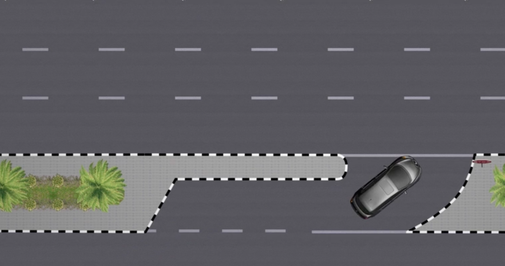

# Risk
## Speed Limits Convention

| Area                     | Speed Limit (km/h) |
| ------------------------ | --------------------- |
| Parking                  | 25                    |
| Service Road             | 25                    |
| Urban Single Carriageway | 40                    |
| Urban Dual Carriageway   | 60/80                 |
| Rural Roads              | 100                   |
| Freeways                 | 120 60 (min)       |
## Moving Off
Moving from stationary/low speed to match traffic speed

Slow moving off can disturb others

- Prepare
- Observe
- Move

## Controlled Intersections
- T-Intersection
	- Continuing road
	- Terminating road
- Junction
	- Traffic light intersection
	- No traffic light
		- Priority to vehicle that does not have stop sign/line
		- If both have stop sign/line, Priority to vehicle that enters junction first
		- If both arrive at the same time, priority to vehicle arriving from the left

- Mirrors
- Signals
- Position
- Speed
- Look around

## Turning
MSPLS

Right on Multi-lane road
- Last lane to last lane
- 2nd Last lane to any lane other than last lane

### U-Turn
Should always be made from the first lane to the last lane

Types
- Open: Opposite to another road
	- 
- Closed: 
	- 
- Three point u-turn
	- 
- Intersection u-turn

## Lane Discipline

Changing lanes
- Mirror center
- Signal
- Side mirror
- Shoulder: Headcheck
	- Do not look away from front for more than a second
- Mirror center

Overtaking
- only allowed from the left side
- be extremely careful overtaking a heavy vehicle due to their large blind spot
- if someone is overtaking you, you must slow down

## Roundabouts
- Keep left indicator on
- When exiting, turn right indicator on

Types
- Single lane
- Two lane
	- U-Turn: First lane
		- Exit the left hand lane
	- Left: First-Lane
		- Exit the left hand lane
	- Straight: 2nd lane
		- Exit the right hand lane
	- Right: 2nd lane
		- Exit the right hand lane
- Three lane
	- U-Turn: First lane
		- Exit the left hand lane
	- Left: First-Lane
		- Exit the left hand lane
	- Straight: 2nd lane
		- Exit the right hand lane
	- Right: Use free-right if available, else 3rd lane
		- Exit the right hand lane

| Type            | Right                | Straight                                                             | Left | U-Turn |
| --------------- | -------------------- | -------------------------------------------------------------------- | ---- | ------ |
| 1 Lane Enter | 1                    | 1                                                                    | 1    | 1      |
| 2 Lane Enter | 2                    | 2                                                                    | 1    | 1      |
| 3 Lane Enter | Free-right 3, o.w | 3: if free-right, parking required, need to turn right soon 2, ow | 1    | 1      |
| 1 Lane Exit  | 1                    | 1                                                                    | 1    | 1      |
| 2 Lane Exit  | 2                    | 2                                                                    | 1    | 1      |
| 3 Lane Exit  | 3                    | 3: if free-right, parking required, need to turn right soon 2, ow | 1    | 1      |
## Parking

- Parallel parking
	- Enter
		- Go ahead
		- Headcheck
		- Reverse
		- Signal
		- Go forward to fit
	- Exit
		- Reverse
		- Headcheck
		- Signal
		- Forward
- 60deg angle parking
- 90deg angle parking
	- Forward
	- Reverse: preferred as easier to exit
