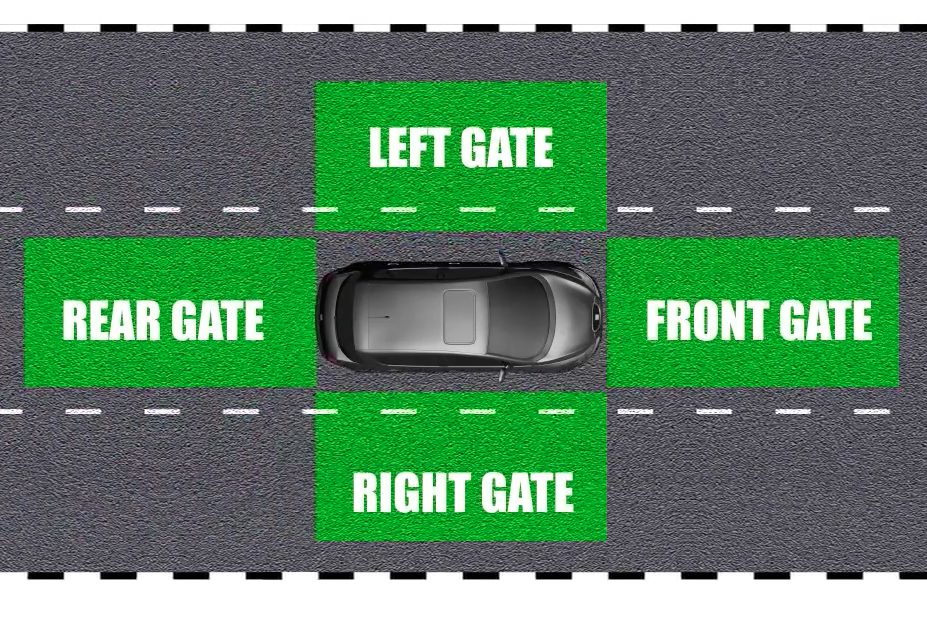

# Focus
## Medication, Fatigue, Alcohol
- Be careful
- Alcohol tolerance level: 0
## Emotions

## Personality Traits
- Actions
- Attitude
- Behavior
## Distractions
Mainly don't use phone
## Vision
Visual field dec with inc speed

Braking
- Reaction distance
	- Perception time
	- Reaction time
- Braking distance

## Space Management

Gates

Always have 2 gates open for emergency

Forward
- 2 sec rule when driving light vehicle
- 3 sec rule when driving motorcycle
- 4 sec rule when driving heavy vehicle

Double the distance at night, or when the conditions are poor