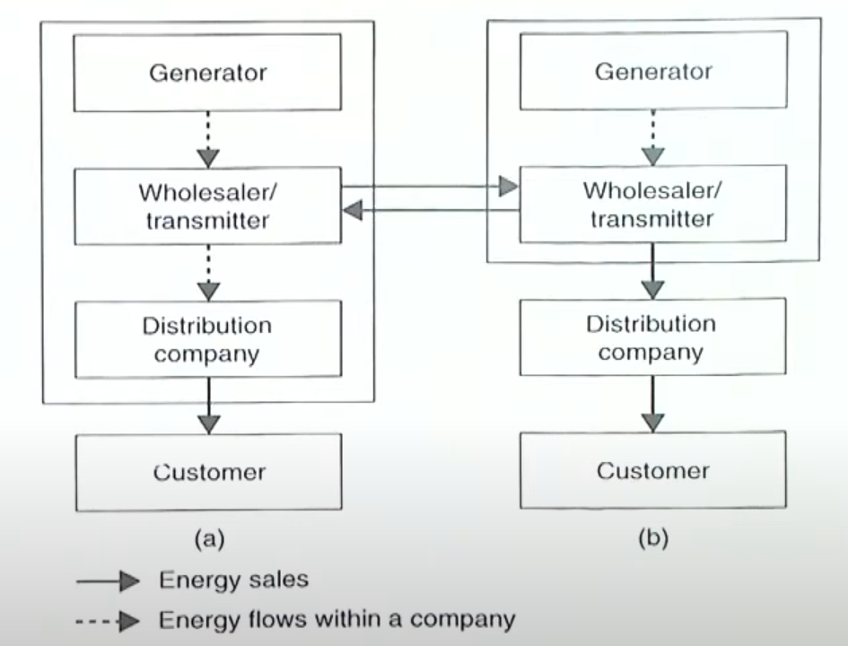
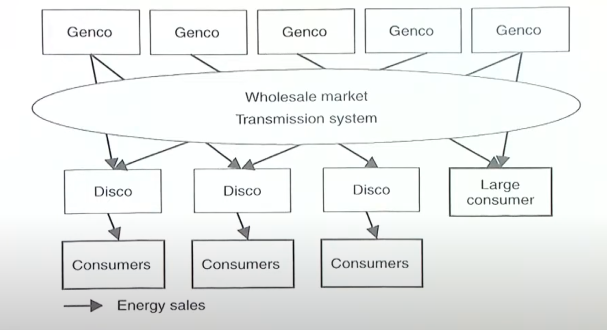
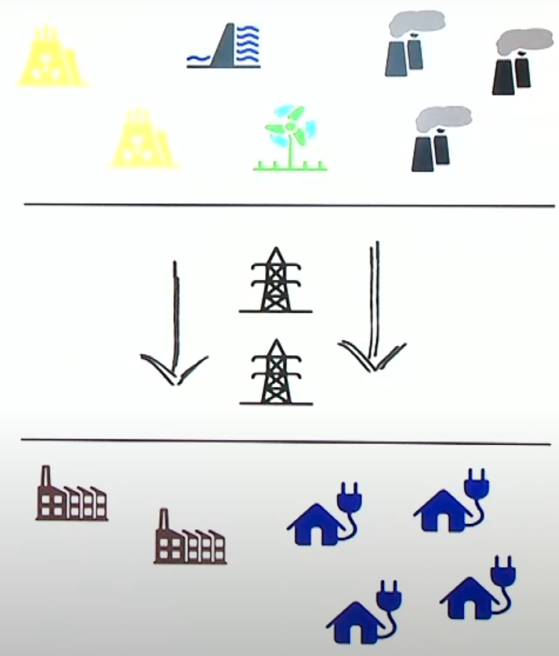
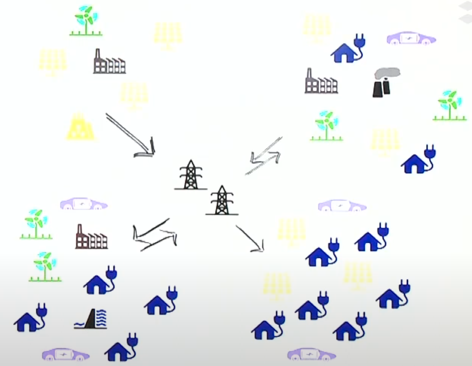
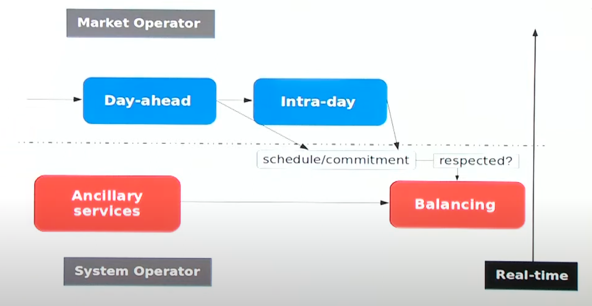
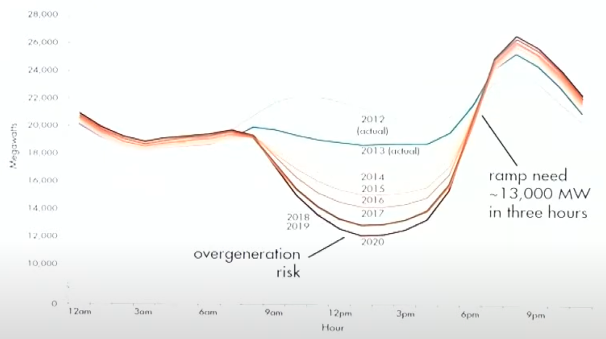
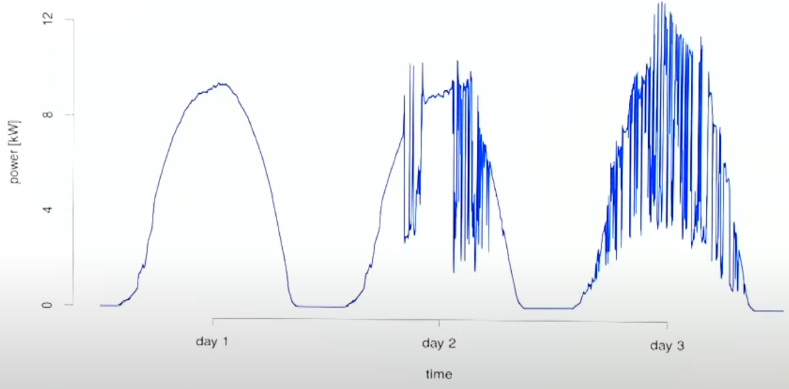

# Introduction

## Why is energy special?

- There should be equilibrium between power generation and consumption
- Transportation and distribution performed on power network, with specific physical rules
- Storage is uneconomical
- Large part of energy demand is of critical nature (hospitals, residencies)
- Consumers should not differentiate origin, quality and nature of production

## Deregulation

|                      | Regulated            | De-regulated                |
| -------------------- | -------------------- | --------------------------- |
| Prices determined by | Regularity body      | “Invisible hand” of market  |
| Structure            | Vertical integration | Horizontal restructuring    |
| Supplier             | Fixed                | Multiple - Competition |

Chile > UK > Scandinavia > California (crisis, shortage, Enron)

## Participants

|                |                                                              |                                                              |
| -------------- | ------------------------------------------------------------ | ------------------------------------------------------------ |
| Grid Operators | TSO (Transmission System Operator)                           | Operates transmissions assets Responsible for power balance on transmission system |
|                | DisCo (Distribution Company) DSO (Distribution System Operator) | Operates distribution grid Often acts as retailer (not preferable) |
| Producers      | GenCo (Generating Company)/ IPP (Independent Power Producer) | Owns production assets Generation is offered through energy market |
| Intermediary   | Retailer                                                     | Buys energy from wholesale electricity market Sales to end-consumers |
| Consumers      | Household (small)/ Industrial (large)                   | Use energy for various purposes Large consumers may be allowed to directly participate in whole electricity market |
| Regulator      |                                                              | Market design Rules Monitoring Curb misbehavior (collusion, power abuse) |
| Operator       |                                                              | Organizes and operates energy market Definition of bid products & forms Set up & maintenance of trading platform Daily matching of supply and demand offers |

## Models

|                 |  | |
|---              | --- | ---|
|Monopoly         |  | |
|Purchasing Agent |  | |
|Wholesale Market |  | |
|Retail Market | |  |
|Consumer-Centric | Peer-Peer Model Micro-Grids |  |

|                | Supplier-Centric                                          | Consumer-Centric                                          |
| -------------- | --------------------------------------------------------- | --------------------------------------------------------- |
| Characteristic | Hierarchical                                              | Decentralized                                             |
|                |                                                           | “Prosumers”                                               |
|                |  |  |

## Markets

### Types

|                   |                                                              |
| ----------------- | ------------------------------------------------------------ |
| Capacity          | For system operator to ensure that sufficient generation capacity is present for reliable system operation in future year and at competitive prices |
| Energy            | Central place for optimal scheduling and settlement of energy exchanges |
| Ancillary Service | Any type of service that supports power system operations, directly bought by system operator - Primary reserves - Secondary reserves - Tertiary receivers (manual) - Black-start capability, short-circuit power, reactive reserves, voltage control |

### Financial

| Market         | Meaning                                                      |
| -------------- | ------------------------------------------------------------ |
| Futures        | Financial contracts with time horizons unto 6 years Used for price hedging and risk management |
| Day-ahead/Spot | Central instrument for everyday matching of electricity supply and demand |
| Balancing      | Close to real-time operator for system operator to ensure power system balance |
| Intra-day      | Continuous trading platform between day-ahead and balancing Allows to correct original schedules (when plant outages/changes in wind power generation) |

## Challenges

|                                                              |                                                              |
| ------------------------------------------------------------ | ------------------------------------------------------------ |
| Variable energy demand “Duck Curve”                     |  |
| Renewable energy generation is variable and non-dispatchable |                     |
| Renewable energy generation is hard to forecast              |                                                              |

## Economic impact of renewable energy

Wind and solar energy induces a downward pressure on market prices

## Quest for Flexibility

Flexibility is seen as ability to adapt to variable and unforeseen changes in operating conditions

- Generation units
- Power system
- Demand side
- Integrated energy systems view (heat and gas energy systems)

## IDK

|                   | Traditional  | Renewable          |
| ----------------- | ------------ | ------------------ |
| Producers         | Fossil fuels | Wind Solar    |
| Fixed Production  | ✅            | ❌                  |
| Fixed Demand      | ❌            | ❌                  |
| Cost distribution | Demand       | Demand Supply |

Probabilistic matching rather than regular price matching