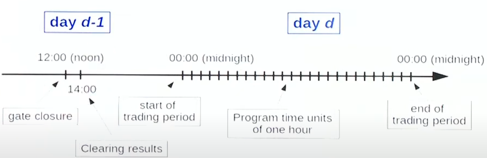
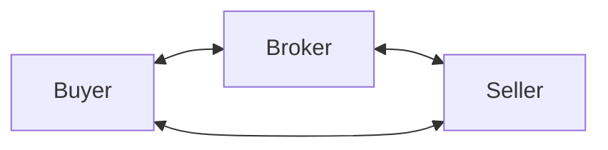
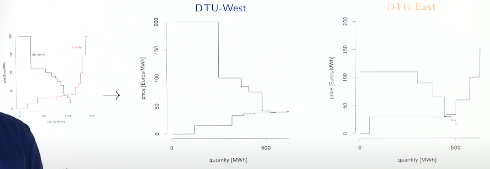
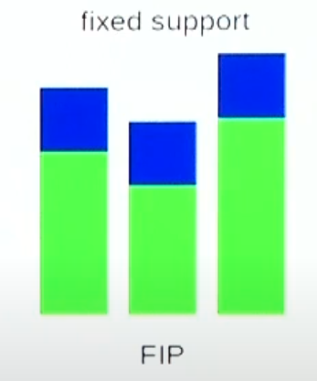

# Spot Markets

## Bilateral Contracts

Direct exchange of energy between buyer and seller in a decentralized fashion

System operator is informed about trades that occur

## Types

|                      | Customized long-term contracts | OTC (Over the counter) | Electronic Trading                                 |
| -------------------- | ------------------------------ | ---------------------- | -------------------------------------------------- |
|                      |                                |                        | Consistently matches supply and offer bids         |
| Flexible             | ✅                              | ❌                      |                                                    |
| Private transactions | ✅                              | ❌                      |                                                    |
| Transaction costs    | High (due to Broker)      | Low                    | $\approx 0$                                        |
| Speed                |                                |                        | Fast (allows for trading “until last second”) |
| Trade volume         | Large                          | Small                  |                                                    |
| Duration             | Long                           | Small                  |                                                    |

## Auctions in Energy Pool

- All generation bids and consumption offers are placed at same time
- No one knows about others’ bids and offers
- Centralized market clearing decides bids and offers that are retained
- Eventually, the system operator is informed about the trades that occurred

## Merit Order

- Consumption orders are ranked in dec price order
- Supply bids are ranked in inc price order

## Social Welfare

Area between consumption and generation

Equilibrium point is that which allows to maximize social welfare

- Any buyer is to pay almost what they were ready to pay
- Any seller will get at least what they were ready to sell for

## Market Clearing

Goal

- Schedule for all supply and demand offers
- Price at which market is cleared

Inputs

- All offers in the market are formulated in terms of quantity $Q$ and price $P$
- Supply side
  - Set of offers
  - Maximum quantity for offer
  - Price for offer
- Demand side
  - Set of offers
  - Maximum quantity for offer
  - Price for offer

Decision variables

- Generation schedule
- Consumption schedule

Objective: Maximize social welfare

Constraints

- Non-negativity of supply and demand
- Balance of generation and consumption
- Generation and consumption within limits

## Settlement Process

- Who should pay what?
- Who should get paid what amount?

### Approaches

|                           | Pay-as-bid                                                   | Uniform                                                      |
| ------------------------- | ------------------------------------------------------------ | ------------------------------------------------------------ |
| Every party pays/receives | whatever they bid                                            | the same equilibrium amount                                  |
| Advantages                |                                                              | Overcomes limitations of pay-as-bid Yields budget balance: sum of revenues equal to sum of payments |
| Disadvantages             | Supplier may receive 0 revenue, which won’t cover their fixed costs Consumers incentivized to lower bids; suppliers incentivized to increase bids |                                                              |

Both approaches guarantee

- individual rationality: consumers will pay at most what they were ready to pay, and producers will receive at least what they were ready to receive
- Revenue adequacy: Sum of revenues $\ge$ Sum of payments

## Geographic Prices

Prices vary across various locations, as power has to flow through network involved

Exchanges capacity limitations

- There is a maximum amount of energy that can be exchanged from one location to another
- When this limit is reached, there is **congestion** and prices for connected areas will different
- Exchange capacity limitations are directly related to network constraints and operational practice

## Approaches to handle exchange capacity limitations

|                        | Zonal                     | Nodal             |
| ---------------------- | ------------------------- | ----------------- |
| System Operator        | TSO                       | ISO               |
| Market Operator        | Ind. Market Operator      | ISO               |
| Offers                 | Market Products           | Unit Capabilities |
| Clearing               | Supply-demand equilibrium | UCED Problem      |
| Network representation | Simplified                | Detailed          |
| Prices                 | Zonal                     | Nodal             |
| Used in                | Europe                    | US                |

Market is not-budget balanced anymore, as the sum of consumer payments > sum of supplier revenues; difference defines congestion rent to be collected by system operator(s)

### Approach 1: Split

Due to transmission constraints, the market has to be split and be treated as individual sub-markets

- Submarkets have their own supply-demand equilibrium
- Transmission-related offers: Extra (price-independent) consumption/generation offers representing the transmission from one zone to the next to be added

### Approach 2: Flow-based coupling

Instead of boldly splitting market, one could instead acknowledge how power flows

This allows clearing a single market with geographically-differentiated prices

## Regulation & Support Schemes 

Grid parity = scenario when it is profitable to produce energy, ie Levelized Cost of Energy (cost of energy production) < market price

New energy generation tech may need support in order to reach grid parity

- Regulation is an instrument for policy makers to support their integration in the market
- Support schemes consist in financial support to make them competitive in the market

These have impact on participant revenues, offering strategies, market outcomes

Types

|                                                  | FIT                                                          | FIP                                                          | CFT                                                          |
| ------------------------------------------------ | ------------------------------------------------------------ | ------------------------------------------------------------ | ------------------------------------------------------------ |
| Meaning                                          | Feed-in-tariff                                               | Fixed Feed-in-Premium                                        | Contract for difference/ Sliding Premium                     |
| Implication                                      | Guaranteed price                                             | Fixed support regardless of market revenue                   | Compensation of difference between guaranteed price and market revenue |
| Blue: Support revenue Green: Market Revenue |  |  |  |
| Implication for producer                         |                                                              |                                                              | Just ensure you get scheduled Bid as low as possible    |

Safe policy to guarantee non-negative equilibrium prices: FIP or CfD at 0
