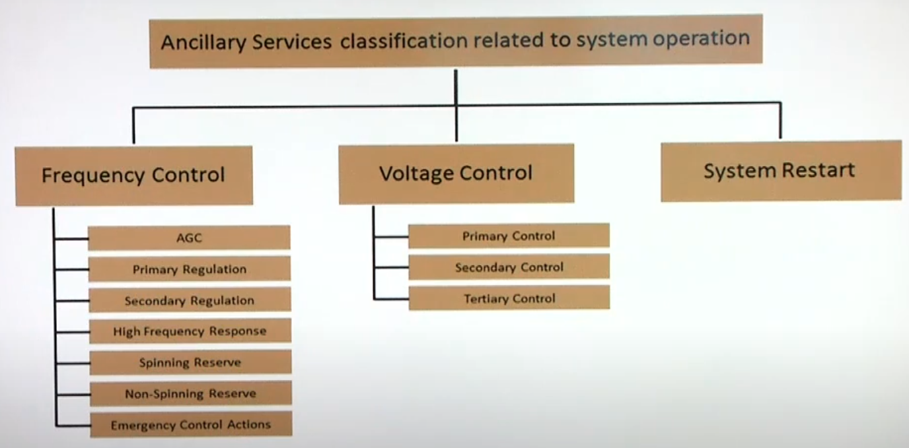
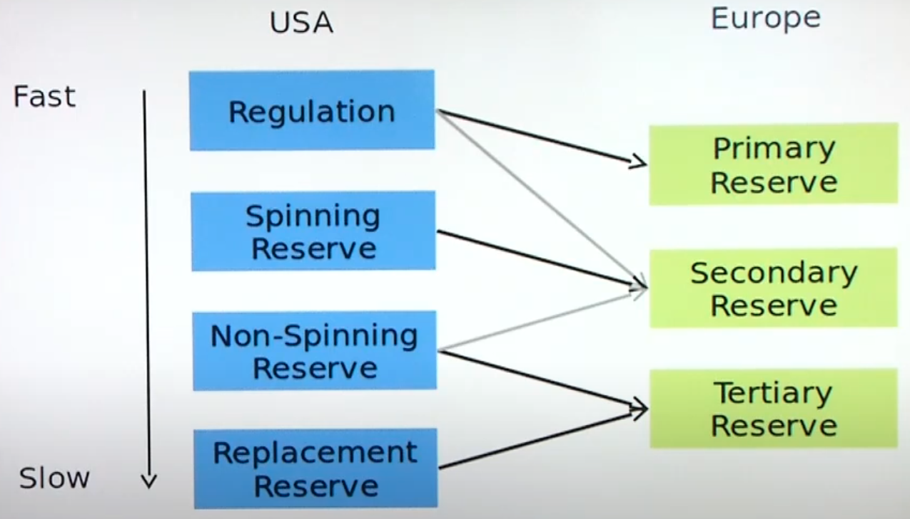
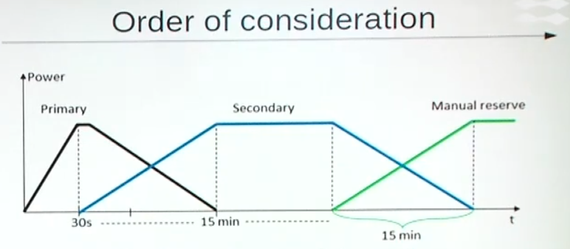

# Ancillary Services

Services required by transmission/distribution system operator to enable them to maintain the integrity and stability of transmission/distribution system as well as power quality

## Types

## Reserve Types

| Reserve   |                                                              |
| --------- | ------------------------------------------------------------ |
| Primary   | Shared among all system operators Daily day-ahead auctions Inflexible demand Needs upward & downward capacity Energy not considered (energy-neutral service ) |
| Secondary | Relieve primary reserve which has ben activated Restore any imbalance on interconnections Capacity purchases on monthly basis Combines symmetric upward & downward products Based on bilateral contracts (negotiated; non-public)  Negative revenue in downward regulation case consists in buying back energy that is already sold through day-ahead market |
| Tertiary  | Daily day-ahead auctions Varying demand Need upward & downward capacity Energy paid for at balancing price |

## Activation Approaches

|           |            |                                                              |
| --------- | ---------- | ------------------------------------------------------------ |
| Reactive  | Corrective |  |
| Proactive | Preventive |  |

## Quantify need for ancillary services

Depends on total uncertainty which is based on

- Supply-side uncertainty
- Demand-side uncertainty

