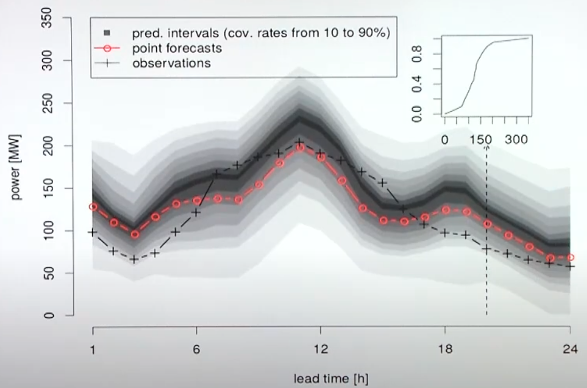
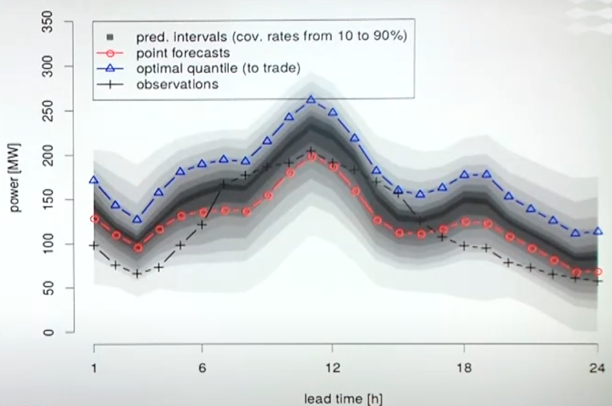

# Participation of Renewables

## Market Participants

- Price taker: Decisions and resulting offers (buying/selling) does not affect market outcomes
- Price maker: Decisions and resulting offers (buying/selling) affects market outcomes

## Market Participation Strategy

1. Increase your offer

|                                                              | $E_i$                           | Limitations                                                 |
| ------------------------------------------------------------ | ------------------------------- | ----------------------------------------------------------- |
| Trust the forecast Directly take forecasts and make offers | $\hat E_i$                      | Susceptible to balancing costs from under-producing         |
| Increase your offer                                          | $\tau \hat E_i$ $\tau > 1$ |                                                             |
| Be bold and just max out generation                          |                                 | Unrealistic (Requires knowledge of future balancing prices) |

## Revenue Analysis

Performance Ratio
$$
\begin{aligned}
\gamma &= (R_\text{DA} + R_B)/R^*_\text{DA} \\
\gamma & \in (0, 1)
\end{aligned}
$$
where

- $R_\text{DA} =$ revenue from day-ahead
- $R_\text{DA} =$ revenue from balancing market
- $R_\text{DA} =$ Optimal revenue

## News vendor problem

How much should news vendor buy from printing store to maximize expected revenue

Bank cashflow problem: how much a bank should keep in reserves to satisfy request for withdrawal

### Requirements

- One shot opportunity to decide on quantity of interest
- Uncertain outcome
- Known marginal revenue, profit, loss
- Objective: maximize expected revenue

### Solution

Optimal number $n^*$ such that
$$
\begin{aligned}
\alpha^*
&= \dfrac{\pi^+}{\pi^+ + \pi^-} \\
n^* &= F^{-1}(\alpha^*)
\end{aligned}
$$
where

- $\pi^+ = \lambda^R - \lambda^P =$ unit cost of buying less than needed
- $\pi^- = \lambda^P - \lambda^T =$ unit cost of buying more than needed
- $\alpha^* =$ Normal level of original CDF F

### Uncertainty

$$
n^* = \hat F^{-1}(\hat \alpha^*) \\
\implies n_t^* = \hat F_t^{-1}(\hat \alpha_t^*)
$$

### Notes

The optimal strategy can change over time

