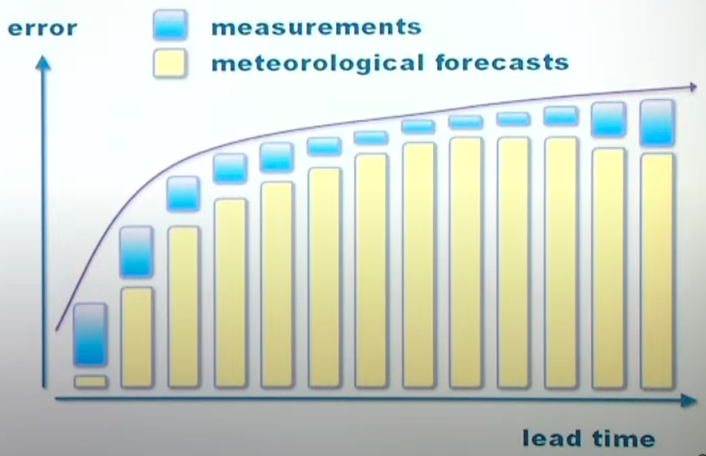

# Renewable Energy Analytics

Forecasting helps make decisions

## What to forecast

Different participants have different needs

- Electric load
- Day-ahead prices
- Potential imbalance sign
- Regulation prices/penalties
- Potential congestion on interconnectors
- Generation from renewable sources

All these are driven by weather and climate

## Use cases

- Definition of reserve requirements
- Unit commitment and economic dispath
- Coordination of renewables with storage
- Design of optimal trading strategies
- Electricity market clearing
- Optimal maintenance planning (especially for offshore wind farms)

Inputs to these methods are

- deterministic forecasts
- probabilistic forecasts such as quantiles intervals and predictive distributions
- probabilistic forecasts in the form of trajectory or scenarios
- Risk indices

## Features for forecasting

- Recent power generation measurements
- Weather forecasts for upcoming future
- Other: Off-sit measurements, radar image, etc

- Short-term (<6hrs): power generation measurements are more important
- Medium-term (6-96hrs): weather forecasts are more important
- Long-term (>96hrs): weather forecasts become less important, as long-term weather forecasts are not reliable

## Power Curve

Power curve shapes the distribution of prediction errors

| Ideal                                                        | Actual                                                       |
| ------------------------------------------------------------ | ------------------------------------------------------------ |
|  |  |

### Uncertainty

## Causes of Non-Stationarity

- Seasonality
- Equipment condition
  - Wind Blades cleanliness
  - Solar panel cleanliness
