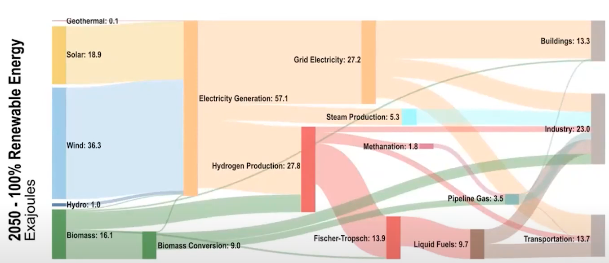
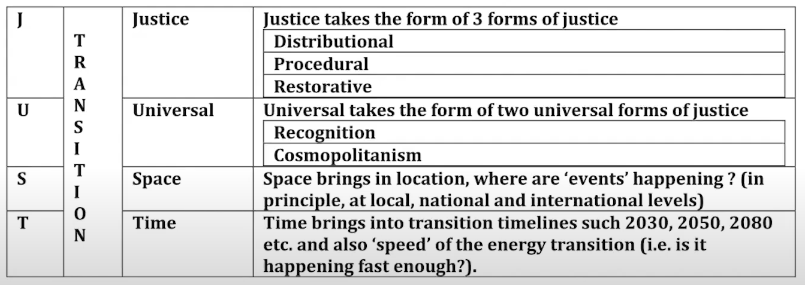

# Cities

## Why Cities?

Intersection of Tech, Policies, Markets

Urban population has the major concentration of populations, and it is continuously increasing

## ‘The Balance Sheet’

Energy Consumption vs **Sustainable** Energy Production

### Key Sources of Consumption

- Transport
  - Cars
  - Planes
  - Freight
- AC
  - Heating
  - Cooling
- Lighting
- Electronics
- Food
  - Production
  - Transporting
  - Maintaining
- Manufacturing

### Key sources of sustainable production

- Wind
- Solar
  - photovoltaics
  - thermal
  - Biomass
- Hydroelectric
- Wave
- Tide
- Geothermal
- Nuclear (unclear whether nuclear counts as sustainable)

## Key Concepts

### Energy

- Quantitative property of doing work
- Conserved: can neither be created/destroyed
- Transformation: Light, heat, mass; $E=mc^2$
- Forms: Kinetic, Chemical, potential, mechanical (elastic), biological
- Units: kWh, Joules, calories, terms
  - Fossil fuels: Barrels, short tons, cubic feet

### Power

- Quantitative rate of doing work
- Energy per time
- Units: Watts, ergs, horsepower, lumen*

## Emissions Intensity

- Unit: mtcde: metric-ton carbon-dioxide equivalent
  - There are many forms of greenhouse gases, so we usually use CO2 equivalent
  - by gas, per unit of energy, per activity, per GDP, by region

## Energy Consumption

Usually shown using Sankey diagrams

Rejected energy is the by-product of energy generation that is not used (energy lost due to heat loss, air resistance, etc)

## Deep Decarbonization

Goal of getting to net-zero emissions by 2050

## Aspects of Urban Energy Planning

- Technological Implementation
- Geography
- Politics
- Land use & built environment

## Key Issues with Monitoring

- City, urban definitions
- Types of emissions: upstream (import), downstream (exports & waste), goods & services
- Measurement of affluence: Wealth vs Income

## Just Energy Transition

Environmental equity: reducing risk for all communities; distribution and effects os environmental problems and policies and processes to reduce differences in who bears environmental risks

Climate Justice

- Historical responsibility
- Inter-generational equity
- Disproportionate causes and burdens
- Grassroots movements
- Legal actions on climate change

Transformative justice

- Practices designed to create change in social systems

Energy justice

- Disproportionate access, harms, burdens
  - Unions & worker
  - Fossil-fuel dominated communities
    - Create a lot of jobs
  - Frontline/EJ communities 

|                |                                                              |
| -------------- | ------------------------------------------------------------ |
| Distributional | equitable distribution of burdens & benefits of energy and environmental decisions |
| Procedural     | Right to fair process for different stakeholders to take part equitably in decision-making process |
| Restorative    | Repair harm done to individuals, instead of focusing upon punishing the offender |
| Recognition    | Recognizing that parts of society might suffer as result of energy & environmental decisions, and identifying individuals and groups who might be impacted by such decisions |
| Cosmopolitan   | Reinforces all of the above, but states that “above forms of justice must apply universally to al human beings” |

### Just Framework

## Importance of land uses and land cover

- Total sequestration potential is uncertain
- Natural/existing ecosystems are more efficient than restored ones
- Policy mechanisms may be wildly different for different ecosystems
  - Farm preservation vs biodiversity protections
  - Carbon storage may fit into different regimes

Controlling the spatial expansion of cities is crucial

---

https://www.youtube.com/watch?v=EWFGkZ64ng4&list=PLUl4u3cNGP63SEOB1q95TFs0hwyf1d7BG&index=5
