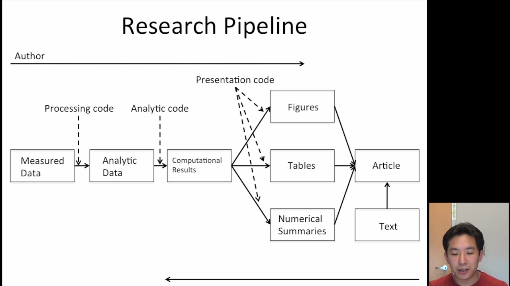

The fundamental problem of data analysis is that $\not \exists$ notation system for communicating results of data analysis.

### Replication

The standard for strengthening scientific evidence is replication of findings and conducting studies with **independent** investigators, data, analytical methods, laboratories, instruments

However, replication is not always possible, as it is expensive, time-consuming, unique

Hence, we aim for reproducibility, which is a compromise between replication and doing nothing

### Reproducibility

#### Requirements

- Analytic data
- Analytic code
- Documentation of code and data
- Standard means of distribution

#### What we get

- Transparency
- Availability of data, software, methods
- Improved transfer of knowledge

However, it does not necessarily ensure correctness of analysis. Reproducible analysis may still be wrong

#### Problems

> so some of the problems I have with reproducibility 
>
> are, so the premise of reproducible research is that, 
>
> you know, with all the data and all the 
>
> code available to people, people can check each other. 
>
> You can kind of validate someone else's analysis, and the whole 
>
> system would kind of be self correcting in the long run. 
>
> Alright. 
>
> So one problem which I don't see here is 
>
> that the long run sometimes is too long and then 
>
> in terms of the context of the problems that 
>
> you're dealing with I think reproducibility addresses what I call 
>
> most, the kind of downstream aspects of scientific dissemination. 
>
> Now, I'll be more specific about what I mean by that. 
>
> Meaning that it kind of only happens post publication [INAUDIBLE]. 
>
> And another key thing which is important in my area, maybe. 
>
> I mean, particularly in my area, is that, [COUGH] 
>
> the ideas of reproducibility kind of assume that everyone 
>
> plays by the same rules, and everyone wants to 
>
> achieve the same goals, which is definitely not tru

#### Challenges

- Authors must take effort to publish results on the web (resources such as web servers may not be available)
- Readers must download the data and results individually and combine everything on their own
- Readers may not have the same resource as authors

## Replication vs Reproducibility

|                     | Replication      | Reproducibility |
| ------------------- | ---------------- | --------------- |
| Ensures validity of | Scientific claim | Data analysis   |

## Research Pipeline

## Literate (Statistical) Programming

An article is a stream of text and code

Analysis code is divided into text and ‘code chunks’

Code chunks load data and computes results

Presentation code formats results

Literate program is

- weaved to human-readable documents
- tangled to machine-readable documents

idk

- Do not save output and import them as images
- Save data in non-proprietary formats (csv, sqlite)

#### Requires

- Documentation lang (human readable)
  for eg: latex, markdown
- Programming lang (machine readable)
  for eg: python, r

`knitr` incorporates both of these through Rmarkdown 

#### Pros

- Text and code in one place, logical order
- Data and results update automatically to external changes

#### Cons

- Hard for author to work, as everything is one place
- Can slow down processing of documents

## Steps in data analysis

1. Define question in the most simple, atomic, concrete manner
2. Define ideal dataset
3. Determine data access
4. Obtain data
5. Data Cleaning
6. EDA
7. Statistical Prediction/Modelling
8. Interpreting results
9. Challenge results
10. Synthesize results
11. Create reproducible code
