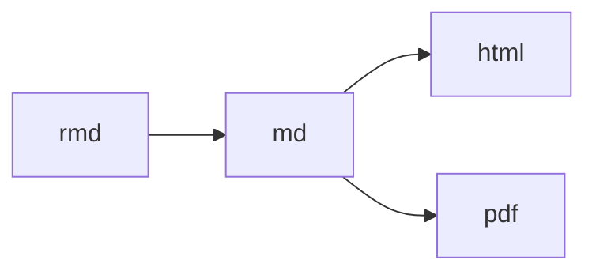

# Coding Standards

- Always write code in human-readable text files, this ensures everyone will be access your code
- Indent code
- Limit width of code to 80 char
- Limit length of individual functions to performing one particular task

# Markdown


# RMarkdown

## Library to pretty print tables

```R
library(xtrable)
xt <- xtable(summary(fit))
print(xt, type="html")
```

## Default Settings

````R
```{r setoptions, echo=FALSE}
# do not display this default settings block
opts_chunk$set(
  echo=FALSE, # hide code of all code chunks
  results="hide", # hide outputs of all code chunks
)
```
````

## Caching

````R
```{r setoptions, cache = TRUE}
my code blah blah()
```
````

# `knitr`


