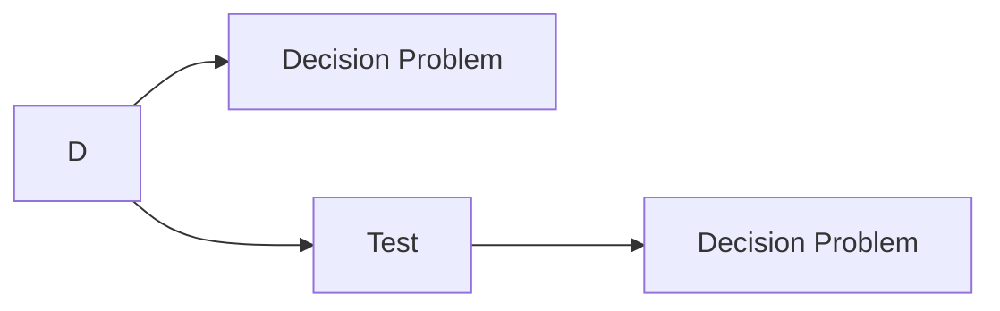
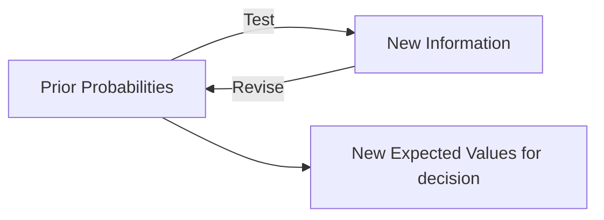

# Value of Information

Decision to collect information is a decision to insert flexibility into development strategy, as the logic behind “test” is so that you may change you decision once you have test results.

Value of information = Value of this flexibility

## Information Gathering

Inserting an test stage before decision problems as possible choice reduces uncertainty before commitment to a system design/roll-out

## Tests

Any decision problem has initial uncertainties = “prior probabilities”, such as those concerning

- Cost of production
- Likelihood of sales

Tests help get information on these issues, for eg

- Running a test plant
- Carrying out market analysis

### Consequence

EV after test $\ge$ EV without test

## EVSI

Expected value of Sample information

Helps understand if test is significantly worth it?
$$
\begin{aligned}
\text{Expected value of Info}
&= EV_\text{after test} - EV_\text{without test} \\
&= \sum p_k \cdot \text{EV}(D_k^*) \  - \ \text{EV}(D^*)
\end{aligned}
$$

- $D^*$ is the current best design
- $D_k^*$ is the best design of test $k$

Test results will not prove what will happen. They are samples, and hence false positives/negatives possible.

Tests merely just update the prior estimates of probabilities using Bayes’ Therom. Each test result implies a different value of project, each with a different probability. This EVSI is complicated

Bayes’ theorem is impractical for systems design, as elements of factor for updating the posterior probability are unavailable

1. Full analysis is complicated process with many possible outcomes
2. Involves many assumptions about what the probability of outcomes of the tests
3. Analysis maybe incorrect even if math is correct

## EVPI

Expected Value of Perfect information

Even though it is hypothetical & not perfect, it helps simplify analysis

Establish upper bound on value of test

Concept: Imagine a black box “Cassandra” machine which predicts exactly which event test result $E_j$ occurs. Therefore, the “best” possible decisions can be made. EV gain over the “no test” EV must be maximum possible, which is the desired upper limit on value of test

### Characteristics

1. Prior probability (occurrence of uncertain event) must equal probability (associated perfect test result)
2. For “perfect test”, the posterior probabilities are either 0/1; no doubt remains
3. Optimal choice generally obvious, once we “know” what will happen
4. EVPI can generally be written directly, without Bayes’ Theorem

## Is Test Worthwhile?

- If value is linear
  - if EVPI < cost of test -> Reject test
- Pragmatic rule of thumb
  - If cost > 50% EVPI -> Reject test
