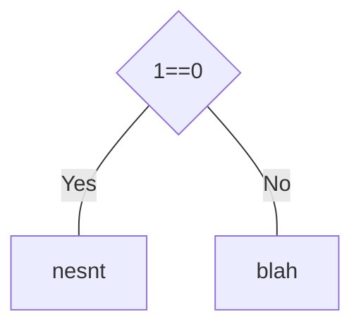
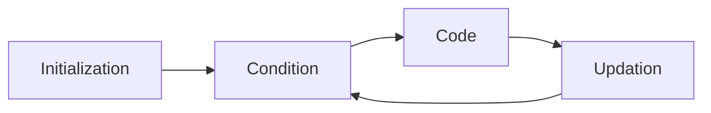

- 0/1 (bit)
- 8 bits = 1 byte
- 1024 bytes = 1KB

`print("hello")` $\to$ 0/1

Language translators

- Compilers ()
  C, C++, Pascal

- Interpretors ()
  Python, Javascript, 

- Python is dynamic

    ```python
    x = "hi"
    x = 304
    ```

- Static (compilation)

    ```c
    #include <stdio.h>
    // standard input output
    // header file
    // libraries
    
    int main()
    {
      // code
      return 0;
    }
    
    def my_func():
      print("hi")
    ```

## Tokens

- atomic unit of a code

- Key words

    ```c
    return
      void
    ```

- Identifiers

    ```
    int x = 3;
    ```

## Structure

```python
print("hi")
print("hello")
```

```c
#include <stdio.h>

void print_on_screen()
{
  printf("hi"); // ; = terminator
}

int main() // driver function of your program
{
  // code
  print_on_screen();

  int x = 4; // 
  
  return 0;
}
```

## Data Types

### Primitive

|           |                                                   |      |      |
| --------- | ------------------------------------------------- | ---- | ---- |
| `void`    | (nothing)                                         | 0    |      |
| `boolean` | True/False<br />true/false                        | 1    |      |
| `char`    | ‘H’                                               | 1    | %c   |
| `int`     | 34444                                             | 2    | %d   |
| `float`   | 334545.345534                                     | 4    | %f   |
| `double`  | 334545345534334545345534.334545345534334545345534 | 8    | %    |

### User-defined

(not in scope of current exam)

## Math Operators

$$
+
-
*
/
\%
$$

- `int`/`int` = `int`

- B
- ^
- Multiplication/Division (whichever comes first)
- Addition/Subtraction (whichever comes first)

### Type Casting

change in data type of a variable for a momentary purpose

implicit (automatic)

int/int $\to$ int

- 3/2 = 1.5
- 3/2 = 1

int/float $\to$ float

- larger data type

```c
int x=5;
float z = 5/(double) 5;
```

explicit(user-defined) type casting

```c
int x = -5;
int y = 2;

-5/2; // -2.5 -2
5/-2; // -2.5 -2

5/-2.0f // -2.5
```

### Relational Operators

$$
> ,
\ge ,
< , \le,
==,
\ne,
!=
$$

- $=$ and $==$
    - assignment
    - equality operator

```c
const float pi = 3.14;
```

## Logical Operators

$$
! \\
\&\& \\
||
$$

$$
[!0 \&\& 1 || 3\&\&!1]
$$

```c
int main()
{
  int x;
  
  // take input from user
  scanf("%d", &x); // storing the value in the address of x
  
  printf("%d", x);
  
  
  return 0;
}

// x = 5
```

```c
int main()
{
  int x = 5;
  
  printf("%d", ++x); // 6
  printf("%d", x); // 6
  
  return 0;
}
```

## if … else

conditional statement

branching



```c
int x = 4;
if (x == 5)
{
  printf("Yes");
  printf("hi");
}

print("outside everything");
```

```
outside everything
```

```c
if(x>10)
{
 if(y < 10) 
 {
   printf("hi");
 }
}
else
{
  printf("hi");
}
```

```c
if(x>10 && y<10)
{
   printf("hi");
}
else
{
  printf("hi");
}
```

```python
elif
```

```
hi
outside everything
```

`for`, `if` and `else` go to the immediate next block

```python
x = 5
if x == 5:
  print("yes")
  print("block 1")
else:
  print("no")
  print("block 2")
```

## Code Block

group of code

## Ternary Operator

cooler way of doing if else

```c
(y<10)?(x=10):(x=0)
```

## Switch

```c
switch(s):
{
  case 1: something; break;
  case 2: something; break;
  default: something;
}

switch(s):
{
  case 'a': something; break;
  case 'b': something; break;
  default: something;
}
```

## Loops

- `while`
    - Entry-controlled loop
- `do...while`
    - Exit-controlled loops
- `for`

### Components

- Initialization
    - $n$
    - $i$
- Loop condition checked
- Code to execute is run
- Updation occurs



```c
/*
int n = 10;
int i = 1; // comesntenret

for (; ; )
{
 
  if(i>n)
    break;
  
  // code
  
  i++;
}
*/

for (int i = 1, n=10; i<=n; i++)
{

}

int i = 1, n=10;
for (; i<=n; i++)
{
  ;// nothing happens
}

printf("%d", i); 11
```

```c
for (int i = 1, n=10; i<=n; i++)
  printf("%d\n", i);
```

```
1
2
...
9
10
```

```c
for (int i = 1, n=10; i<=n; i++)
  printf("%d\n", i);
  printf("%d\n", i);

for (int i = 1, n=10; i<=n; i++)
{
  printf("%d\n", i);
}
printf("%d\n", i);

// here
```

```
1
2
3
...
9
10
11
```

```c
for (int i = 1, n=10; i<=n; i++)
{
  printf("%d\n", i);
  printf("%d\n", i);
}

// here
```

```
1
1
2
2
...
9
9
10
10
```

```c
int i, n;
for (i = 1, n=10; i<=n; i++);
  printf("%d\n", i);

int i, n;
for (i = 1, n=10; i<=n; i++)
{
 ; 
}
  
printf("%d\n", i);
```

```
11
```

```c
int i = 1, n = 10;

// curly brace
// run 10 times
while(i<=n)
{
 print("hi");
 i++;
}
```

```c
int i = 1, n = 10;
// curly brace

do
{
  // code
  i++;
} while (i<n); // has semi-colon
```

```python
x=5, y=10
```

### Pyramid example

```
*
*
*
*
```

```c
#include <stdio.h>

int main()
{
  int n = 4; // no of lines
  for (int i=1; i<=n; i++) // run the loop 4 times
  {
    printf("*\n");
  }
  
  return 0;
}
```

```
*
**
***
****
```

```c
#include <stdio.h>

int main()
{
  printf("*\n");
    printf("**\n");
    printf("***\n");
    printf("****\n");
  
  return 0;
}
```

1. DUMB
2. Not scalable
3. Not elegant

Hence, we need loops (iterative statements)

```c
#include <iostream.h>

int main()
{
  for (int i=1; i<=n; i++)
  {
    for (int j=1; j<=i; j++)
    {
      printf("*");
    }
    
    printf("\n");
  }
  return 0;
}
```

## jump statements

- break
    - exits the current loop
- continue
    - skips the below code of the current iteration
    - goes to the update segment of (for)loop
    - in other loops, it goes to condition
    - then continues as usual

```c
for (int i=1; i<=5; i++)
{
  if(i==3)
  {
    break;
    printf("%d\n", i);
  }
  
   printf("%d\n", i);
}

// come here
```

```
1
2
```

```c
for (int i=1; i<=5; i++)
{
  if(i==3)
  {
    continue;
    printf("%d\n", i);
  }
  
   printf("%d\n", i);
}
```

```
1
2
4
5
```

```c
int i=1;
while(i<=5)
{
  if(i==3)
  {
    continue;
    printf("%d\n", i);
  }
  
   printf("%d\n", i);
  
  i++;
}
```

```
1
2
(infinite loop)
```

```c
int i=1;
do
{
  if(i==3)
  {
    continue;
    printf("%d\n", i);
  }
  
   printf("%d\n", i);
  
  i++;
} while(i<=5); // has terminator
```

```
1
2
(infinite loop)
```

## IDK

```c
int n = 4; // no of lines
int j = 1;
for (int i=1; i<=n; i++) // controls no of lines
{
  printf("%d", j);
  j++;

}
```

```
1
2
3
4
```

```c
int n = 4; // no of lines

for (int i=1; i<=n; i++) // controls no of lines
{
  int j = 1;
  printf("%d", j);
  j++;
}
```

```
1
1
1
1
```

## Variables

```c
int x; // declaration
x=5; // initialization

int x = 5; // combined
```

## Arrays

linear data structure

primitive data structure

arrays are 0-indexed

- index start from 0

it is non-mutable (non-changeable)

statically-allocated

size of array is fixed

array is similar to tuple in python, but only same data type

collection of elements of the ==same== data type

### $\ne$ List

In python, list is a collection of elements of the same/different type

```python
list = [2, "hi", 3, 4, 5]
```

### Declaration/Creation

```c
int array[10];

char array[10];
float array[10];
double array[10];
const int length = 10;
int array[length];
```

### Initialization

```c
array[0]= 1;
array[1] = 2;

int num;
scanf("%d", &num);
array[2] = num;
scanf("%d", &num);
array[3] = num;
```

```c
for(int i=0; i<10; i++)
{
  int num;
  scanf("%d", &num);
  array[i] = num;
}

// no error
```

```c
for(int i=0; i<10; i++)
{
  scanf("%d", array[i]); // no &
}

// no error
```

```c
for(int i=1; i<=9; i++)
{
  scanf("%d", &num);
  array[i] = num;
}

// no error
```

### Display

```c
for(int i=0; i<10; i++)
{
  printf("%d\n", array[i]);
}
```

### example

```c
#include <iostream.h>

int main()
{
  int a[100]; // assuming a random number
  
  
  // input no of elements
  int n;
  printf("Please enter no of elements that you are goint to input");
  scanf("%d", &n);
  
  // input the elements
  for(int i=0; i<n; i++)
  {
    printf("Enter number at index %d: ", i);
    scanf("%d", a[i]);
  }
  
  // display marks > 60
  for(int i=0; i<n; i++)
  {
    if(a[i] > 60)
      printf("%d", a[i]);
  }
  // or
  for(int i=0; i<n; i++)
  {
    int num = a[i];
    if(num > 60)
      printf("%d", num);
  }
  
  return 0;
}
```

## Pointer

a variable that stores address

==name of an array is a pointer to the first element of that array==
## Handrawn


