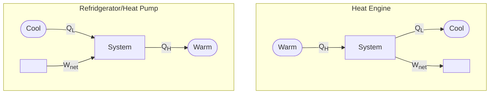

## Terms

| Term        | Meaning                    |                    Formula                     |
| ----------- | -------------------------- | :--------------------------------------------: |
| $\eta$      | Efficiency                 | $\frac {\text{Desired Output}}{\text{Input}}$ |
| COP         | Coefficient of Performance | $\frac {\text{Desired Output}}{\text{Input}}$ |
| $q$         | Calorific/Heating Value    |                  $\frac Q m$                   |
| Gravimetric | mass terms                 |                                                |

## Devices

| Device        | Purpose                                |                                                              |                                                              |                                                              |
| ------------- | -------------------------------------- | :----------------------------------------------------------: | :----------------------------------------------------------: | :----------------------------------------------------------: |
| Heat Engine   | - Heat $\to$ Work - cycle         | $\begin{align} \eta_{\small\rm{HE}} &= \frac{W_\rm{net, out}}{Q_\rm{H}} \\ &= 1 - \frac{Q_\rm{L}}{Q_\rm{H}} \end{align}$ |        $\eta_\rm{HE} < 1$ Kelvin-Plank Statement        | $\begin{align} \Delta U &= 0 \\ Q_\rm{net} &= W_\rm{net} \\ W_\rm{net, out} &= Q_\rm{in} - Q_\rm{out} \\ &= Q_\rm{H} - Q_\rm{L} \end{align}$ |
| Refridgerator | - maintain cool temp - Reverse HE | $\begin{align} \rm{COP_R} &= \frac{Q_\rm{L}}{Q_\rm{net, in}} \\ &= \frac{1}{ \frac{Q_\rm{H}}{Q_\rm{L}} - 1 } \end{align}$ |                   $\rm{COP_R}$ can be > 1                    |                                                              |
| Heat Pump     | - maintain warm temp - Reverse HE | $\begin{align} \rm{COP_{HP}} &= \frac{Q_\rm{H}}{W_\rm{net, in}} \\ &= \frac{1}{ 1 - \frac{Q_\rm{L}}{Q_\rm{H}} } \end{align}$ | $\begin{align} \rm{COP_{HP}} &= \rm{COP_{R}} + 1 \\
\rm{COP_{HP}} &> \rm{COP_{R}} \end{align}$ |                                                              |

## Carnot Cycle

For Heat Engine

Adiabatic means polytropic process with**out** heat transfer

| Transition | Characteristic                            |    Constant     |            Signs             |                             Work                             |
| :--------: | ----------------------------------------- | :-------------: | :--------------------------: | :----------------------------------------------------------: |
|   1 - 2    | Isothermal Expansion Heat Absorbed   |    $PV = c$     | $W_{12} > 0 \\ Q_\rm{H} > 0$ | $P_1 V_1 \ln|\frac{V_2|{V_1}} \\ P_2 V_2 \ln|\frac{P_1|{P_2}}$ |
|   2 - 3    | Adiabatic Expansion                       | $PV^\gamma = c$ |         $W_{23} > 0$         |               $\frac{P_3 V_3 - P_2 V_2}{1-n}$                |
|   3 - 4    | Isothermal Compression Heat Released |    $PV = c$     | $W_{34} < 0 \\ Q_\rm{L} < 0$ | $P_3 V_3 \ln|\frac{V_4|{V_3}} \\ P_4 V_4 \ln|\frac{P_3|{P_4}}$ |
|   4 - 1    | Adiabatic Compression                     | $PV^\gamma = c$ |         $W_{41} < 0$         |               $\frac{P_1 V_1 - P_4 V_4}{1-n}$                |

$$
\begin{align}
W_\rm{net, out} &= W_{12} + W_{23} + W_{34} + W_{41} \\
\eta
&= \frac{W_\rm{net, out}}{Q_\rm{H}} \\&= 1 - \frac {Q_\rm{L}}{Q_\rm{H}} \\&= 1 - \frac {T_L}{T_H}
\end{align}
$$

Make sure of the signs when calculating $W_\rm{net, out}$

## Reverse Carnot Cycle

For Refridgerator, Heat Pump

$Q_\rm{L} > 0, Q_\rm{H} < 0$

$$
\begin{align}
W_\rm{net, in} &= W_{12} + W_{23} + W_{34} + W_{41} \\
\rm{COP_R} &= \frac{Q_\rm{L}}{W_\rm{net, in}} \\
\rm{COP_{HP}} &= \frac{Q_\rm{H}}{W_\rm{net, in}}
\end{align}
$$

