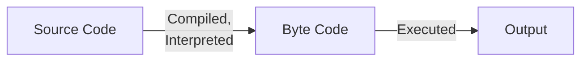
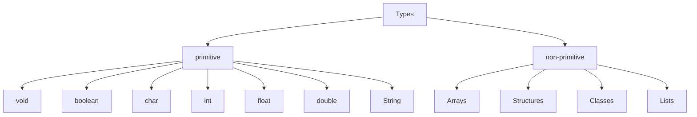

## Java Basics

4 bit precision - returns 4 bits for numbers by default

hexadecimal is small characters ~~A B~~ a b

JDK 16

`.java` is the file extension

java is case-sensitive

file name should be the name of the class containing the main function (TesterClass)

main method should always be `public static void main(String[] args)`

## Stages of Java Program



### Compilation

`javac file.java`

Program gets compiled and intrepreted to a .class file bytecode

Bytecode offers **platform independence**

### Execution

 `java file` (no extension)

### Compilation-Execution in one-go

If entire program is contained in a single class, then you just have to use
`java abc.java` (just a single command)

## Basic Program

```java
class Tester
{
  public static void main(String args[]) // String is a class in java
    // or (String ... args)
  {
    System.out.print("hello world"); // same line

    System.out.println("hello world"); // new line
  }
}
```

`print()` and `println()` belong to outstream of System class

## main()

to pass mutiple arguments, we can also use `main(String ... args)`

Optional keywords

- final = constant in c

- synchronized = for threading

- strictfp = strict floating point operations

## Errors

Runtime error: `NoSuchMethodError:main` when there is a problem inside main()
Eg: [ ] missing

## Data Types

Float ends with f: 34.342f

Double ends with d: 34.342d

double 0x443 (will print 104, cuz 443 is taken as hex) (no need of d at the end)



### Table (from slides)

| Data Type | Default Value     | Memory (bytes) |
| --------- | ----------------- | -------------- |
| boolean   | false             | 1 bit          |
| char      | \u0000            | 1              |
| int       | 0                 | 4              |
| float     | 0.0f              | 4              |
| double    | 0.0d              | 8              |
| String    | null (without "") | 0              |

## Control Statements

### if-else

same as c

```java
if (cond)
  statement;
else if (cond)
  statement;
else
  statement;
```

### switch

``` java
switch(var)
{
  case 1: 
    statement; 
    break;
  case 2: 
    statement;
    break;
  default: 
    statement;
}
```

### Loops

``` java
while(cond)
{
  statement;
}

do {
  statement;
} while (cond);

for(init, cond, upd)
  statement;
```

## Input

```java
import java.util.Scanner;

public class Tester
{
  public static void main(String[] args)
  {
    Scanner inp = new Scanner(System.in);
    // variable to access input stream
    
    int x = inp.nextInt();
  }
}

// scanner methods

//check
inp.hasNextLine();
inp.hasNextInt();
inp.hasNextFloat();
inp.hasNextDouble();

//input
String line = inp.nextLine();
String entireThing = inp.next();
int i = inp.nextInt();
float f = inp.nextFloat();
double d = inp.nextDouble();
```

## Operators

### Arithmetic

$+ - * / \%$

### Unary

$+ \quad - \quad ++x \quad y-- \quad !$

### Conditional

&&

||

?: ternary

```java
var = cond?tVal:fVal;

int x = (x<5)?5:0;
```

### Bitwise/Bitshift

| Operator |         Name         |        Function        | Example |
| :------: | :------------------: | :--------------------: | ------- |
|    ~     |  Bitwise Complement  |                        | y = ~x  |
|    <<    |      left shift      |    Multiply by 2^n^    | x<<2    |
|    >>    |     right shift      |     Divide by 2^n^     | x>>2    |
|   >>>    | unsigned right shift |     Divide by 2^n^     | x>>>3   |
|    &     |     Bitwise AND      | perform AND bit-by-bit | x&y     |
|    ^     | Bitwise exclusive OR | perform OR bit-by-bit  | x^y     |
|    \|    | Bitwise inclusive OR | perform OR bit-by-bit  | x\|y    |

## Type Casting

changing the data type of variable during runtime for a momentary purpose

``` java
Integer.parseInt(); // string to int
Integer.toString(); // int to string

Float.parseFloat();
Float.toString();
```

## Method Overloading/Overriding

Method Overloading: Multiple methods having the same name but different functionality
Static polymorphism, as compiler knows overloading is happening beforehand

Operator overloading: same operator symbol with different functionality
Static polymorphism, as compiler knows overloading is happening beforehand
eg: - is used for subtraction and also for negative numbers, % is used for mod and for percentages

Method Overriding: parent and child class with same function name, but different functionality
Dynamic polymorphism, as compiler does not know beforehand, and overriding occurs during run-time

For method overloading, the function signature/argument/parameter list of the methods should be differ in atleast one of the following ways

1. number of parameters
2. data type of parameters
3. order of data type of parameters

Two functions of the same name but different return type is **not** valid

``` java
int add(int, int);
Float add(int, int);
```
## Command Line Argument

An information that directly follows program's name on the command line when it is executed.

**Arguments are stored as strings** in the String args[] argument of the main().

Each argument should be separated by (space)

``` java
java filename 10 134 3 // command line argument
  
class filename
{
  public static void main(String args[])
  {
    for (int i = 0; i<args.length(); i++)
    {	
      int x = Integer.parseInt(args[i]);
    }
  }
}
```

## Keywords

### `static`

only one instance

#### variable

variable that acts as common property of all objects

gets memory only once in the class area at time of class loading

`classname.var`, `object.var`

#### method

belongs to class itself, not the object of the class

This is why main() is declared as static: to avoid the need for calling it through an object

==only static methods can change the value of a static variable==

they cannot change values of non-static variables

`classname.method()`

#### block

gets executed before main

useful to initialize static data members

#### class

only a nested class can be static

methods inside it will also be static

``` java
class Student
{
  static int x = 5;
  public static void change()
  {
    x = 15;
  }
  static class Nested
  {
    public void nest() // static because it is inside a static class
    {
      x = 2;
    }
  }
  
}
class Tester
{
  static
  {
    System.out.println("Static block executed");
  }
  public static void main(String args[])
  {
    Student s = new Student();
		System.out.println(s.x); // 5
    
    Student.change();
 		System.out.println(s.x); // 10
    
    Student.Nested n = new Student.Nested();
  }
}
```

### `final`

#### variable

value is fixed

#### method

cannot override it

method overriding is when parent and subclass' methods have the same name

#### class

cannot extend/inherit it

``` java
final class Student
{
  final int x = 5;
  public static void change()
  {
    x = 15; // compiler error
  }
  final void override()
  {
    System.out.println("hello"); 
  }
}

class Life extends Student // compiler error
{
  final void override()
  {
    System.out.println("hi"); // compiler error
  }
}

class Tester
{
  public static void main(String args[])
  {
    Student s = new Student();
		System.out.println(s.x); // 5
    
    Student.change();
 		System.out.println(s.x); // 10
    
    Student.Nested n = new Student.Nested();
  }
}
```

## Packages

is a collection of classes

similar to (not same as) header files in C

`java.lang` is the default package in java; it is imported by default

### Importing

`import packagename.*`, `import packagename.ClassName`

can contain

- classes
- subpackages
- interfaces

(Libraries in C/C++ can only contain functions)

### Uses

1. prevent naming conflicts
   allows to use the same class name multiple times in different packages
2. simplify modular usage of classes
3. control access using access specifier
4. data encapsulation/hiding

### Types

1. built-in
   1. java.lang
      default package, primitive data types, math operations
   2. java.io
      read/write from files/device
   3. java.util
      Data structures
   4. java.applet
   5. `java.awt`
   6. `java.swing`
   6. java.net
2. user-defined
   1. creating
      1. create a directory with name of package
      2. create `MyClass.java` in directory with the the first statement as `package packagename`
   2. compiling
      1. `javac MyClass.java`
      2. `javac -d . MyClass.java`
   3. using
      the main file should be inside the package folder
      1. `import myPackage1.MyClass`

## Accessor Method

methods for accessing/getting data

should always return data; hence return type shouldn't be void; display() isn't exactly an accessor

`public returnType getData()`

## Mutator Method

Methods for changing/setting data

should be void

`public void setData(parameter)`

## Math Class

it is inbuilt in `java.lang` itself

``` java
double y = Math.sqrt(x),
	t =  Math.pow(x, n);
```