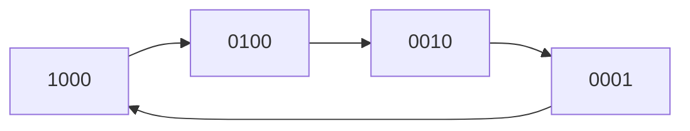
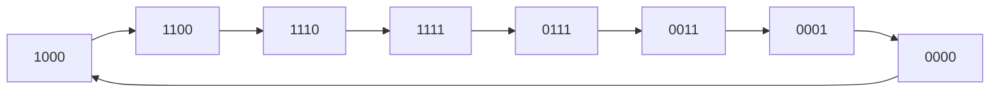

## Registers

binary storage device consisting of group of flipflops

- each flipflop in a register can store 1 bit binary
- for $n$ bits, we need $n$ flipflops

the frequency of the clocks are what determine the speed

this is what we talk about in ‘over-clocking’

## 4 bit register using D-FF

## Register w/ $\parallel$ load control

### Load = 0

$Q$ is fed back to the D FF

@ every clock pulse, output is re-written

### Load = 1

sets/overwrites the previous value with new inputted value

## Shift Register

a register capable of shifting binary information from 1 flip flop to another

$$
\fbox 1
\fbox 0
\fbox 1

$$

Input and output can be serial/parallel

1. SISO
2. SIPO
3. PISO
4. PIPO

### Shift-Right

| clk | i/p | $Q_2$ | $Q_1$ | $Q_0$ |
| --- | --- | ----- | ----- | ----- |
| 0   | 0   | 0     | 0     | 0     |
| 1   | 0   | 0     | 0     | 0     |
| 2   | 1   | 1     | 0     | 0     |
| 3   | 1   | 1     | 1     | 0     |
| 4   | -   | 0     | 1     | 1     |
| 5   | -   | 0     | 0     | 1     |

## Other Types

### Bidirectional Shift

### Rotate Shift

#### Right

#### Left

## Universal Shift Register

contains

- features
  - clock pulse
  - reset/clear
  - four 4 x 1 mux for modes
    0. No change
    1. Shift Left
    2. Shift Right
    3. Parallel load
  - four d flipflops
- inputs
  - serial input for shift-left
  - serial input for shift-right

## Ring/Shift-Register Counter

- circular shift-register
- mod(n) counter

in addition to regular SISO register 

- the last FF output will be the first FF input
- only one FF is set (value = 1) at a time
- all others are cleared (value = 0)

| clk pulse         | i/p | $Q_3$ | $Q_2$ | $Q_1$ | $Q_0$ |
| ----------------- | --- | ----- | ----- | ----- | ----- |
| 0 (initial stage) | -   | 1     | 0     | 0     | 0     |
| 1                 | 0   | 0     | 1     | 0     | 0     |
| 2                 | 0   | 0     | 0     | 1     | 0     |
| 3                 | 0   | 0     | 0     | 0     | 1     |
| 4                 | 1   | 1     | 0     | 0     | 0     |

if $n =$ no of flipflops

- the no of distinguished states = mod(ring counter) = $n$
- to achieve a cycle, input is required $n$ times

### Ring Counter using decoder

1. one 2 bit counter
2. one $2 \times 4$ decoder
3. four AND gates

## Johnson Counter

other names

- Twisted Ring counter
- Switched Ring Tail counter
- mod(2n) counter

same as ring counter, but

- first i/p $= Q'_0$
- any no of 0s/1s is possible

if $n =$ no of flipflops,

- no of states = $2n$
- 

| clk pulse | i/p | $Q_3$ | $Q_2$ | $Q_1$ | $Q_0$ |
| --------- | --- | ----- | ----- | ----- | ----- |
| 0         | -   | 0     | 0     | 0     | 0     |
| 1         | 1   | 1     | 0     | 0     | 0     |
| 2         | 1   | 1     | 1     | 0     | 0     |
| 3         | 1   | 1     | 1     | 1     | 0     |
| 4         | 1   | 1     | 1     | 1     | 1     |
| 5         | 0   | 0     | 1     | 1     | 1     |
| 6         | 0   | 0     | 0     | 1     | 1     |
| 7         | 0   | 0     | 0     | 0     | 1     |
| 8         | 0   | 0     | 0     | 0     | 0     |

## Diagrams

