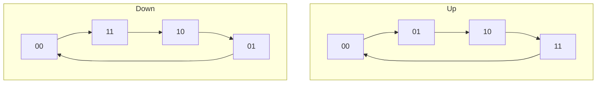
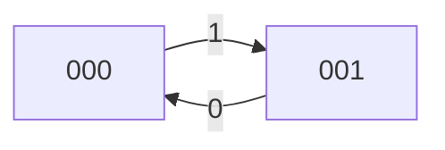
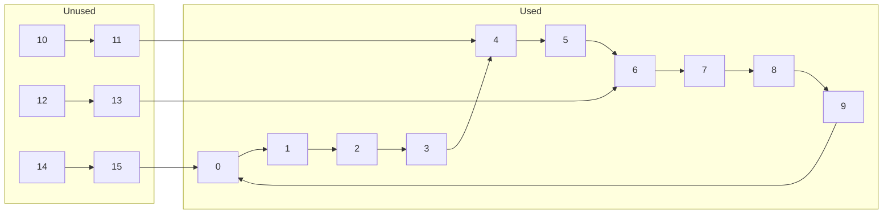
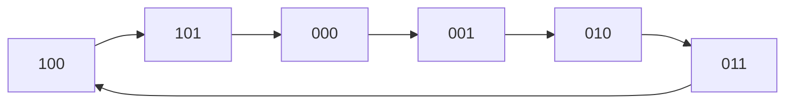
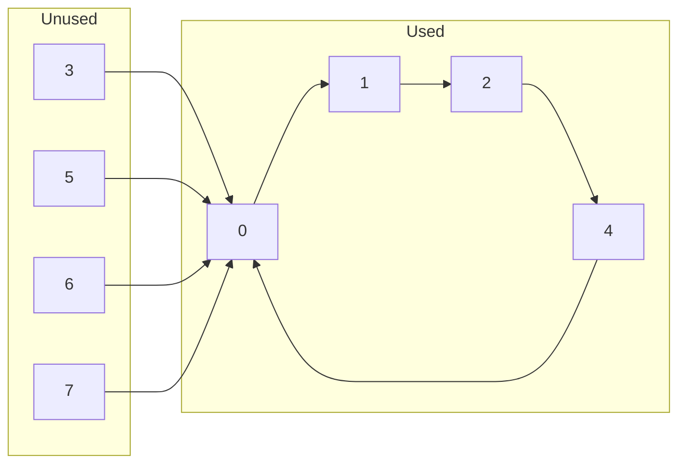

## Counter

is a register that goes through a prescribed *sequence* of states, upon the application of clock pulse

mod of a counter = no of states

Features

1. active low clock
2. active low reset
3. FF: JK/T

### Binary Counter

follows a binary counting sequence (normal without any zigzag)

| bits | no of FF | counting possibility | no of states | counter name |
| ---- | -------- | -------------------- | ------------ | ------------ |
| $n$  | $n$      | $0 \to 2^{n-1}$      | $2^n$        | $mod(2^n)$   |
| 2    | 2        | $0 \to 3$            | $4$          | mod 4        |
| 3    | 3        | $0 \to 7$            | $8$          | mod 8        |

$mod(N)$ counter that divides input frequency by $n$ is called as ‘divided-by-$n$’ counter

## Types

### Counting method

1. up-counter $(0 \to n)$
2. down-counter $(n \to 0)$

### Types

|                                                            | Asynchoronous | Synchoronous |
| ---------------------------------------------------------- | ------------- | ------------ |
| clk pulse for flipflops                                    | different     | same         |
| inputs                                                     | on            |              |
| Synonym                                                    | Ripple        |              |
| steps for design                                           | directly      | multiple     |
| non-binary counter possible? zigzag - (0, 5, 6, 3, 7) | N             | Y            |

## 2-bit ripple w/ neg trigger

ripple means asynchoronous

storeable values $= 0, 1, 2, 3$

$c_1 = Q_0$

### upcounter

| clk              | $A_1$ | $A_0$ |
| ---------------- | ----- | ----- |
| 0 (initial cond) | 0     | 0     |
| 1                | 0     | 1     |
| 2                | 1     | 0     |
| 3                | 1     | 1     |
| 4                | 0     | 0     |

### down counter

| clk              | $A_1$ | $A_0$ |
| ---------------- | ----- | ----- |
| 0 (initial cond) | 0     | 0     |
| 1                | 1     | 1     |
| 2                | 1     | 0     |
| 3                | 0     | 1     |
| 4                | 0     | 0     |

When m = 0, the circuit acts as an upcounter; m = 1 down counter??????????

## IDK

## For 2nd FF

| counter | Trigger | clk          |                                          |
| ------- | ------- | ------------ | ---------------------------------------- |
| up      | Neg     | $Q$          |                                          |
| up      | Pos     | $Q'$         |                                          |
| down    | Neg     | $Q'$         |                                          |
| down    | Pos     | $Q$          |                                          |
| up/down | Neg     | $M \odot Q$  | M = 1 (up) M = 0 (down)             |
| up/down | Pos     | $M \oplus Q$ | M = 1 (up) M = 0 (down) (same) |

## 4-bit ripple w/ neg trigger

### upcounter

| clk              | $A_3$ | $A_2$ | $A_1$ | $A_0$ |
| ---------------- | ----- | ----- | ----- | ----- |
| 0 (initial cond) | 0     | 0     | 0     | 0     |
| 1                | 0     | 0     | 0     | 1     |
| 2                | 0     | 0     | 1     | 0     |
| 3                | 0     | 0     | 1     | 1     |
| …                |       |       |       |       |
| 15               | 1     | 1     | 1     | 1     |
| 16               | 0     | 0     | 0     | 0     |

## BCD Ripple Counter

also called as decade

requires

- 4 FF
- NAND gate
- OR gate

| clk              | $A_3$ | $A_2$ | $A_1$ | $A_0$ |
| ---------------- | ----- | ----- | ----- | ----- |
| 0 (initial cond) | 0     | 0     | 0     | 0     |
| 1                | 0     | 0     | 0     | 1     |
| 2                | 0     | 0     | 1     | 0     |
| 3                | 0     | 0     | 1     | 1     |
| …                |       |       |       |       |
| 9                | 1     | 0     | 1     | 0     |
| 10               | 0     | 0     | 0     | 0     |
| …                | X     | X     | X     | X     |

## 4 decade counter

also called as 4 digit BCD counter

mod 10 counter

contains four BCD counters

## Custom mod counters

not all states are used

1. Find no of FF
   the required no of FF is the ***smallest*** $n$ that satisfies
   $N \le 2^n$, where
   - $N =$ no of states
   - $n =$ no of FF
2. Write the counting sequence of the counter
3. Draw the truth table
4. If necessary, find the minimal expression for *reset* condition, using KMAP

### Design of mod6 asynchoronous counter

## Cascading of Ripple Counter

If we have 2 counters mod M and mod N,
then the resulting cascaded ripple counter will be mod(MxN)

The MSB of the first(left) counter is connected to the clock of the second (right) counter

## Synchoronous Counter

### Design

1. identify the no of FF

2. counting sequence and state diagram

3. choice of FF, excitation table

4. minimal expression for excitation (KMAP)
   
   1. kmap is drawn for J,K or T wrt the corresponding Present state variables

5. Logic Diagram

### 3 Bit upcounter

### 3 Bit downcounter

| $Q_3(t)$ | $Q_2(t)$ | $Q_1(t)$ | $Q_3(t+1)$ | $Q_2(t+1)$ | $Q_1(t+1)$ | J3  | K3  | J2  | K2  | J1  | K1  |
| -------- | -------- | -------- | ---------- | ---------- | ---------- | --- | --- | --- | --- | --- | --- |
| 0        | 0        | 0        | 1          | 1          | 1          | 1   | X   | 1   | X   | 1   | X   |
| 1        | 1        | 1        | 1          | 1          | 0          | X   | 0   | X   | 0   | X   | 1   |
| 1        | 1        | 0        | 1          |            |            | X   | 0   | X   | 1   | 1   | X   |
| 1        | 0        | 1        | 1          |            |            | X   | 0   | 0   | X   | X   | 1   |
| 1        | 0        | 0        | 0          |            |            | X   | 1   | 1   | X   | 1   | X   |
| 0        | 1        | 1        | 0          |            |            | 0   | X   | X   | 0   | X   | 1   |
| 0        | 1        | 0        | 0          |            |            | 0   | X   | X   | 1   | 1   | X   |
| 0        | 0        | 1        | 0          |            |            | 0   | X   | 0   | X   | X   | 1   |

| PS $Q_3 Q_2 Q_1$ | NS $Q_3 Q_2 Q_1$ | $J_3$ | $K_3$ | $J_2$ | $K_2$ | $J_1$ | $K_1$ |
|:---------------------:|:---------------------:| ----- | ----- | ----- | ----- | ----- | ----- |
| 000                   | 111                   |       |       |       |       |       |       |
| 111                   | 110                   |       |       |       |       |       |       |
| 110                   | 101                   |       |       |       |       |       |       |
| 101                   | 100                   |       |       |       |       |       |       |
| 100                   | 011                   |       |       |       |       |       |       |
| 011                   | 010                   |       |       |       |       |       |       |
| 010                   | 001                   |       |       |       |       |       |       |
| 001                   | 000                   |       |       |       |       |       |       |

$$
\begin{align}
J_1 &= ? &
K_1 &= ? \\
J_2 &= ? &
K_2 &= ? \\
J_3 &= Q_2' Q_1' &
K_3 &= Q_2' Q_1'
\end{align}
$$

### up/down

- $m = 0 \to$ downcounter
- $m=1 \to$ upcounter

| PS $Q_3 Q_2 Q_1$ | $m$ | NS $Q_3 Q_2 Q_1$ | $J_3$ | $K_3$ | $J_2$ | $K_2$ | $J_1$ | $K_1$ |
|:---------------------:|:---:|:---------------------:|:-----:|:-----:|:-----:|:-----:|:-----:|:-----:|
| 000                   | 0   | 111                   | 1     | X     | 1     | X     | 1     | X     |
| 000                   | 1   | 001                   | 0     | X     | 0     | X     | 1     | X     |
| 001                   | 0   | 000                   | 0     | X     | 0     | X     | X     | 1     |
| 001                   | 1   | 010                   | 0     | X     | 1     | X     | X     | 1     |
| 010                   | 0   | 010                   | 0     | X     | X     | 1     | 1     | X     |
| 010                   | 1   | 011                   | 0     | X     | X     | 0     | 1     | X     |
| 011                   | 0   | 010                   | 0     | X     | X     | 0     | X     | 1     |
| 011                   | 1   | 100                   | 1     | X     | X     | 1     | X     | 1     |
| 100                   | 0   | 011                   | X     | 1     | 1     | X     | 1     | X     |
| 100                   | 1   | 101                   | X     | 0     | 0     | X     | 1     | X     |
| 101                   | 0   | 100                   | X     | 0     | 0     | X     | X     | 1     |
| 101                   | 1   | 110                   | X     | 0     | 1     | X     | X     | 1     |
| 110                   | 0   | 101                   | X     | 0     | X     | 1     | 1     | X     |
| 110                   | 1   | 111                   | X     | 0     | X     | 0     | 1     | X     |
| 111                   | 0   | 110                   | X     | 0     | X     | 0     | X     | 1     |
| 111                   | 1   | 000                   | X     | 1     | X     | 1     | X     | 1     |

4 variable KMAP

$$
\begin{align}
J_1 &= 1 &
K_1 &= 1 \\
J_2 &= Q_1 \odot M &
K_2 &= Q_1 \odot M \\
J_3 &= Q_2 \odot Q_1 \odot  m &
K_3 &= Q_2 \odot Q_1 \odot  m \\\end{align}
$$

### BCD upcounter

| PS $Q_4 Q_3 Q_2 Q_1$ | NS $Q_4 Q_3 Q_2 Q_1$ | $J_4$ | $K_4$ | $J_3$ | $K_3$ | $J_2$ | $K_2$ | $J_1$ | $K_1$ |
|:-------------------------:|:-------------------------:| ----- | ----- | ----- | ----- | ----- | ----- | ----- | ----- |
| 0000                      | 0001                      | 0     | X     | 0     | X     | 0     | X     | 1     | X     |
| 0001                      | 0010                      | 0     | X     | 0     | X     | 1     | X     | X     | 1     |
| 0010                      | 0011                      | 0     | X     | 0     | X     | X     | 0     | 1     | X     |
| 0011                      | 0100                      | 0     | X     | 1     | X     | X     | 1     | X     | 1     |
| 0100                      | 0101                      | 0     | X     | X     | 0     | 0     | X     | 1     | X     |
| 0101                      | 0110                      | 0     | X     | X     | 0     | 1     | X     | X     | 1     |
| 0110                      | 0111                      | 0     | X     | X     | 0     | X     | 0     | 1     | X     |
| 0111                      | 1000                      | 1     | X     | X     | 1     | X     | 1     | X     | 1     |
| 1000                      | 1001                      | X     | 0     | 0     | X     | 0     | X     | 1     | X     |
| 1001                      | 0000                      | X     | 1     | 0     | X     | 0     | X     | X     | 1     |
| 1010                      | -                         |       |       |       |       |       |       |       |       |
| 1011                      | -                         |       |       |       |       |       |       |       |       |
| 1100                      | -                         |       |       |       |       |       |       |       |       |
| 1101                      | -                         |       |       |       |       |       |       |       |       |
| 1110                      | -                         |       |       |       |       |       |       |       |       |
| 1111                      | -                         |       |       |       |       |       |       |       |       |

10-15 are unused states

$$
\begin{align}
J_1 &= 1 &
K_1 &= 1 \\
J_2 &= Q_4' Q_1 &
K_2 &= Q_1 \\
J_3 &= Q_2 Q_1 &
K_3 &= Q_2 Q_1 \\
J_4 &= Q_3 Q_2 Q_1 &
K_4 &= Q_1
\end{align}
$$

## Special Conditions

### Lockout/Deadlock

Both PS and NS are unused states

### Self-Start

When a system is switched on and enters an unused state, and then after a few clock pulses, the system enters a used state

### Steps

1. Fill up unused state as present state
2. Fill up FF i/p based on the equation obtained from KMAP
3. Fill up the next state (using excitation wrt present state and FF ip)

### Question

Does design of a synchoronous BCD counter using JK FF have lockout condition?

unused states = {10, 11, 12, 13, 14, 15}

= {1010, 1011, 1100, 1101, 1110, 1111}

|     | Unused PS $Q_4 Q_3 Q_2 Q_1$ | $J_4$ | $K_4$ | $J_3$ | $K_3$ | $J_2$ | $K_2$ | $J_1$ | $K_1$ | NS $Q_4 Q_3 Q_2 Q_1$ |     |
|:---:|:--------------------------------:|:-----:|:-----:|:-----:|:-----:|:-----:|:-----:|:-----:|:-----:|:-------------------------:| --- |
| 10  | 1010                             | 0     | 0     | 0     | 0     | 0     | 0     | 1     | 1     | 1011                      | 11  |
| 11  | 1011                             | 0     | 1     | 1     | 1     | 1     | 0     | 1     | 1     | 0100                      | 4   |
| 12  | 1100                             | 0     | 0     | 0     | 0     | 0     | 0     | 1     | 1     | 1101                      | 13  |
| 13  | 1101                             | 0     | 1     | 0     | 0     | 0     | 1     | 1     | 1     | 0110                      | 6   |
| 14  | 1110                             | 0     | 0     | 0     | 0     | 0     | 0     | 1     | 1     | 1111                      |     |
| 15  | 1111                             | 1     | 1     | 1     | 1     | 1     | 1     | 1     | 1     | 0000                      |     |

From unused state, the counter goes to used state after a few clock pulses and counts in a normal way

Hence, it is self-starting

### Mod 6 counter

|     | PS $Q_3 Q_2 Q_1$ | NS $Q_3 Q_2 Q_1$ | $J_3$ | $K_3$ | $J_2$ | $K_2$ | $J_1$ | $K_1$ |
|:---:|:---------------------:|:---------------------:|:-----:|:-----:|:-----:|:-----:|:-----:|:-----:|
| 0   | 000                   | 001                   |       |       |       |       |       |       |
| 1   | 001                   | 010                   |       |       |       |       |       |       |
| 2   | 010                   | 011                   |       |       |       |       |       |       |
| 3   | 011                   | 100                   |       |       |       |       |       |       |
| 4   | 100                   | 101                   |       |       |       |       |       |       |
| 5   | 101                   | 000                   |       |       |       |       |       |       |
| 6   | 110                   | X                     | X     | X     | X     | X     | X     | X     |
| 7   | 111                   | X                     | X     | X     | X     | X     | X     | X     |

unused states will be represented as don’t care in the KMAP

$$
\begin{align}
J_1 &= 1 &
K_1 &= 1 \\
J_2 &= Q_3' Q_1 &
K_2 &= Q_1 \\
J_3 &= Q_2 Q_1 &
K_3 &= Q_1 \\\end{align}
$$

|     | Unused PS $Q_3 Q_2 Q_1$ | $J_3$ | $K_3$ | $J_2$ | $K_2$ | $J_1$ | $K_1$ | NS $Q_3 Q_2 Q_1$ |     |
|:---:|:----------------------------:|:-----:|:-----:|:-----:|:-----:|:-----:|:-----:|:---------------------:|:---:|
| 6   | 110                          | 0     | 0     | 0     | 0     | 1     | 1     | 111                   | 7   |
| 7   | 111                          | 1     | 1     | 0     | 1     | 1     | 1     | 000                   | 0   |

Self-start

Design a type D counter that goes through the states $0, 1, 2, 4, 0, \dots$ , such that the unused states must always go to 0 on the own next clock pulse

because of the given next states for the unused states, we cannot write it as don’t care for them

|     | PS $Q_3 Q_2 Q_1$ | NS $Q_3 Q_2 Q_1$ | $D_3$ | $D_2$ | $D_1$ |
|:---:|:---------------------:|:---------------------:|:-----:|:-----:|:-----:|
| 0   | 000                   | 001                   | 0     | 0     | 1     |
| 1   | 001                   | 010                   | 0     | 1     | 0     |
| 2   | 010                   | 100                   | 1     | 0     | 0     |
| 3   | 011                   | 000                   | 0     | 0     | 0     |
| 4   | 100                   | 000                   | 0     | 0     | 0     |
| 5   | 101                   | 000                   | 0     | 0     | 0     |
| 6   | 110                   | 000                   | 0     | 0     | 0     |
| 7   | 111                   | 000                   | 0     | 0     | 0     |

$$
D_1 = Q_3' Q_2' Q_1' \\D_2 = Q_3' Q_2' Q_1 \\D_3 = Q_3' Q_2 Q_1'

$$

Using a JK counter, count $3, 4, 6, 7, 3, \dots$

|     | PS $Q_3 Q_2 Q_1$ | NS $Q_3 Q_2 Q_1$ | $D_3$ | $D_2$ | $D_1$ |
|:---:|:---------------------:|:---------------------:|:-----:|:-----:|:-----:|
| 0   | 000                   | -                     | X     | X     | X     |
| 1   | 001                   | -                     | X     | X     | X     |
| 2   | 010                   | -                     | X     | X     | X     |
| 3   | 011                   | 100                   | 1     | 0     | 0     |
| 4   | 100                   | 101                   | 1     | 0     | 1     |
| 5   | 101                   | 110                   | 1     | 1     | 0     |
| 6   | 110                   | 111                   | 1     | 1     | 1     |
| 7   | 111                   | 011                   | 0     | 1     | 1     |

Is Johnson counter lockout or self-start?

|     | Unused PS $Q_4 Q_3 Q_2 Q_1$ | NS $Q_4 Q_3 Q_2 Q_1$ |     |
|:---:|:--------------------------------:|:-------------------------:|:---:|
| 2   | 0010                             | 1001                      | 9   |
| 4   | 0100                             | 1010                      | 10  |
| 5   | 0101                             | 0010                      | 2   |
| 6   | 0110                             | 1011                      | 11  |
| 9   | 1001                             | 0100                      | 4   |
| 10  | 1010                             | 1100                      | 13  |
| 11  | 1011                             | 0101                      | 5   |
| 13  | 1101                             | 0110                      | 6   |

Lockout condition

## Diagrams

