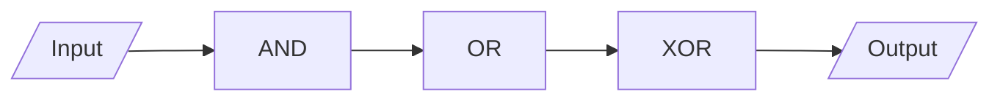

## Memory

storage device

stores binary information

## Memory cell

Basic storage device that stores 1 bit

works when enabled/select = 0, no read/write operations occur

| Memory Enable | Read/Write | Enabled = 1             |
| :-----------: | :--------: | :---------------------- |
|       0       |     X      | No operations allowed   |
|       1       |     0      | Write to selected word  |
|       1       |     1      | Read from selected word |

## Memory location

group of 8 cells to store a byte

we can read/write

## Other stuff

16 bits = 1 word???

## Memory Address

unique binary number for every memory location

$n$ bit binary address can generate $2^n$ different binary addresses

Hence, for $n=10$, we can have 1024 addresses
this is called as 1 *kilo location*

Similarly, for $n=11$, we can have $2 \times 1024$ addresses
this is 2 *kilo locations*

### 1 KB Memory Unit

$$
\underbrace{1 K}_\text{Memory Storage}
\times
\underbrace{8}_\text{Word Size/ Data Lines}
$$

- Memory Storage = $1024 = 2^{10}$
- address lines $n = 10$
- Data lines $m = 8$
    - 8 data input lines
    - 8 data output lines

- 1 enabled line

$$
\begin{align}
\text{Capactity} &= m \times 2^n \text{ bits} \\&= \frac{m \times 2^n}{8 \times 1024} \text{ KiloBytes}
\end{align}
$$

### 8K x 16

1. 16 data input lines, 16 data output lines

2. 13 address lines
   $$
   \begin{align}
   2^n &= 8 \times 2^{10} \\   &= 2^3 \times 2^{10} \\   &= 2^{13} \\   
   \implies n &= 13
   \end{align}
   
$$

3. Capacity = 16KB
   $$
   \begin{align}
   \text{Capactity} &= m \times 2^n \text{ bits} \\   &= \frac{16 \times 2^{13}}{8 \times 1024} \text{ KiloBytes} \\   
   &= 16 \text{ KB}
   
   \end{align}
   
$$

## Operations

| Read         | Write         |
| ------------ | ------------- |
| Address line | Address line  |
| Enabled line | Enabled line  |
| Read control | Write control |
| Data line    | Data line     |

## Types of Semi-conductor Memory

1. RAM
2. ROM

|           | RAM                                          | ROM                                                          |
| --------- | -------------------------------------------- | ------------------------------------------------------------ |
| Full form | Random Access Memory                         | Read-Only Memory                                             |
| Read      | Y                                            | Y                                                            |
| Write     | Y                                            | N                                                            |
| Types     | 1. Dynamic - Refreshing Logic 2. Static | 1. OTP - One time Programmable  2. EP - Eraseable Programmable + UV - Ultraviolet + EE - Electrically Erasable |
| Volatile? | Y                                            |                                                              |

## Address Decoding

we need

- $n$ and gates
- $n \to 2^n$ decoder
- something or gates

### 4 x 4 RAM

- $n = 2$ address lines
- $m = 4$ data lines

We need

- four and gates
- one 2x4 decoder
- four or gates

The four OR gates acts as *buffer* -  gives high current level and helps in sending information for long distances

### 1K RAM

- $=2^{10}$
- $n=10$ address lines
- $m=$

### Coincident Decoding

instead of using one large decoder, we will use two equal smaller decoders. This allows us to minimize the no of and gates

one decoder acts as MSD rows(X), and the other acts as LSD columns (Y)

data gets stored at ‘crossing points’

eg: instead of one $10 \times 2^{10}$, we will use two $5 \times 2^{32}$

we will only need $2 \times 32 = 64$ and gates

## Address Multiplexing

RAS - Row Address Select, CAS - Column Address Select

eg: instead of one $10 \times 2^{10}$, we will use two $5 \times 2^{32}$ decoders; we can further simplify this by sending

- one 5bit address
- 

Instead of sending 

## ROM

- $n$ address lines
- $m$ data output lines (no inputs)

every cross point is considered to be a fuse point

- if fuse exists, it is logic 1
  it is represented as $\times$ at crossing points
- else, it is logic 0

### 32 x 8 ROM

- $2^5 \times 8$
- $n = 5$ address lines
- $m = 5$ data output lines

## Comb circuit using ROM

1. a circuit inputs a 3 bit binary and outputs a binary equal to the square of input no

| A2   | A1   | A0   | B5   | B4   | B3   | B2   | B1   | B0   |
| ---- | ---- | ---- | ---- | ---- | ---- | ---- | ---- | ---- |
| 0    | 0    | 0    | 0    | 0    | 0    | 0    | 0    | 0    |
| 0    | 0    | 1    | 0    | 0    | 0    | 0    | 0    | 1    |
| 0    | 1    | 0    | 0    | 0    | 0    | 1    | 0    | 0    |
| 0    | 1    | 1    | 0    | 0    | 1    | 0    | 0    | 1    |
| 1    | 0    | 0    | 0    | 1    | 0    | 0    | 0    | 0    |
| 1    | 0    | 1    | 0    | 1    | 1    | 0    | 0    | 1    |
| 1    | 1    | 0    | 1    | 0    | 0    | 1    | 0    | 0    |
| 1    | 1    | 1    | 1    | 1    | 0    | 0    | 0    | 1    |

To minimize, we can take $B_0 = A_0, B_1 = 0$

So instead of $8 \times 6$ ROM, we can minimize to $8 \times 4$ ROM

## PLD

Programmable logic devices

1. PROM  (Programmable ROM)
2. PAL (Programmable Array Logic)
3. PLA

## PLA

Programmable Logic Array

diagram is important

here, X denotes a 0 *or* 1 - it just denotes a connection (different from ROM)

used to implement a boolean function in SOP form

it consists of

- $n$ inputs
  every input is provided with
    - buffer
    - inverter
- $k$ AND gates
  takes care of Product terms
- $m$ OR gates
  takes care of Sum terms
- $m$ XOR gates
  used to generate normal/complement of output; this is like adder/subtractor

### PLA with 3 i/p, 4 product terms, 2 outputs

Fig 7.14

Outputs of AND gate

1. AB’
2. AC
3. BC
4. $A’BC’$

Outputs of OR gate

1. $AB’ + AC + A’BC’$
2. $AC + BC$

Outupts of XOR gates

1. $F_1 = AB’ + AC + A’BC’$
2. $F_2 = (AC + BC)'$, as other input is 1 and hence, the output gets complemented

#### PLA Programming Table

converts a diagram into a table

there is no 0 for outputs

|      | Product Term | Inputs (connected to AND) a b c | Outputs (connected to OR) $F_1 F_2$ (T) (c) |
| :--: | :----------: | :---------------------------------------: | :--------------------------------------------------------: |
|  1   |     AB’      |                   1 0 -                   |                            1 -                             |
|  2   |      AC      |                   1 - 1                   |                            1 1                             |
|  3   |      BC      |                   - 1 1                   |                            - 1                             |
|  4   |   $A’BC’$    |                   0 1 0                   |                            1 -                             |

### Convert the following into PLA diagram

| A    | B    | C    | $F_1$ | $F_2$ |
| ---- | ---- | ---- | ----- | ----- |
| 0    | 0    | 0    | 1     | 1     |
| 0    | 0    | 1    | 1     | 0     |
| 0    | 1    | 0    | 1     | 0     |
| 0    | 1    | 1    | 0     | 0     |
| 1    | 0    | 0    | 1     | 0     |
| 1    | 0    | 1    | 0     | 1     |
| 1    | 1    | 0    | 0     | 1     |
| 1    | 1    | 1    | 0     | 1     |

- $F_1(T)$ is just the normal one
- $F_1(c)$ means getting the same output as $F_1(T)$ with complemented inputs
    - so we have to invert the inputs
    - complement the entire thing

$$
\begin{align}
F_1(T) &= \sum (0,1, 2, 4) \\&= A'B' + B'C' + A'C' \\
F_1(C) &= \bigg( \sum (3, 5, 6, 7) \bigg)' \\&=  \\
F_2(T) &= \sum (0, 5, 6, 7) \\&= \\
F_2(c) &= \bigg( \sum (1, 2, 3, 4) \bigg)' \\&=
\end{align}
$$

We are gonna select $F_1(c)$ and $F_2(T)$, as they have the maximum no of common terms

|      | Product Term | Inputs | outputs $F_1 F_2$ (c) (T) |
| :--: | :----------: | :----: | :---------------------------------: |
|  1   |      AB      | 1 1 -  |                1   1                |
|  2   |      AC      | 1 - 1  |                1   1                |
|  3   |      BC      | - 1 1  |                1     -                |
|  4   |    A’B’C’    | 0 0 0  |                -   1                |

==Draw diagram==
