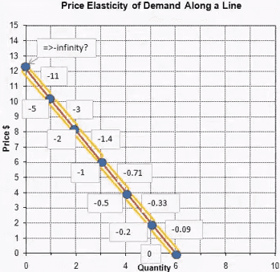

## Elasticity
Partial derivatives are not a good way for comparing sensitivity, as unit of measurement is different and hence cannot be used

1. for different commodities, or
2. in different locations

Elasticity is better

1. unit-free
2. different goods
3. different locations

## Price Elasticity of Demand

Proportional change in demand of commodity wrt proportional change in price of that commodity

measure/responsives of the demand of a commodity to a given change in price, in terms of %

$e$ is generally negative (demand is generally negatively-related)
but for giffen goods, $e$ is positive

$$
\begin{align}

e_x^p
%&= \frac{(x' - x)/x}{(p' - p)/p} \\&= \frac{\% \Delta x}{\% \Delta p} \\&= \frac {\color{red} \Delta x/x}{\color{orange} \Delta p/p} \\
&= \frac{\color{red} \Delta x}{\color{orange} \Delta p}
\frac{\color{orange} p}{\color{red}{x}}

\end{align}
$$
if price of commodity changes by some $k \%$, demand for it changes by $k \times e \%$

### Types

Note that the following shows the magnitude only

|          $|e_x^p|$ | Demand                                                       |
| -----------------: | ------------------------------------------------------------ |
|                  0 | perfectly inelastic (demand curve vertical - parallel to price axis) |
|      $0 < |e| < 1$ | inelastic (low sensitivity)                                  |
|                  1 | unitary elastic                                              |
| $1 < |e| < \infty$ | elastic                                                      |
|           $\infty$ | perfectly elastic (demand curve horizontal - parallel to demand axis) happens in perfectly-competitive market |

### Cases

Consider profit functions
$\pi_1 = f_1(R, \dots), \pi_2 = f_2(R, \dots),$ where

- $\pi =$ profit of company
- R = revenue (incorporates pricing of both companies)

Now
- if $\frac {\delta \pi_2}{\delta \pi_1} = 0,$ perfectly competitive market
  the profits of one company is independent of the profits of another company
  - eg: agricultural farmers
- else imperfect market
  - eg: aviation industry

## Cross Price Elasticity of Demand

Proportional change in demand of commodity wrt proportional change in price of another commodity

proportional change may be % change

$$
\begin{align}

e_{x_1}^{p_2} 
%&= \frac{(x' - x)/x}{(p' - p)/p} \\&= \frac{\% \Delta x_1}{\% \Delta p_2} \\&= \frac {\color{red} \Delta x_1/x_1}{\color{orange} \Delta p_2/p_2} \\
&= \frac{\color{red} \Delta x_1}{\color{orange} \Delta p_2}
\frac{\color{orange} p_2}{\color{red}{x_1}}

\end{align}
$$
if price of another commodity changes by some $k \%$, demand of our main commodity changes by $k \times e \%$

### Sign

- -ve for complimentary goods
- 0 for insensitive
- +ve for substitute goods

### Magnitude

shows the degree of complimentarity/substitutability

## Determinants of Elasticity of Demand

i’m using $|e|$ to highlight only the magnitude

### Availability of substitute

$|e| \propto n_s$

- more substitutes, more elastic
  - coke, pepsi
  - rice, wheat
- no substitutes, inelastic
  - petrol
  - water

### Type of commodity

- Luxury goods - elastic $|e| \to \infty$
- Necessities - inelastic $|e| \to 0$

### No of purposes/uses for commodity

$|e| \propto u$

more uses, more elastic

- eg: milk, steel
- if price increases, you will stop using for less important stuff

fewer purposes, less elastic

- eg: petrol
- even if prices change, nothing really changes, you can only use petrol for car

### Proportion of income spent on commodity

$|e| \propto p$

more prop of income required, price elastic

- what you buy very frequently
- milk, petrol

less prop of income required, price inelastic

- what you buy less frequently
- eg: flight tickets, junk food, noodles for me

### Time Period

$|e| \propto T$

- In the shortrun, demand is inelastic
- In the longrun, demand is elastic

There is more time for consumers to reconsider their decision, to see if it is actually necessary to do so

### Addictiveness

$|e| \propto \frac 1 a$

- More addictive product is inelastic
- less addictive product is elastic

### Income Elasticity

## Total Revenue

basically finding the relationship bw TR and demand

### Graph

- y = price
- x = Total Revenue

$$
TR = xp \\
\frac {\partial (TR)}{\partial p} = x[e_x^{p} + 1]

$$

Changes in total revenue depends on

1. quantity demand
2. elasticity of demand

The change is based on which factor is of greater magnitude

### Inelastic

$|e| < 1$

For necessities, when price increases, total revenue increases

reduction in price is pointless, and increase in price is good for profits

### Unitary Elastic

$|e| = 1 \to \frac {\partial (xp)}{\partial p} = 0$

graph is vertical line parallel to price

proportion of consumers’ income spend does not change with change in price

### Elastic

$|e| > 1$

For luxury goods, when price increases, total revenue decreases

discounts and offers is always a good policy, cuz the inc in profit due to inc in demand > dec in profits due to dec in price

### TR using Graph

normal price-demand graph

TR = quantity x price
= area under graph

with change in price

- For inelastic demand, the area of graph has minimal change
- For elastic demand, the area of graph has significant change

## Various Points of Graph

draw geogebra graph

- At greater price, demand is elastic
- At center point, demand is unitary elastic
- At lower price, demand is inelastic

==Revenue is greatest at center point==

This is due to [Point Elasticity](#Point Elasticity)

eg: if price of car goes from 100k to 50k, so many *more* people will buy
but if price of car goes from 10k to 5k, not that many *more* people will buy

## Income Elasticity

Proportional change in demand of commodity wrt proportional change in income of consumers

$$
\begin{align}

e_x^m
%&= \frac{(x' - x)/x}{(p' - p)/p} \\&= \frac{\% \Delta x}{\% \Delta m} \\&= \frac {\color{red} \Delta x/x}{\color{orange} \Delta m/m} \\
&= \frac{\color{red} \Delta x}{\color{orange} \Delta m}
\frac{\color{orange} m}{\color{red}{x}}

\end{align}
$$

For inferior goods, $- \infty < e < 0$

For normal goods, $0 < e < \infty$

- For necessities $e \to 0$
  - income inelastic
- For luxury goods, $e \to \infty$

## Relation bw Income Elasticity and Price Elasticity

$e^p \propto e^m$
High Income Elasticity $\implies$ High Price Elasticity

This is because of

1. substitution effect
   1. when price decreases, you start buying more
   2. when price increases, you just don’t buy this product and start buying alternatives
2. income effect
   the real income gets changed
   1. when price decreases, you feel richer, cuz you can now buy more
   2. when price increases, you feel poorer, cuz you can now buy less

## Midpoint Formula for % change

Good as it gives the same answer regardless of direction of change

helpful when we don’t know what the initial value, ie we don’t know what $\frac p x$ is

let $v$ be the value

$$
\begin{align}
\% \text{ change}
&= \frac {\Delta v}{v_\text{avg}} \\v'&= \frac{|\Delta v|}{
(v_1 + v_2)/2
}
\end{align}
$$

## Elasticity of Supply

Proportional change in the supply of a commodity wrt proportional change of its price

Always $0 < e < \infty$

### perfectly inelastic

- $e \propto T$
  - sellers have small time to revise their decisions
  - Real Estate in short run

- $e \propto \frac 1 G$
  - or where gestation period is long(time taken to convert raw materials into final good)
  - eg: agrigultural, large machinery
### Perfectly elastic

perfectly competitive market

## Factors of Elasticity of Supply

### Nature of Commodity

supply is elastic if it is possible to change the amount produced

- it is not possible for real estate
- it is possible for books, cars, manufactured goods

### Time

supply is more elastic if suppliers have time to respond

supply is more elastic in long run, as there is time to find alternatives

- oil was nearly inelastic before cuz there were no other alternatives
- but now, suppliers have to make decision on production quantity based on how much they think the consumers will buy, as there are other alternatives

## Interesting question on farmer

based on total revenue

in slides

- the relation for eggs is lagged; the supplier wouldn’t know the future price
- but for oil, they can do it instantly

but the breaking eggs and reducing oil production only works in the short run, cuz consumers will find other alternatives

for medicines, technological change is disliked by pharmaceutical companies

but for luxury goods and computer manufacturing it is opposite, cuz demand for computers is elastic; so decrease in price would increase the total revenue 

## Applications

### OPEC

(above)

### Drugs

2 options to address

- Interdiction: cracking down on suppliers and restrict the supply for drugs
- Education: reduce the demand for drugs

Keeping in mind that drugs are price-inelastic, education is more effective cuz

|                   | Interdiction | Education  |
| ----------------- | ------------ | ---------- |
| supply            | dec          | same       |
| demand            | same         | dec        |
| price             | inc          | dec        |
| surviving cartels | richer       | poorer     |
| addicts           | poorer       | better off |
| crime             | inc          | dec        |

### Immigration

the increase in price for luxury housing will be greater than that for cars

|                | supply    | demand  |
| -------------- | --------- | ------- |
| luxury housing | inelastic | elastic |
| cars           | elastic   | elastic |

## Point Elasticity

This wasn’t taught in class, but I came across during Study Project research.

Point elasticity is the elasticity at a point, duh.

We know that elasticity is $e_x^p = \dfrac{\Delta x}{\Delta p} \dfrac{p}{{x}}$. But for a single point, we do not have $\Delta x$ and $\Delta p$. So what we do is we take the slope of the graph instead.

So the point elasticity of any point is

$$
e_\text{point} = \frac{1}{\text{Slope}} \times \frac{p}{{x}}
$$
