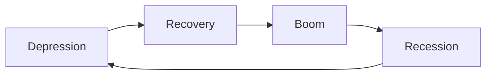

## There's always Trade-offs

Refers to the fact that when picking an option, you're always giving up on something else; ie there is always an opportunity cost

It is due to scarcity of resources; every resource is finite; nothing comes free

Eg: when i want to study, i'm giving up sleep

## Real Cost

Cost of something is what you sacrifice to get it
Real Cost = relative price = opportunity cost

It's not just monetary cost

## Rational people think at Margin

Rationality: making a decision considering all possibilities to obtain best outcome with minimal input and losses.

Marginality: making decisions considering **incremental** benefits/costs associated with an action; not at total benefit/cost

marginal profit (net benefit) = marginal benefit - marginal cost
Proceed incrementing production as long as marginal net benefit $\ge$ 0

## People respond to incentives

Incentive: instrument to induce an individual to act/react
tool to change behavior

Subsidies = +ve incentive
Taxes = -ve incentive

## Trade benefits everyone

1. Reduces cost of production through specialization
   Specialists require lower resources for production, because they are really good at it; hence they can increase output
2. Both parties gain a greater variety of goods and services

Overall trade gains depends on

1. choice set
2. cost minimization

Individual gains depends on

1. Terms of trade
   basically means the exchange rate
2. Bargaining power
   1. nature of the product (Shelf life / perishability)
      The one with the greater shelf life product will have greater bargaining power because they don't have to sell in a hurry
   2. elasticity of demand

### Benefits of scale

you get larger benefits with lower costs if you focus on specialization at large scale

the average cost reduces when the volume of production increases

eg: college mess cooking

### Elasticity of demand

#### Elastic demand

Demand for commodity is highly sensitive to income of consumers

eg: smartphones

#### Inelastic demand

Demand for commodity is nearly independent of income of consumers.

Eg: coffee, rice, food
Even if someone gets richer, they won't be eating more food

## Markets are usually good

### Types of economic systems

An economic system is an arrangement of economic activity

1. Market-Based/Capitalist/Private
   
   1. The market is dynamically affected by what the producers produce and consumers consume
   2. less regulated
      pure capitalism means that the market is free from govt intervention
      eg: USA
   
   Advantages
   
   1. high competition
   2. encourages people to perform better
      everyone tries to optimize
   3. consumers have freedom to choose from large variety of products
   
2. Centralized/Govt
   A central authority dictates
   Eg: north korea

3. Public? (communism type)

4. Hybrid
   In india, there are a few sectors which are centralized, such as railways, while others are market-based

### Functions of market

1. organizing economic activity

2. determining the price
   supply reflects the availability/abundance of the commodity
   demand reflects the willingness for purchasing commodity
   ==price for a product without a market(demand/supply) for it is undefined==

3. Signaling and allocation of resources

   | Price | Reaction of Production | Reaction of Demand |
   | :---- | ---------------------- | ------------------ |
   | Inc   | Inc                    | Dec                |
   | Dec   | Dec                    | Inc                |

   Not all market signals are pure market signals
   Distortion of market signal: when govt creates policies to change pricing in a free market
   Eg: subsidies

## Govt

Govt can sometimes improve market outcomes

### Govt steps in

1. protect property rights

2. generate efficient outcomes, such as prevent

   1. monopoly
   2. Tragedy of Commons for CPR(Common Property Resources)
      for community resources(like fishing ponds, forests), the govt comes in to prevent over-utilization of the resources; supports sustainability

3. market failure

   1. market fails when it comes to non-excludable commodity
   2. govt interferes in fields where private investors are not interested

   example

     - national defence
     - community services
     - landscapes
     - fresh air

4. Promote equality/equity

   1. prevention of trade of whatever is socially harmful (alcohol, drugs)
   2. keeps market's obsession with efficiency at the expensive of equity in check
   3. reduces economic inequality

5. Socially desirable outcomes

### Monopoly

private monopoly: unfair situation for consumers where there is only a sole producer of a product
natural monopoly: situation where there is a single producer (like govt), but not necessarily bad; eg: Railways

monopoly can be addressed through govt subsidies for the monopoly
the monopoly company will tend to increase output to attain the new maximum marginal net benefit
hence, the level of optimal output will be greater after subsidies than without it, and hence the producers increase the supply
this will reduce the price and benefit the consumers

### Excludability

#### Excludable

possible to exclude whoever did not pay for it

Eg: netflix subscription

#### Non-excludable commodity

where it is impossible to exclude those who did not pay for it

eg: national defence, community parks

### Efficiency vs Equity

There is always a conflict b/w efficiency vs equity.

#### Efficiency

optimization to maximize output with minimum input

#### Equity

Morals

upholding social norms, benefitting society/the world

### Rivalry of consumption

#### Rivalled consumption

When the consumption of a product makes it unavailable for consumption for others

#### Non-rivalled consumption

When the availability of a product is independent of its consumption

That's one of the best things of digital revolution: it has enabled non-rivalry

Eg: national defence, fresh air, lighthouses, netflix subscription

### Goods

Something that generates pleasure

You pay for it

|            |      Public      |  Club   |          CPR           | Private |
| :--------: | :--------------: | :-----: | :--------------------: | :-----: |
|  Rivalled  |        N         |    N    |           Y            |    Y    |
| Excludable |        N         |    Y    |           N            |    Y    |
|  Example   | national defence | netflix | forests, natural goods |  food   |
|            |                  |         | prone to exploitation  |         |

### Bads

generates displeasure

you receive payment

## Standard of living

Standard of living of a country depends on its production level

Measures for standard of living

- for individuals
  comparing real personal income
- for countries
    - comparing real GDP
    shows the employment opportunities in the country
    - comparing real GNP (Gross National Product)
    shows the status of citizens of the country
    - per capita income and output
    per capita income $= \frac{income}{population}$, per capita output $= \frac{output}{population}$
    shows the average contribution of people; doesn't show income inequality though

Disparities in standard of living is caused due to difference in productivity
Productivity: amount of goods and services produced by a worker during an hour of work

i don’t exactly agree with this cuz women have a history of earning less for the same productivity

### Income

#### Nominal income

monetary income

#### Real income

$\frac{\text{nominal income}}{\text{average of prices of all goods and services bought}}$

it reflects the quantity of goods and services you can buy

### GDP & GNP

#### Gross Domestic Product

total value of final goods and services produced within the borders of a country (regardless of nationality)

From the consumer's perspective, it is the same as national income
ie, sum of incomes of all individuals is mathematically = GDP

#### Gross National Product

total value of final goods and services produced only by the nationals/citizens of a country (regardless of location)

#### Nominal GDP & GNP

production quantity x prices of the current year

#### Real GDP & GNP

production quantity x prices of base year

### Paradox of value

The paradox of value is the contradiction that, although water is more necessary than diamonds for survival, diamonds are costlier

## Prices rise when govt prints excess money

4 functions of money

1. Facilitates trade
   prevents the need for coincidence of wants; ie money prevents the need for both parties to want to exchange products that they want from the other person
2. mode of deferred payment
3. unit of value
4. store of value

If you print money without them producing anything, money loses its value and inflation occurs
However, if you print money due to increase in the country's output, then it's fine

When prices of commodity increases, value of money reduces
value of money $\propto \frac{1}{\text{price of commodities} }$

### Inflation

Rate at which prices of commodities increase

happens when economy is doing well

upto 2-5% inflation is acceptable

#### Micro Effects

Money-givers gain

Fixed income money-receivers lose
eg: regular employees

Variable income money-receivers not affected
business people, freelancers

#### Macro Effects

Imports increase: demand for domestic products decreases, as they are costlier
Exports decrease: as other countries do not want a more expensive product

Hence, high inflation is not good

#### Cost-Push inflation

Prices increase due to increase in the cost for supply 

- cost of production
- prices of raw materials
- oil prices (transportation)

for the name, think suppliers **push** the product to the consumers

#### Demand-pull inflation

Prices increase due to increase in demand

for the name, think consumers **pull** the product from the sellers

#### Structural inflation

The suppliers are not able to keep up with the demand due to lack of infrastructure; ie, demand increases and producers want to increase output, but aren't able to do so

idk point: Agricultural inflation affects non-agricultural sectors, as agricultural products are used as raw materials
also, agricultural sector depends on the manufacturing sector and vice-versa

### Deflation

Rate at which prices decreases

in other words, it is negative inflation

more dangerous than high inflation

### Welfare Cost

The cost associated with any action that has macro-level consequences and affects entire society
eg: taxes, interest rates have welfare costs associated with them

## Inflation/Unemployment

Economy faces a short-run trade-off between inflation and unemployment

Short run: period where contracts cannot be renegotiated (monthly, quarterly)
Lon run: a long period (annually) which contains multiple renegotiations of contracts

### Unemployment

the fraction/proportion of people seeking jobs but cannot get

does **not** include people who aren't seeking jobs

#### Natural Rate

Unemployment rate which exists regardless of whatever we do

Depends on the country's

1. resources
2. technology
3. production capacity/no of factories
4. population/size of the country

#### Actual Rate

The current rate of unemployment 

it fluctuates a lot

- during depression, actual > natural
- during boom, actual < natural

However, if you take the average of 20yrs or so, the average actual rate tends to the natural rate

### Output

#### Potential output

predicted output an economy can ideally produce by using all its resources

#### Actual output

What an economy actually produces

#### Scenarios

- during recession, actual < potential
- during boom, actual > potential

### Phases of economy

### Phillips Curve Relation

y-axis = inflation
x-axis = unemployment

inflation $\propto \frac{1}{\text{unemployment}}$

$$
\pi_t = \alpha - \beta U_t \qquad  (\pi_t = - \beta U_t + \alpha, \ y = mx+c)\\
\text{Taking derivative wrt } \pi_t \\
\beta = - \frac{d \pi_t}{dt}
$$

- $\pi_t =$ Inflation
- $\alpha =$ inflation when there is no unemploment
- $\beta =$ cost for reducing unemployment by a unit
- $U_t =$ actual rate of unemployment

This relation is only short-run
for long run, whatever is the inflation, unemployment tends to natural unemployment
the graph will be a straigth line parallel to the y-axis

During shortrun, the contracts for raw materials, employees is fixed
but prices for commodity increases
therefore, producers increase production to maximize profit (misperception by producers); this is done by increasing employees
Unemployment rate decreases

Moreover, workers suffer money illusion (only focus on the nominal income increase;  don’t realise that the real income is the same)

Then in the long run, few months later, the employees will renegotiate for higher wages; then the producers will hesitate as they no longer see the attraction for producing at such large volume and paying such wages; so they fire employees; therefore, the unemployment rate will increase again

#### Extra

inflation $\propto$ employment

As output increases with employment, output $\propto$ inflation

