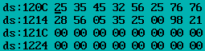
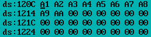

## Program 1

Write a program to add an array of eight 2-digit hexadecimal numbers stored in memory and store the result in memory.

```assembly
.MODEL SMALL
.STACK 20
.DATA ; Data segment start here
ORG 1000H ; Memory address initialization
NUM DB 25H, 35H, 45H, 32H, 56H, 98H, 76H,76H ; eight 2-digit hex numbers input
SUM DW ? ; Variable to store Sum
COUNT DW 0008H ; Count Variable to store count 8

.CODE ; Code start here
START:
MOV AX, @DATA ; Initializing DS: segment register
MOV DS, AX
MOV CX, COUNT ; Reg CX is initializing to COUNT=8
MOV SI, 0000H ; Initializing Source Index Register SI=0000
MOV AX, 0000H ; move AX=0000

REPEAT: ; Loop start here
ADD AL, NUM[SI] ; Moving the 1st array value to AL register
JNC NEXT ; Jump If not Carry, here Next is 16bit address.
ADD AH, 01 ; Add 01 to AH
NEXT: ; Next address reference
INC SI ; Increment SI
LOOP REPEAT ; Repeat loop Reference
MOV SUM, AX ; Moving the AX value to Sum variable memory
INT 3 ; Breakpoint interrupt
END START ; stopping the program
```


## Program 2

Write a program to count number of occurrences of the byte 25H in the given array of 16-bytes stored starting from 1200H. Also store the result in 1220H memory location.

```assembly
.MODEL SMALL
.STACK 20
.DATA ; Data segment start here
ORG 1200H ; Memory address initialization as given in the program
ARRAY DB 25H, 35H, 45H, 32H, 56H, 25H, 76H, 76H, 28H, 56H, 05H, 35H, 25H, 00H, 98H, 21H ; Inputs
ORG 1220H ; Memory address initialization to store results
RES DB ? ; Variable to store Number of occurrences
COUNT DW 0010H ; Count Variable to store length of the array i.e 10
.CODE ; Code start here
START:
MOV AX, @DATA ; Initializing DS: segment register
MOV DS, AX
MOV CX, COUNT ; Reg CX is initializing to COUNT
MOV SI, 0000H ; Initializing Source Index Register SI=0000
MOV AL, 25H ; move AL=25H, We need to find out number of

; occurrences of 25H
REPEAT: ; Loop start here
CMP AL, ARRAY[SI] ; The CMP instruction compares two operands.
JNE NEXT ; Jump if Not Equal, if SI and AL data not equal it jumps

; to INC SI

INC RES ; if SI and AL equal the RES is incremented
NEXT:
INC SI ; Increment SI
LOOP REPEAT ; Loop Repeat
INT 3 ; Breakpoint interrupt
END START ; stopping the program
```




## Program 3

Write a program to exchange two data blocks of length 10-bytes stored in memory starting from 1200H and 1220H respectively.

```assembly
.MODEL SMALL
.STACK 20
.DATA ; Data segment start here
ORG 1200H ; Memory address one initialization as given in the program
ARRAY1 DB 05H, 15H, 25H, 35H, 45H, 55H, 65H, 75H, 85H, 95H ; Inputs
ORG 1220H ; Memory address two initialization as given in the program
ARRAY2 DB 0A1H, 0A2H, 0A3H, 0A4H, 0A5H, 0A6H, 0A7H, 0A8H, 0A9H, 0AAH ; Inputs
COUNT DW 000AH ; Count Variable to store length of the array i.e 000A
.CODE ; Code start here
START:
MOV AX, @DATA ; Initializing DS: segment register
MOV DS, AX
MOV CX, COUNT ; Reg CX is initializing to COUNT
MOV SI, 0000H ; Initializing Source Index Register SI=0000
REPEAT: ; Loop start here
MOV AL, ARRAY1 [SI] ; Moving first element of array one to AL Register
XCHG AL, ARRAY2 [SI] ; Exchange Data. The XCHG exchange the contents of

; two operands.

MOV ARRAY1 [SI], AL ; Move the Content of AL to Array one address
INC SI ; Increment SI
LOOP REPEAT ; Loop Repeat
INT 3 ; Breakpoint interrupt
END START ; stopping the program
```





## Assignment

Write a program to arrange the given array of 8-bit binary numbers stored in the memory in ascending order.

```assembly
.MODEL SMALL
.STACK 20
.DATA
NUM DB 11H, 21H, 31H, 31H, 55H, 45H, 35H, 25H
COUNT DW 0008H

.CODE
START:
MOV AX, @DATA
MOV DS, AX
MOV CX, COUNT

DEC CX

NEXT:
	MOV DX, CX
	MOV SI, 0000H

  REPEAT:
    MOV AL, NUM[SI]
    CMP AL, NUM[SI + 1]
    JC NOEX
    XCHG AL, NUM[SI +1]
    MOV NUM[SI], AL

	NOEX:
		INC SI
		DEC DX
		JNZ REPEAT
		LOOP NEXT

INT 3
END START
```


