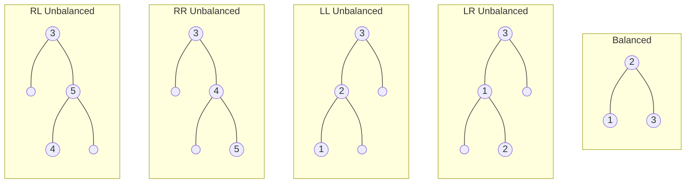

**Balanced** BST that reduce the worst-case time complexity from linear to logarithmic.

## Balance Factor

$$
BF =
\text{Height of left subtree} - \text{Height of right subtree}
$$

Leaves are always balanced, as they have a balanced factor of 0.

## Balanced Tree

Tree with [balanced factor](#balanced factor) $\{ -1, 0, +1 \}$

## Unbalanced $\overset{\text{rotation}}{\longrightarrow}$ Balanced

Rotation Mechanism

| Unbalanced | Type of Rotation |
| ---------- | ---------------- |
| LL         | RR               |
| RR         | LL               |
| LR         | LR               |
| RL         | RL               |

## Time Complexity

|  Operation  |   Compexity   |
| :---------: | :-----------: |
| Restructure |    $O(1)$     |
|   Search    | $O(\log_2 n)$ |
|  Insertion  | $O(\log_2 n)$ |
|  Deletion   | $O(\log_2 n)$ |

