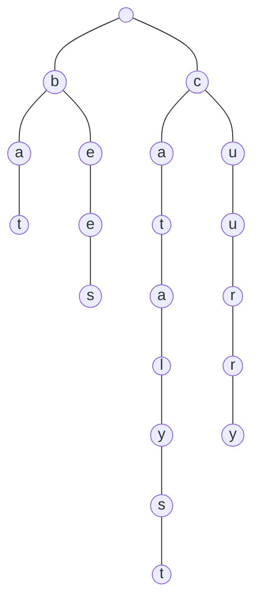
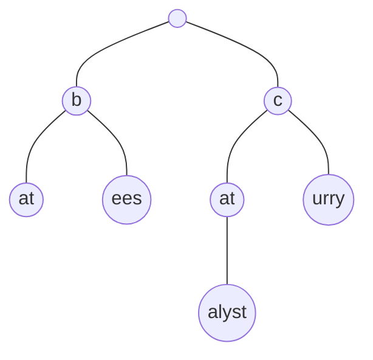
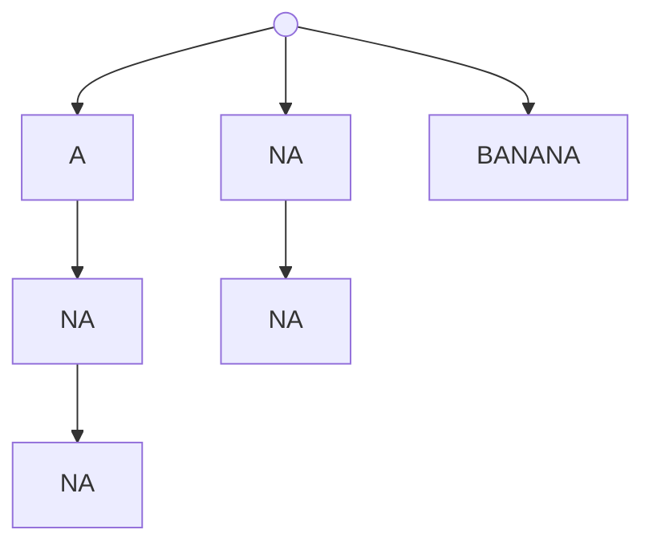
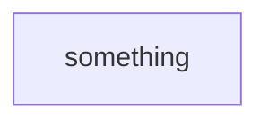
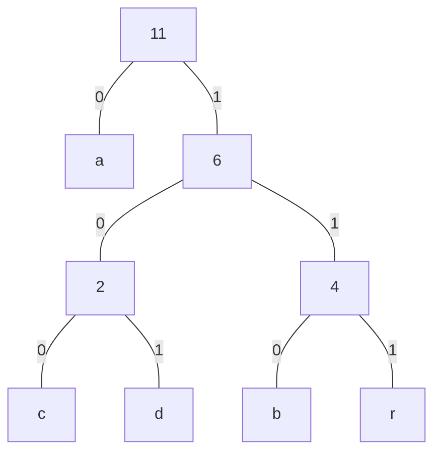

advanced form of tree, mainly used for *Text Processing*

| Property of *Try* | Depends on                   |
| ----------------- | ---------------------------- |
| Height            | 1 + length of longest string |
| Width             | no of strings                |

## Types

Consider S = {cat, curry, bat, bees, catalyst}

## Standard

Stored using regular usual representation of tree

## Compressed

Stored using [compact representation](#compact representation)

## Suffix

It is a **compressed** trie of suffixes for every character of a single word. Used for testing DNA sequencing $(ATCG)$.

Consider `BANANA`

### Generation

### Addressing

## Encoding Trie

Left is 0. Right is 1.

Leaves store characters.

## Huffman Tree

Uses huffman encoding

### Aim

Assign the minimum key to the character with the maximum frequency.

### Steps

1. Calculate frequency of each character for input string

2. Build tree, by grouping based on minimum frequencies

3. Generate key/code of tree, taking left as 0 and right as 1

4. Calculate the average no of code/key using
   
$$
\text{Average Code Size} =
\frac{
\sum\limits_i \text{Frequency}_i * \text{No of Bits}_i
}{
\sum\limits_i \text{Frequency}_i
}
$$

### Example

Consider input string `abracadabra`

| Letter | Frequency |
| ------ | --------- |
| a      | 5         |
| b      | 2         |
| c      | 1         |
| d      | 1         |
| r      | 2         |

| Letter | Code |
| ------ | ---- |
| a      | 0    |
| b      | 110  |
| c      | 100  |
| d      | 101  |
| r      | 111  |

Average code size = 2.09

## Compact Representation

Each string is added into an array of strings.

Each node of the tree contains `(string_index, substring_start_index, substring_end_index)`

