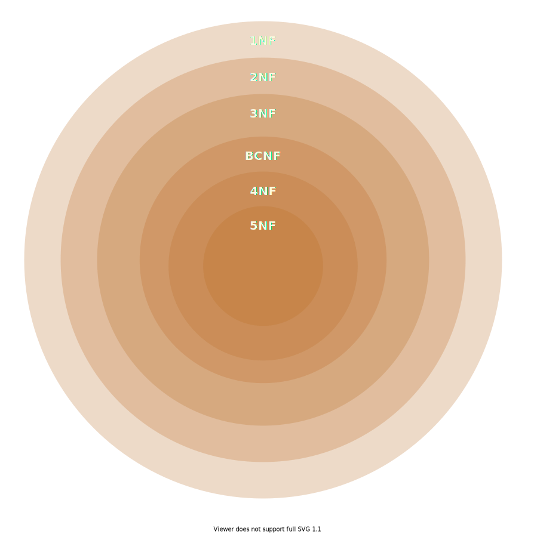

A good database ensures there is no **redundancy** or **anomalies**.

<table>
  <caption style="margin-bottom:0.5em; font-weight:bold">A Bad Table</caption>
  <colgroup>
    <col>
    <col>
    <col>
    <col span=2 style="background-color: hotpink">
  </colgroup>
  <tr>
    <th>ID</th>
    <th>Name</th>
    <th>CourseID</th>
    <th>CourseName</th>
    <th>CourseCredits</th>
  </tr>
  <tr>
    <td>198</td>
    <td>Ahmed</td>
    <td>212</td>
    <td>DBMS</td>
    <td>3</td>
  </tr>
  <tr>
    <td>199</td>
    <td>Jameel</td>
    <td>212</td>
    <td>DBMS</td>
    <td>3</td>
  </tr>
    <tr>
    <td>200</td>
    <td>Azra</td>
    <td>212</td>
    <td>DBMS</td>
    <td>3</td>
  </tr>
  <tr>
    <td>201</td>
    <td>Habi</td>
    <td>212</td>
    <td>DBMS</td>
    <td>3</td>
  </tr>
  <tr>
    <td>202</td>
    <td>Azhar</td>
    <td>213</td>
    <td>OOPS</td>
    <td>3</td>
  </tr>
</table>

## Bad Practices

Increase time and space complexity of database operations.

### Redundancy

The same data is present in multiple places.

**Note:** It may be intentional for data backup.

### Anomaly

#### Updation

If `courseName ` and `courseCredits` change for `212`, **all** the records have to be changed.

#### Insertion

If a new course comes up, but there are no students, then `courseID` cannot be entered into the bad table, as primary key (ID) will be `null`.

#### Deletion

If I delete `ID 202`, then I’ll lose details about the `courseId 213`

## Keys

| Superkey                                                     | Primary Key                         | Candidate Key                  |
| ------------------------------------------------------------ | ----------------------------------- | ------------------------------ |
| Attribute(s) that can uniquely identify all attributes in a table. | Primary key is a minimal super key. | Key that can be a primary key. |

## Decomposition

1. Atomize every table wrt an entity
2. Connect those tables using relational tables with foreign key

**Prevents**

1. Redundancy
2. Anomaly

## Normalization

It is the process of structuring a database, usually a relational database, in accordance with a series of so-called normal forms in order to reduce data redundancy and improve data integrity.

Sometimes, it’s not feasible to re-create an entire database design. In those cases, we will have to **normalize** tables into a more appropriate design.

| Prime                           | Non-Prime       |
| ------------------------------- | --------------- |
| attributes in the candidate key | other attribute |

## Candidate Key

A key/combination of keys that can help either directly/indirectly derive all attributes of a table.

## Functional Dependency

Gives a unique tuple as the output

idk what this means:
A key can be a functional dependancy, but the vice-versa does not hold

### Partial Dependency

Consider a key combination as (name, age)

Query possible with just name

Subset of candidate key can derive non-prime attributes

$$
p \to np

$$

### Transitive Dependency

Non prime attributes gives non-prime

$$
np \to np

$$

### Full Dependency

Query possible only with (name, age) combination

Subset of candidate key cannot derive non-prime attributes

$$
f(a, b) = y \implies f(a) \ne y, f(b) \ne y

$$

## Normal Forms

|                               | 1NF  | 2NF  | 3NF  | BCNF | 4NF  | 5NF  |
| ----------------------------- | :--: | :--: | :--: | :--: | :--: | :--: |
| No Multi-Valued Attributes    |  ✅   |  ✅   |  ✅   |  ✅   |  ✅   |  ✅   |
| No Partial Dependency         |      |  ✅   |  ✅   |  ✅   |  ✅   |  ✅   |
| No Transitive Dependency      |      |      |  ✅   |  ✅   |  ✅   |  ✅   |
| LHS = Candidate/Super Key     |      |      |      |  ✅   |  ✅   |  ✅   |
| No Multi-Attribute Dependency |      |      |      |      |  ✅   |  ✅   |
| Lossless Decomposition        |      |      |      |      |      |  ✅   |

## 1NF

### Given

| sid  | sname |   course    |
| :--: | :---: | :---------: |
|  01  |   A   | CC, CP, OOP |
|  02  |   B   |   CP, DB    |
|  03  |   C   |     DB      |

### Normalized

We can turn into 2 tables

| sid  | sname |
| :--: | :---: |
|  01  |   A   |
|  02  |   B   |
|  03  |   C   |

| sid  | course |
| :--: | :----: |
|  01  |   CP   |
|  01  |   CC   |
|  01  |  OOP   |
|  02  |   CP   |
|  02  |   DB   |
|  03  |   DB   |

## Finding Candidate Key

1. Find the keys with no incoming
   these compulsorily have to be in the combination, because there is no other way to reach them

2. Find the transitive closures of all

   - attributes

   - combination of failure keys

3. List out all keys

4. Candidate keys are only the keys that are 

## 3NF

every functional dependency $A \to B$ contains

- superkey $A$
- prime attribute $B$

## Armstrong’s Inference Rules

$\to$ means derives

| Rule               | Condition           | Inference          |
| ------------------ | ------------------- | ------------------ |
| Reflexive          | $y \subset x$       | $x \to y$          |
| Augmentation       | $x \to y$           | $xz \to yz$        |
| Transitive         | $x \to y, y \to z$  | $x \to z$          |
| Decomposition      | $x \to yz$          | $x \to y, x \to z$ |
| Union              | $x \to y, x \to z$  | $x \to yz$         |
| Psuedotransitivity | $x \to y, wy \to z$ | $wx \to z$         |

## Canonical Minimal Cover

Removing one/more functional dependencies when a set of functional dependencies are given, ensuring that **5NF is still maintained**.

