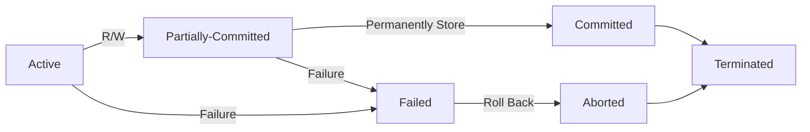
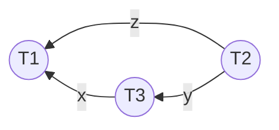

single logical unit of work formed by a set of operations.

## Operations

- `read(a)`
- `write(a)`

where `a` is a resource.

## Conflicts

occurs when resources are in shareable mode.

2 operations conflict if they are

- on the same object/resource
- by different transactions
- atleast 1 transaction is a write

## Transaction States

1. active
2. partially-commited
3. committed
4. failed
5. aborted
6. terminated

## ACID

Good features of a database. Relational databases are ACID-compliant, but NoSQL aren’t

### Atomicity

Transaction status should be binary - occured/not occured. No transaction must **not** occur partially.

If any sub-steps of a transaction(Operation/Query) fails, the whole transaction must fail and the database must be in the same state as the original.

### Consistency

Correct data is ensured through constraints.

### Isolation

Concurrent-Execution Safe

Simultaneous transactions must be considered as multiple sequential transactions.

Transactions must be one-one.

### Durability

Committed transactions must be stored to a non-volatile memory, to prevent loss of data.

## Commit

Storing update into permanent memory.

## Concurrency Problems

Conflicts that occur when simultaneous transactions occur.

| Problem           | Description                                                  | Solution                                                     |
| ----------------- | ------------------------------------------------------------ | ------------------------------------------------------------ |
| Blind Write       |                                                              |                                                              |
| Dirty-read        | uncommited transactions are read                             | - [Serial Scheduling](#Serial Scheduling) - values should be stored only after committing |
| Unrepeatable read | multiple reads of the same parameter without a commit        |                                                              |
| Lost Update       | a later write committed first is preferred over the first write committed second, when multiple writes occur simultaneously | Nothing really, just how it works                            |
| Phantom Read      | - transaction 1 reads - some other transaction deletes - transaction 1 tries reading, but can’t find |                                                              |

## Solutions

Before any write occurs, always do a read.

## Types of Schedules

### Serial

Schedule where each transaction occurs one after the other.

### Parallel

Multiple schedules happen at the same time?

### Concurrent/Interleaved

Helps improve [Throughput](#Throughput)

Schedule where each transaction overlapping over each other.

### Serializable

Non-serial schedule that **can** be converted into serial schedule.

### Conflict Serializable

Serializable schedule that is possible, only **after** removing conflicts.

### Equivalent

Represented as $S \equiv S'$

A serial and non-serial schedule which can be converted to each other.

### Conflict Equivalent

Conflict Serializable schedule, such that conflicting-pairs occur in the same way as initially.

### View Serializable

2 schedules $S, S'$ that meet the following criteria. The transaction that

1. performs first read for a resource in $S$ must do the same in $S'$
2. reads resource written by another transaction in $S$ must do the same in $S'$
3. performs final write for a resource in $S$ must do the same in $S'$

## Eliminating Conflicts

## Precedence Graph

Shows which transaction is **dependent** on which other transactions(s).

### Interpretations

#### Serializability

|               | Loop/Cycle | Simple Graph |
| ------------- | :--------: | :----------: |
| Serializable? |     ❌      |      ✅       |

The above example is serializable.

#### Order

Order will start from the transaction with indegree = 0

In above example, order will be $T_2 \to T_3 \to T_1$

## Blind Write

without even reading the value, you are writing.

## Throughput

Work done per unit time.

## 2 Phase Locking Concurrency Control

| Lock Mode | Type  |          Number           |
| --------- | ----- | :-----------------------: |
| Shareable | Read  | Max Capacity (50, 100, …) |
| Exclusive | Write |             1             |

### Lock Manager

Manages locks on data items

### Lock Table

used by lock manager blah blah

### Graph

### Types

| Hold lock throughout | Strict | Rigorous |
| -------------------- | :----: | :------: |
| Read                 |   ❌    |    ✅     |
| Write                |   ✅    |    ✅     |

## Well Formed Transaction

- Data item must be locked before reading/writing.
- Should **not** try to
    - unlock free resource
    - lock already-locked resource

