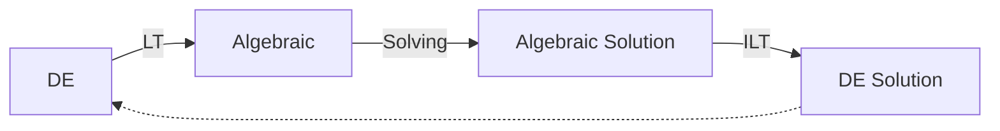

## Laplace Transformation

Converting differential calculus into algebra

## LT Function

Laplace Transform

$$
\begin{align}
L\{ f(t) \}
&= \int\limits_0^\infty e^{-st} f(t) \cdot dt 
\quad \text{ (or a function of } x)\\&= F(s)
\end{align}
$$

|        |                                 |
| ------ | ------------------------------- |
| $f(t)$ | Time Domain Function            |
| $s$    | Laplace Variable (real/complex) |
| $F(s)$ | Laplace Domain Function         |

## ILT Function

Inverse Laplace Transform

$$
L^{-1} \{ F(s) \} = f(t)
$$

## Basic Rules

| Situation          |       LT   |             ILT   |
| ------------------ | :---------: | :--------------: |
| Constant Coeffient |                $L\Big(k f(t) \Big) = k L(t)$  | $L^{-1}(k s) = k L^{-1} \Big( F(s) \Big) $          |
| Sum                | $L \Big( f(t) \pm g(t) \Big) = L \Big( f(t) \Big) \pm L \Big( g(t) \Big)$ | $L^{-1} \Big( F(s) \pm G(s) \Big) = L^{-1} \Big( F(s) \Big) \pm L^{-1} \Big( G(s) \Big)$ |

## LT of Standard Functions

|                   $f(t)$                    |                     $L\Big( f(t) \Big)$                      |
| :-----------------------------------------: | :----------------------------------------------------------: |
|                     $1$                     |                        $\frac{1}{s}$                         |
|                     $k$                     |                        $\frac{k}{s}$                         |
|                  $e^{at}$                   |             $\frac{1}{s\textcolor{orange}{-}a}$              |
|                 $\cos(at)$                  |                    $\frac{s}{s^2 + a^2}$                     |
|                 $\sin(at)$                  |                    $\frac{a}{s^2 + a^2}$                     |
|                 $\cosh(at)$                 |                    $\frac{s}{s^2 - a^2}$                     |
|                 $\sinh(at)$                 |                    $\frac{a}{s^2 - a^2}$                     |
|                    $t^n$                    | $\begin{cases} \dfrac{n!}{s^{n+1}}, & n \le 0 \\ \dfrac{\Gamma(n+1)}{s^{n+1}}, & \text{otherwise} \end{cases}$    where $\Gamma$ is [gamma function](#Gamma Function) |
| $e^{at} f(t)$ (exponent shifting rule) | $F(s \textcolor{orange}{-} a) = \Big\{ F(s) \Big\}_{s \to s-a}$ |
|                  $u_a(t)$                   |                     $\frac{e^{-as}}{s}$                      |
|                $\delta (t)$                 |                             $1$                              |

## Unit Step Function

$$
u_a (t) =
\begin{cases}
0, & t < a \\1, & t \ge a
\end{cases}
$$

## Unit Impulse Function

$$
\delta (t) = \lim_{\epsilon \to 0} f_\epsilon(t)
$$

$$
f_\epsilon(t) =
\begin{cases}
\dfrac{1}{\epsilon}, & 0 \le t \le \epsilon \\0, & t > \epsilon
\end{cases}
$$

$$
\begin{align}
L\Big( \delta(t) \Big)
&= \lim_{\epsilon \to 0} L\Big( f_\epsilon (t) \Big) \\&= \lim_{\epsilon \to 0} \left[
	\int\limits_0^\infty e^{-st}  f_\epsilon(t) \cdot dt \\
\right] \\& \dots \\&= 1
\end{align}
$$

## Sum of GP

$$
\sum GP = \frac{a}{1-r}
$$

## Gamma Function

$$
\Gamma(x) = \int_0^\infty e^{-x} x^{n-1} dx
$$

### Properties

$$
\begin{align}
\Gamma \left(\frac{1}{2} \right)
&= \sqrt{\pi} \\
\Gamma(n)
&= (n-1)! \\&= (n-1) \cdot \Gamma(n-1) \\ 
n! &= \Gamma (n+1) \\
\end{align}
$$

## IDK

When doing nested transformations, do it as Part 1 and $f(part 1)$ like how you did it for grade 12 integrals $I_1 + I_2$
