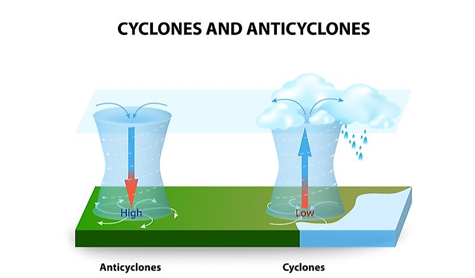

Increased Sodium causes high BP

## Pollution

1.  Source
1.  Movement of pollutant
1.  Recipient

## Pollutants

### Primary

pollutant directly entering the atmosphere

## Acid Rain

### Sulphur

$$
\ce{
2SO2 + O2 -> 2 SO3 \\SO3 + H2O -> H2SO4
}
$$

### Nitrogen

$$
\ce{
2NO + O2 -> 2NO2 \\2NO2 + H2O -> HNO3 + HNO2
}
$$

## Hydrocarbons

contribute to green house effect

deplete ozone layer

recalcitrant means these synthetic compounds that are slowly biodegradable or non-biodegradable

### PAH

Poly-Aromatic Hydrocarbons

1. Biogenic
2. Petrogenic
3. Natural
4. Anthropogenic
5. Pyrogenic

## PM

Particulate Matter

### Source

VOC

## Secondary Pollutants

### Ozone

is a good thing in stratosphere. but it affects plants in troposphere, with impacts on

- evaporation rates
- cloud formation
- precipitation levels

#### Formation

$$
\ce{
O2
->[h\nu][<200nm]
2O^. \\
O^. + O2
->
O3
}
$$

#### Destruction

$$
\ce{
O3
->[][200-300 nm]
O2 + [O]\\
O + O3 -> 2O2
}
$$

### PAN (Peroxy Acetyl Nitrate)

- Reduced respiration
- Eye Irritation

$$
\ce{
HC + NO_x ->[h\nu] O3 + PAN + RCHO + R2CO + \text{other oxidants}
}
$$

$$
\ce{
3CH4 + 2O3 -> H-CHO + 3 H2O \\RCH2 + 2 O2 + 2NO -> RCHO + 2NO2 + H2O
}
$$

$$
\ce{
CH3CHO + \rm{\dot{O} H} -> CH3C\rm{\dot{O}} + H2O \\CH3C\rm{\dot{O}} + O2 ->
CH3C(O)O\rm{\dot{O}} + \rm{\dot{N}}O2 ->
CH3C(O)OO NO2
}
$$

### Photochemical Smog

$$
\ce{
\text{Hydrocarbons + NO}_x ->[h\nu] \text{Photochemical Smog}
}
$$

### Aerosols, Mists ($\ce{H2SO4}$)

## Health Effects

1. Headache, anxiety (SO2, PM)
2. Irritation of eyes, nose, throat
3. Breathing problems
4. Irriation, inflammation, infections
5. Cardiovascular diseases
6. Liver, spleen, blood
7. Reproductive system

| Pollutant  | Effect |
| ---------- | ------ |
| $\ce{SO2}$ | Blah   |
|            |        |
|            |        |

## Metereological

## Rose Diagrams

### Wind Rose

Graphical representation of wind speed and direction at a location, over a specified time period.

It is a calm condition if wind speed $< 0.5 \text{ m/s}$

### Pollutant Rose

for a particular pollutant
