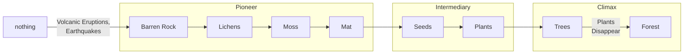

## Ecological Succession

Gradual process by which ecosystems change and veelopo over time

## Primary Succession

Succession from bare rock to deep vegetation

### Stages

### Reason

occurs due to eruption of volcanoes

when lava flows into the ocean, new rocks are formed

weathering and other natural forces cause formation of

### Threats to Climax Stage

1. natural
   1. Forest Fires
   2. flooding
   3. storms
   4. volcanic eruptions
2. humans
   1. human settlement
   2. clearing for agriculture

## Secondary Succession

Succession that follows disruption of a pre-existing community

Organisms are destroyed, but the soil is safe. Therefore, this succession is faster.

Soil contains seeds of weeds, grasses and trees. Wind and birds help in spreading the seeds.

Succession begins again, but species are different