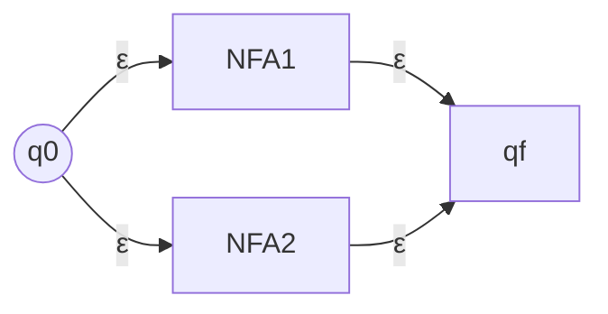
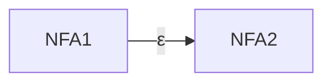

Non-deterministic Finite Automator

Finite automator that only shows the transitions required for the pattern to be recognized.

For a state $q$ and symbol $a \in \Sigma$, NFA can have

- no edge leaving $q$ labelled with symbol $a$
  or
  multiple edges leaving $q$ labelled with the same symbol $a$
- edges leaving $q$ labelled with $\epsilon$
- can take $\epsilon$-edge without reading any symbol from input string.

## Advantage of NFA ✅

- Easier to construct than DFAs
- Easier to combine than DFAs for operations like union, concatenation etc. on regular languages

## Evaluation of NFA

### Tracing Steps

- NFA splits into multiple copies of itself (threads)
  - Each copy performs independent and parallel computation
- At any instant, NFA will be in a set of states (one/more states)
- If a copy is in a state and there is no outgoing transition, then the copy dies/crashes
  - We discard this copy from our evaluation

### Conclusion

- Accept, if **atleast one** copy ends in an accept state after reading entire input string
- Reject, if **no** copy ends in an accept state after reading entire input string

## DFA vs NFA

|                     | DFA                                               | NFA                                                  |
| ------------------- | ------------------------------------------------- | ---------------------------------------------------- |
| $\Sigma$            | consist of only symbols excluding $\epsilon$ | $\Sigma_\epsilon = \Sigma \cup \epsilon$             |
| $\delta$            | $Q \times \Sigma \to Q$                           | $Q \times \Sigma^* \to P(Q)$ (Power set of $Q$) |
| No of states        | $\uparrow$                                        | $\downarrow$                                         |
| Easy to construct   | ❌                                                 | ✅                                                    |
| Efficient Execution | ✅                                                 | ❌ (due to backtracking)                         |
| Time Complexity $T$ | $O(k)$                                            | $O\Big(k*f(m, n)\Big)$                               |

$k =$ length of input string

### Notes

- Both DFA and NFA accept the same class of languages called Regular Languages
- Every NFA has an equivalent DFA
- ==NFAs have the same power as DFAs==
- Parallel (or non deterministic execution) does not add any computation power to NFAs
- Power of a machine is defined based on the class of languages recognized by the machine.

## $\epsilon$-Closure (of a set of states)

Set of states that can be reached transitively from a state by travelling using 0 or more $\epsilon$ transitions

## NFA $\to$ DFA

For every transition, we will have a set of states

These combination of states will be renamed as a single new state.

## NFA for Operations

### Union

Let’s say you have 2 NFAs

- Take both the NFAs
- Introduce an extra starting state
  - Introduce a $\epsilon$ transition **to** each of the starting states of the NFAs
- Introduce an extra ending state
  - Introduce a $\epsilon$ transition **from** each of the ending states of the NFAs

### Intersection

No simple method; you have to do cross product

### Concatenation

- Draw both the NFAs
- Connect end state of one NFA to start state of other NFA

### $W^R$

Reversed word

(similar to DFA only; however, here we are given an NFA and are asked for an NFA)

1. Swap the direction of every transition
2. Swap starting and accepting states
