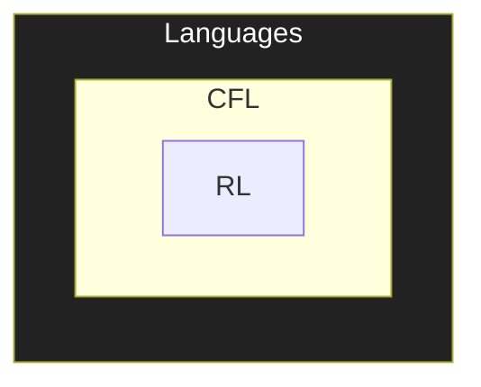

Refer to POPL notes, as this is kinda repeated

## Grammar

Set of substitution/production rules to derive a string, applied $k$ times

Grammar is way to

- Describe a language
  Represent all possible legal strings
- Derive a sentence
  Generate a legal string of the language
- Analyze a sentence
  Check if given string is valid (opposite of derivation)

## Parse Tree

Visual representation of derivation of a string, using a grammar

## CFG

Context-Free Grammar

Context-free grammar

$$
\text{CFG} = G(V, \Sigma, R, S)
$$

|          |                                       |
| -------- | ------------------------------------- |
| $V$      | Finite set of variables/non-terminals |
| $\Sigma$ | Finite set of terminals               |
| $R$      | Finite set of substitution rules      |
| $S$      | Start symbol                          |

$V \cap \Sigma = \phi$

### CFG vs CSG

|                                                        | CFG                 | CSG                     |
| ------------------------------------------------------ | ------------------- | ----------------------- |
| $X$                                                    | Single non-terminal | $\in (V \cup \Sigma)^+$ |
| **Substitution independent** of context $X$ appears in | ✅                   | ❌                       |

## Derivations

$u \overset{*}{\implies} v$ means $u$ derives $v$

- $u = v$
- or
  $\exists \ u_1, u_2, \dots u_k$ such that $u \implies u_1 \implies u_2 \implies \dots \implies v$

$\overset{*}{\implies}$ denotes a sequence of zero/more single step-derivations

**Note**

$\to$ and $\implies$ are different

- $\to$ used in defining rules (productions)
- $\implies$ used in derivation

## CFL

Context-Free Language

Lang which can be generated by a CFG

$$
L(G) = \{ w \in \Sigma^* | S \overset{*}{\implies} w \}
$$

$$
L(G) \subseteq \Sigma^*

$$

## Ambiguous Grammar

Multiple parse tree for a single string

$\exists$ multiple interpretations for the string

Examples

-  Arithmetic expressions evaluation without BODMAS
- Balenced parenthesis evaluation