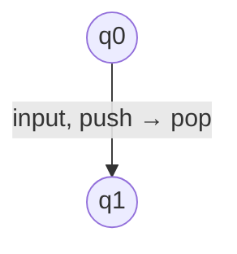
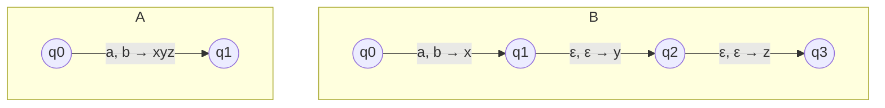
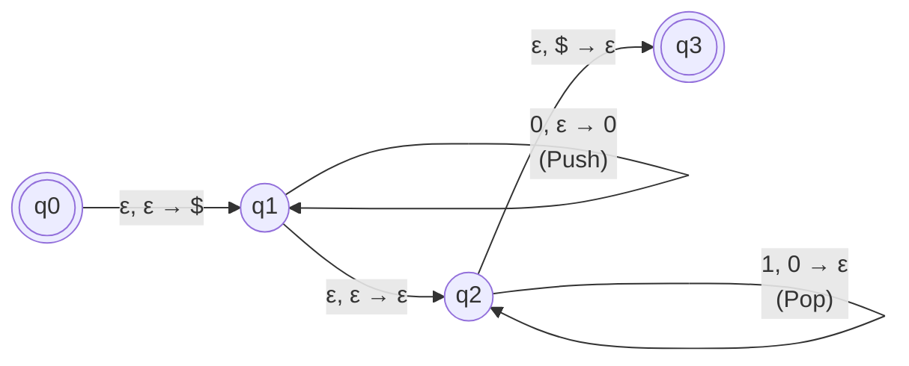
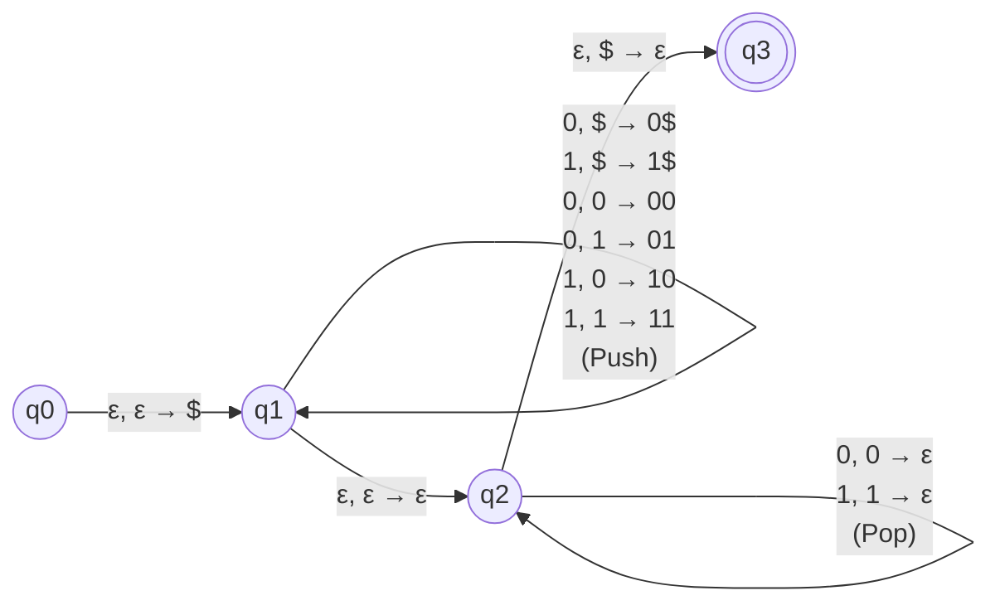
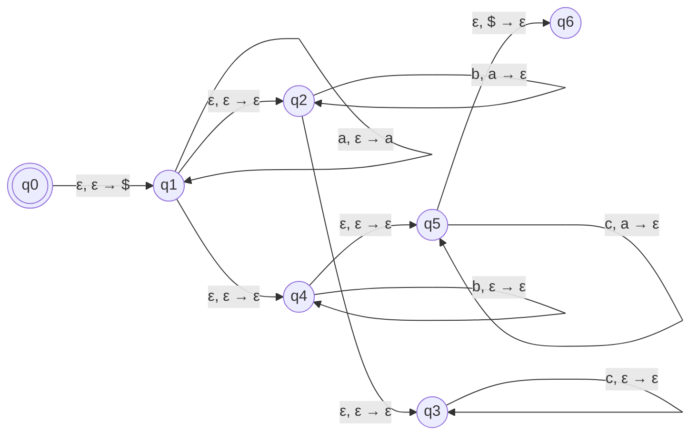
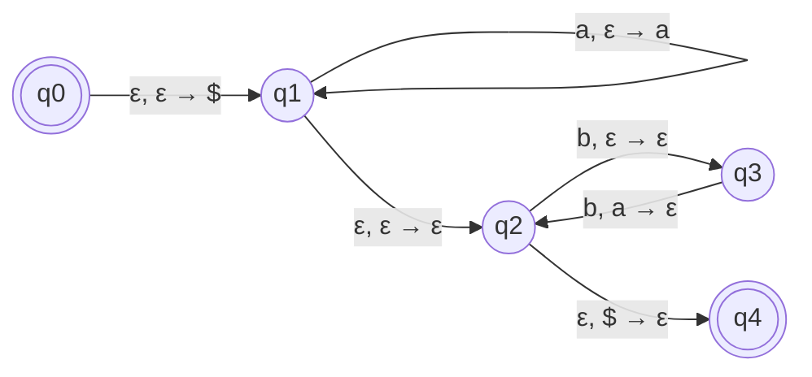
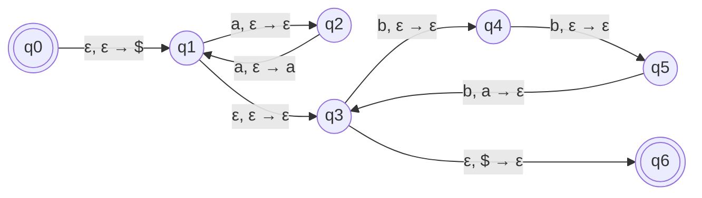
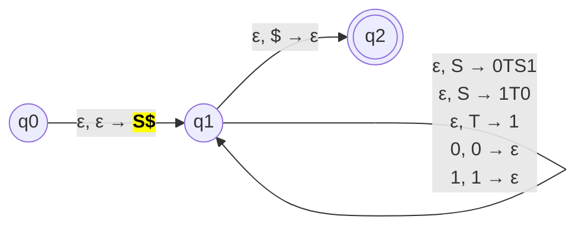
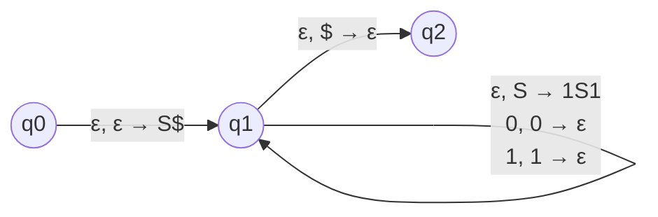

## PDA

Pushdown Automaton

NFA + Stack

Also represented as NPDA (non-deterministic)
$$
\text{PDA} \implies M(Q, \Sigma, \Gamma, \delta, q_0, F)
$$

| Symbol   | Meaning                 |                                                              |
| -------- | ----------------------- | ------------------------------------------------------------ |
| $Q$      | Set of States           |                                                              |
| $\Sigma$ | Set of input alphabet   | $\Sigma_\epsilon = \Sigma \cup \epsilon$                     |
| $\Gamma$ | Set of stack alphabet   | $\Gamma_\epsilon = \Gamma \cup \epsilon$                     |
| $\delta$ | Transition Function     | $\delta: Q \times \Sigma_\epsilon \times \Gamma_\epsilon \to P(Q \times \Gamma_\epsilon)$ |
| $q_0$    | Start state             |                                                              |
| $F$      | Set of accepting states |                                                              |

- States $Q$
- Input Alphabet $\Sigma$
- Stack Alphabet $\Gamma$
  - $\

$$
 marks the bottom of stack
  - Symbols are pushed/popped to/from stack
- Transitions
  - If PDA is current in state $q_i$
    - it reads $a \in \Sigma_\epsilon$ off the stack
    - it pops $b \in \Gamma_\epsilon$ off the stack

### Conclusion

Same as [NFA Conclusion](03 NFA.md#Conclusion)

### Note

DPDA means DFA + Stack

- Every DPDA has an equivalent PDA
- Not every PDA has an equivalent DPDA

## Stack Operations

| Operation                            | Representation   |
| ------------------------------------ | ---------------- |
| Pop 0 and Push 1                     | $0 \to 1$        |
| Push 0 (Pop $\epsilon$, Push 0) | $\epsilon \to 0$ |
| Pop 0 (Pop 0, Push $\epsilon$)  | $0 \to \epsilon$ |

## CFL

Context-Free Language

Language that is recognized by a PDA

The intersection of 2 context-free languages ==***does not result***== in another CFL

|                 | Deterministic CFL     | Non-Deterministic CFL      |
| --------------- | --------------------- | -------------------------- |
| $\exists$ DPDA? | ✅                     | ❌                          |
| Example         | Programming Languages | - $w w^R$ - $0^n 1^n$ |

### Closed Operations

Let $L_1, L_2$ have grammar $G_1 = \{S_1 \to A\}, G_2 = \{S_2 \to B\}$

| Operation                            | New Grammar $G_\text{new}$ |
| ------------------------------------ | -------------------------- |
| $L^*$                                | $\{SS | \epsilon \}$       |
| $L_1 \cdot L_2$ (concatenation) | $\{S_1 \cdot S_2 \}$       |
| $L_1 \cup L_2$                       | $\{S_1 | S_2\}$            |

#### Note

Using properties, we can say that $L=\{a^n b^n | n \ge 0, n \ne 50 \}$ is CFL

This is because

$$
\begin{align}
L
=& \{a^n b^n \} - \{a^{50} b^{50} \} \\=& \{a^n b^n \} \cap \{a^{50} b^{50} \}' & & \Big( A-B = A \cap B' \Big) \\=& \text{CFL} \cap \text{RL} && {\Big(\rm{(RL)' \to RL }\Big)} \\\implies & \text{CFL}
\end{align}
$$

### Non-Closed Operations

- Intersection is not closed $\implies L_1 \cap L_2$ is ==**not**== always CFL
- Complement is not closed ${L_1}'$ is not always CFL

## PDA for CFG

Initialize stack as ==$\$S$==

### Leftmost Derivation

| Top of Stack | Input    |                              |
| ------------ | -------- | ---------------------------- |
| Non-Terminal |          | Pop it Push RHS of rule |
| Terminal     | Terminal | Pop it                       |
| $\

$$
         |          | Pop it Accept string    |

As pushing strings instead of a symbol into stack is not possible, we can use another approach, as both are equivalent.

## Classic Questions

### PDA for $0^n 1^n$

The reason why $1, 0 \to \epsilon$ for $q_2\to q_3$ ==**can**== be replaced by $\epsilon, \textcolor{hotpink}{\epsilon} \to \epsilon$ is because the top of stack should be $\textcolor{hotpink}{\epsilon}$. The top of stack can be thought as the actual top of stack or an empty string “” $(\epsilon)$

|   Input $\rarr$   |      | $0$  |                |                       | $1$  |            |      |      $\epsilon$       |                       |
| :---------------: | :--: | :--: | :------------: | :-------------------: | :--: | :--------: | :--: | :-------------------: | :-------------------: |
| Stack Top $\rarr$ | $0$  | $\

$$
 |   $\epsilon$   |          $0$          | $\

$$
 | $\epsilon$ | $0$  |         $\

$$
          |      $\epsilon$       |
|       $q_0$       |      |      |                |                       |      |            |      |                       |    $\{(q_1, \$)\}$    |
|       $q_1$       |      |      | $\{(q_1, 0)\}$ |                       |      |            |      |                       | $\{(q_2, \epsilon)\}$ |
|       $q_2$       |      |      |                | $\{(q_2, \epsilon)\}$ |      |            |      | $\{(q_3, \epsilon)\}$ |                       |
|       $q_3$       |      |      |                |                       |      |            |      |                       |                       |

(Blank entries are $\phi$)

### PDA for $ww^R$

### PDA for $a^i b^j c^k: (i, j, k \ge 0) \land \Big((i=j) \lor (i=k) \Big)$

We can simplify the regex: our PDA will accept the following strings

- $a^i b^i c^*$
- $a^i b^* c^i$

### PDA for $a^n b^{2n}$

### PDA for $a^{2n} b^{3n}$

### PDA for $G = \{S \to \rm 0TS1 | 1T0 , T \to 1 \}$

### PDA for $G = \{S \to 0S1\} \quad (0^n 1^n)$

