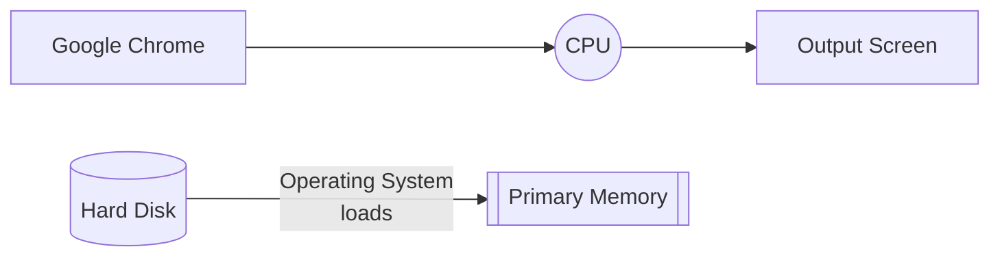
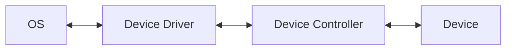
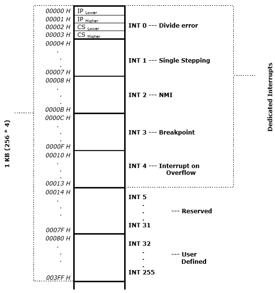
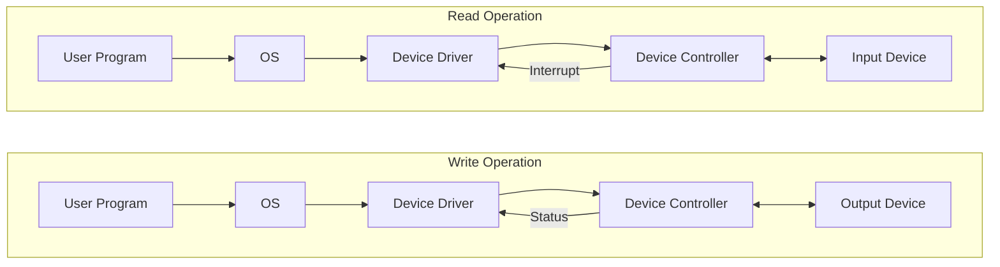
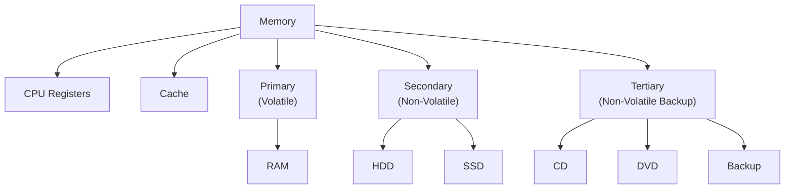
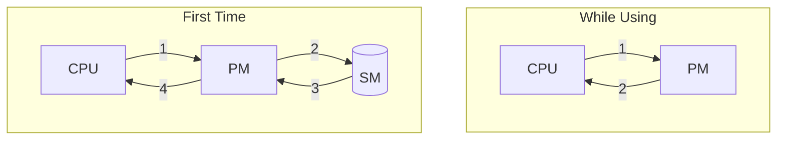
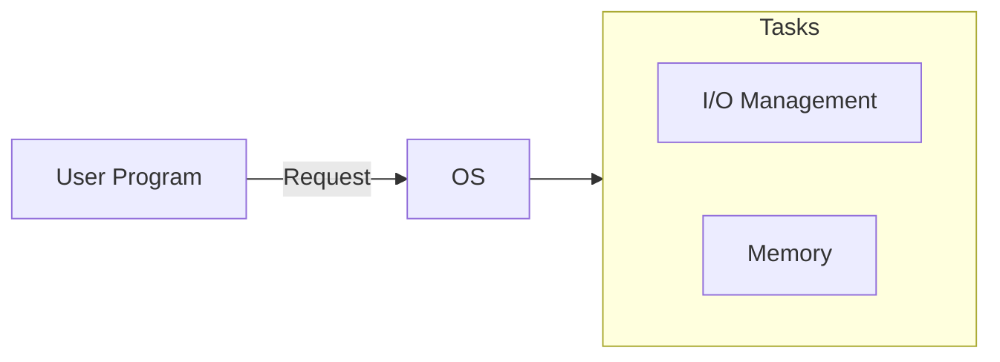

## Software

a set of programs

## Types of Softwares

|             | Application Softwares                  | System Softwares                                             |
| ----------- | -------------------------------------- | ------------------------------------------------------------ |
| **Purpose** | Helps users with specific applications | - Provides environment for application software - Manage hardware resources |
| **Example** | Word, Paint                            | - Operating System - Emulator - Language Translators (Compiler, Interpreters, Assemblers) - Linker, Loader |

## Operating System

> System software that acts as an interface between users and the hardware resources of a computing system.

- Resource allocator
  - Keeps track of
    - occupied/empty portions of the primary and secondary memory
    - Status of I/O Devices
- control porgam
- Kernel of a computing system
  Kernel means most important part of any computing system/programming environment
  - Kernel is system software which is part of operating system
  - Kernel provides interface between hardware and software components
  

$$
\fbox{
System, Application Software
$\fbox{
  Operating System
$\fbox{Kernel
$\fbox{H/W Resources}$
}$}$
}
$$

## Types of Operating System

- Mobile
- Personal Computer
- Real Time
- Distributed

## Hardware Resources

- Memory
  - Primary is volatile
  - Secondary is non-volatile
- Processor
- I/O Devices

## Example

## Device

### Controller

- Data Register/Local buffer
- Command Register

### Driver

- Interface between OS & Device
- Understands the device controller & device

## Daemons

Background system processes, that are not in direct control of user

## Interrupts

Asynchoronous request to the CPU, handled by the OS using the ISR (Interrupt Service Routine).

They can be initiated anytime without reference to the system clock.

Could be hardware-generated or software-generated.

### ISR & IVT

ISR and IVT(Interrupt Vector Table) are stored in fixed location in memory.

ISR is accessed using IVT, which contains the starting address of the ISRs.

$$
\begin{align}
&\text{Starting address of ISR in IVT}\\& = \text{Starting address of IVT in memory } \\& \quad + (
\text{type} \times \text{no. of loc to store address of 1 ISR}
)
\end{align}
$$
8086 has 256 vectored interrupts

Each ISR requires 4 bytes

- 2 bytes of IP
  followed by
- 2 bytes of CS

If the starting address of IVT is $\rm{00000_H}$, then the ending address is $\rm{003FF_H}$

### Graph

(take from slides)

### Interrupt latency

Time taken to **service** an interrupt

### Advantages

- Save processor time
  Processor resources are very valuable, as it can be used for some other task
- Avoid polling
  Going around asking I/O devices; wasting processor time

## Program Counter

Similar to instruction pointer of x86

- Initially points to 1st instruction
- Subsequently, points to the address of the next instruction to be executed

## Interrupt Handling

1. An interrupt that occurs in between an instruction can only happen after fetch, decode, execute, write-back of that instruction is first complete.
2. When interrupt occurs, we need to push the following values into stack

   - [PC](#Program Counter) so that we can return to the same point after finishing the interrupt

   - CPU state
     Contents of all CPU and flag registers
3. Service the interrupt using ISR
4. Restore processor state
5. Load the saved return address into the program counter
6. Resume interrupted computation

## Storage of Multi-Byte data

Little Endian = Lower Byte is stored first then Higher Byte
This is what 8086 uses

Big Endian = Higher Byte is stored first then Lower Byte

## Storage Structure

- Bit (0/1) [most basic unit]
- Byte = 8 bits
- Word = Group of bytes

|      | Bytes    |
| ---- | -------- |
| KB   | $2^{10}$ |
| MB   | $2^{20}$ |
| GB   | $2^{30}$ |
| TB   | $2^{40}$ |
| PB   | $2^{50}$ |

## Types Of Storage Devices

| Feature     | Order                      |
| ----------- | -------------------------- |
| Speed       | Reg > Cache > PM > SM > TM |
| Cost        | Reg > Cache > PM > SM > TM |
| Access Time | Reg < Cache < PM < SM < TM |
| Size        | Reg < Cache < PM < SM < TM |

## Booting

Process of loading OS Kernel into the primary memory

### Steps

- Starting address of Bootstrap program is stored into the Program Counter
- Bootstrap loader loads the OS using Boostrap program

### Bootstrap Program

- In Intel architecture, it’s called as BIOS(Basic Input Output System)
- In Unix architecture, it’s called as GRUB(GRand Unified Bootloader)
- In Android, LK(Little Kernel)

#### Tasks

1. Run POST(Power-On Self Test) diagnostics
2. Initialize and check peripheral devices
3. Initializes other aspects of the system, such as the registers
4. Locates and loads the kernel

### ROM

Read-Only Memory

### EEPROM

Electrically Erasable Programmable Read-Only Memory

It is firmware (combination of hardware and software that can hold code)

==**Bootstrap program is burnt into EEPROM**==

System Programs loaded to PM, System process, Deamons, Program in its execution, Printer network, Background Process

In linux, the first program is `systemd`

## Software Interrupt

Trap/exception

| Source/Cause | Example                                                   |
| ------------ | --------------------------------------------------------- |
| Errors       | - Divide by zero - Access to illegal parts of memory |
| System call  | When user actions requires something like input/output    |

## Programming Types

Uni was before.

|                     | Uni                                                                                                     | Multi|
|---                  | ---                                                                                                     | ---|
|Primary memory parts | - OS area - User area can be used by only 1 program                                                | - OS area - User area contains multiple programs|
|Advantage            |  | When one program is waiting for I/O, the OS sends off another program to the CPU.|
|Disadvantage         | This had improper utilization of system resources, especially when I/O devices are being used. | Malicious program can affect the other program’s segments; before it was even possible for them to affect the OS|

## Modes of Operations

This mode bit will change continuously.

| Mode Bit | Mode                          | Computer is executing |
| :------: | ----------------------------- | --------------------- |
|    0     | Kernel/Supervisor/Priveledged | OS code/System call   |
|    1     | User                          | User code             |

## Privileged Execution of Instruction

Priviledge signifies access level of a program

I/O, memory, timer, CPU, Interrupts are privileged

Privilege level varies from

- 0 (high privilege)
- 3 (low privilege)

If a program trying to access memory is privileged, then it is checked if it is in Kernel mode or User mode.

If it is in user mode, a trap is generated.

## Lab code

[Lab](Lab)

## I missed something (Sep 14 1st Hour)