## CPU Scheduling

Note that in this course, we are ==neglecting the effect of context switch==. In reality, context switch time is around $5 \micro s$

- Wait $\to$ Ready
  - Higher priority process enters Ready Queue
- Current Process in the CPU goes to wait state
- Current process terminates
- Current process is timed-out

## Pre-Emptive Scheduling

Re-evaluate the schedule every time a new process enters the ready queue.

Usually you evaluate the schedule every time a process **completes** its quanta(will be explained below)/or **completely executes**

## Dispatcher

Gives control of CPU to the process selected by CPU-Scheduler

### Functions

- Context Switch
- Switch to the user mode
- Jumping to correct location of user program’s for restarting it

### Dispatch Latency

Time between stopping one process and starting another process, including context switch time

## Sheduling Criteria

| Criteria                                        | Goal is to max/min? |
| ----------------------------------------------- | ------------------- |
| CPU Utilization Amount of time CPU is used | $\uparrow$          |
| Throughput                                      | $\uparrow$          |
| Response Time                                   | $\downarrow$        |

## Times

|                                    |                                                              |                            |
| ---------------------------------- | ------------------------------------------------------------ | -------------------------- |
| Arrival Time                       | **Time** at which process arrived (duh)                      |                            |
| Burst Time                         | **Duration** of CPU execution required for a process         |                            |
| End Time/ ==Completion Time== | **Time** at which process has completed entire execution (not duration)  💡 **Tip for questions** - Find the latest instance of the process in the Gantt chart - That end time is the end time of the process |                            |
| Turnaround Time                    | **Duration** to complete execution, ie time between job submitted and final result obtained  - Waiting time to enter memory - Waiting time in ready queue - Time to execute - Time to perform I/O operations | EndTime - ArrivalTime      |
| Wait Time (to be minized)     | **Duration** spent waiting for complete execution            | TurnAroundTime - BurstTime |
| Average Wait Time                  | Avg of wait times of all processes We can reduce this by shifting the more time-consuming processes to later |                            |

## CPU Scheduling Algorithms

## FCFS

First-Come-First-Serve

Simple

Ready Queue = FIFO Queue

### Properties

- Non-interactive
  - Not applicable for time-sharing systems
- Non-Preemptive Scheduling
- High average waiting time
- Convey effect?
  Many times resources are idle
  - CPU
  - I/O devices
## SJF

Shortest Job First

Pick the process with the lowest CPU **remaining** burst time (at the moment of scheduling)

### Types

- **Preemptive **(SRTF)
  Shortest remaining time first (makes sense for partially-executed programs)
  - Reschedule every time a new task enters ready queue
  
- **Non-Preemptive**
  - Only prioritize once a process is completed
## Priority Scheduling

Processes are scheduled based on a priority number alone (Burst time not involved in the scheduling calculation)

Priority number is assigned to every process, which is an integer value within a fixed range

- Some implementations take $0$ as highest priority
- Some implementations take $0$ as low priority

In this course, **smallest number $=$ highest priority**, unless specified otherwise.

**Equal priority processes are scheduled in FCFS order**

### Types

- Preemptive
- Non-Preemptive

### Priority

In our questions, it will be given.

However, in real world, it is based on

### ❌ Starvation

Low priority processes may never execute

#### Solution: Aging

Increase the priority of processes, as time progresses

## Round Robin

Basically pre-emptive FCFS

Used in Time Sharing systems

Also called as ‘Fair-Share Scheduling’

CPU Time is divided into small units, called as time slice/quanta

Ready Queue is actually a circular queue

### Working

1. Scheduler runs
2. Picks process at the `Head` of the queue
3. Dispatcher runs
4. Timer is set (equal to time quanta)
5. Timer interrupt (time-out/time quanta expires)
6. Process moves to the `Tail` of the queue
7. `Head` pointer now points to the next process

If there are $n$ processes in the ready queue and the time quantum is $q$, the each process gets $\frac{1}{n}$ of the CPU time in chunks of atmost $q$ time units at once.

No process waits more than $(n-1) q$ time units

- ❌ Higher average waiting time than SJF
- ✅ Lower response time than SJF

### Value of $q$

We need to choose $q$ in a reasonable way

| $q$       | Behaves like              | Solution                                                     |
| --------- | ------------------------- | ------------------------------------------------------------ |
| Too large | FCFS                      | Dec $q$                                                      |
| Too small | too many context switches | Inc $q$ $q$ must be large with respect to context switch time otherwise overhead is too high; more time will be spent on context switching rather than actual execution |

### Example

Assume time quantum is 20ms, and all the processes arrive at time 0.

| Process |   Burst Time    | Turn-Around Time |  WT  |
| :-----: | :-------------: | :--------------: | :--: |
|  $P_1$  |      $53$       |       134        |  81  |
|  $P_2$  |      $17$       |        37        |  20  |
|  $P_3$  |      $68$       |       162        |  94  |
|  $P_4$  |      $24$       |       121        |  97  |
|         | ***Avg*** $\to$ |      113.5       |  73  |

## Multi-Level Queuing

1. Maintain one ready queue for each type of process
2. Process are usually classified into different types, using one of the following methods

   - Method 1

     - foreground process
       - interactive
       - require quick response time

     - background process
       - batch process

   - Method 2

     - Real-Time Process

     - System Process

     - Interactive Process

     - Batch Process
3. Assign fixed priorities to each queue
4. Apply an appropriate **within-queue scheduling** algo
5. Apply an appropriate **between-queue scheduling** algo
   - Fixed-priority pre-emptive scheduling
     - Entry of a new process into a higher priority queue will cause pre-emption
     - The higher priority ones have short burst time, so no need to worry about user delay
     - Low-priority queues do not execute unless higher priority queues are empty
       - Hence, there is possibility of starvation of batch processes
     
   - Time Slice Scheduling
     - Round Robin between queues
     - Each group is given a certain amount of CPU Time
     - For eg
       - Real-Time = 40% of CPU Time
       - System = 30% of CPU Time
       - Interactive = 20% of CPU Time
       - Batch = 10% of CPU Time

## Multilevel Feedback Queue

Move between queues

Kind of pre-emptive scheduling, as process from low priority queue is pre-empted when a process enters any of the high priority queues

### Aim

Separate processes based on CPU Burst Time

### Working

Favors (gives high priority to) I/O-bound and interactive processes

- Small CPU burst time $\to$ High priority
- Long CPU burst time $\to$ Low priority

In case of starvaton, process from low priority queue moves to a high priority queue (Aging)

**==In case of any pre-emption, the round robin timer won’t reset==**

- For eg, if a process in $Q_1$ has executed for 4ms out of 8ms time quanta, and it gets pre-empted by a process in $Q_0$
- When we get back to $Q_1$, we continue from 4ms (not reset to 0)

### Components

3 Queues

```mermaid
flowchart LR

Start((Start))
Finish((Finish))

Start -->
q0[["Q0<br>(q = 8ms)"]] -->
|"Incomplete<br />❌"| q1[["Q1<br />(q = 16 ms)"]] -->
|"Incomplete<br />❌"| q2[["Q2<br />FCFS"]]

q0 & q1 & q2 -->|"Complete<br />✅"| Finish

classDef queue fill: teal, color: orange, font-weight: bold
class q0,q1,q2 queue
```

