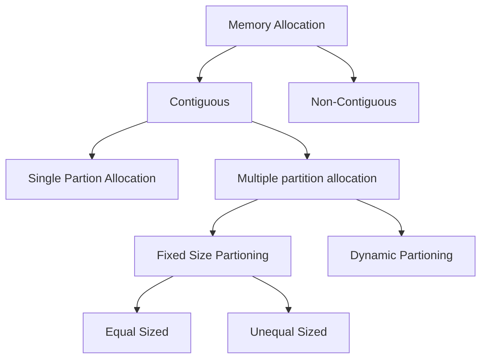

## Address

| Address           |                                                              |
| ----------------- | ------------------------------------------------------------ |
| Logical (Virtual) | Address generated by CPU                                     |
| Physical          | Address seen by memory unit (one loaded into memory address register) |

## Address Space

| Address Space |                             |
| ------------- | --------------------------- |
| Logical       | Set of all logical address  |
| Physical      | Set of all physical address |

## Types of Memory Allocation

| Type           | 1 chunk of consecutive locations are required? |
| -------------- | ---------------------------------------------- |
| Contiguous     | ✅                                              |
| Non-contiguous | ❌                                              |

## Contiguous

## Multiple Partition Allocation

When a partition is free, a process is selected from input queue and is loaded to the free partition

### Fixed Size Partitions

Internal fragmentation = unused memory within a partition

#### Equal Fixed Size Partitions

❌ Program may be much smaller or larger than the size of the partitions

❌ Internal fragmentation = large

#### Unequal Fixed Size Partitions

❌ Program may be much smaller or larger than the size of the partitions

✅ Internal fragmentation is lower than equal partitioning

### Dynamic Partitions

Partitions are created dynamically as process enter and leave main memory

Hole is the block of available memory

❌ Causes external fragmentation (multiple holes generated within the memory)

## Allocation Algorithms

|           | Meaning                                                      |
| --------- | ------------------------------------------------------------ |
| First-fit | Allocate the **first** hole that is big enough to accomodate |
| Next-fit  | Allocate the hole immediately after the previously alloted location (Subtype of first-fit) |
| Best-fit  | Allocate the **smallest** hole that is big enough to accomodate |
| Worst-fit | Allocate the **largest** hole available                      |

## Compaction/Defragmentation

Computationally-expensive, but allows us to reduce external fragmentation

Move

- allotted partitions beside each other
- holes beside each other

## Paging

non-contiguous memory allocation technique

To run a program of size $n$ pages, we need to find $n$ free frames and load the pages of the program into the frames

used to map/translate logical to physical address

Every process has a page table

==**frame size = page size**== $\in 2^n, n \in Z$

### Page Table

Indexed by page number

Stores the frame number/base address of each page in physical memory

==No of entries = no of pages==

| Page number (acts as index) | Frame no/base address |
| :------------------------------: | :-------------------: |
|                0                 |           0           |
|                1                 |           4           |
|                2                 |           2           |
|                3                 |           7           |

### Formulae

$$
\begin{align}
&\text{Total no of logical address (space size) of the paging} \\&= \text{No of pages $\times$ Page Size} \\&\text{Total Physical memory size} \\&= \text{No of frames $\times$ Frame Size}
\end{align}
$$

$$
\begin{align}
\text{Logical memory size} &= 2^\text{Size of logical address bus} \\
\implies \text{Size of logical address bus} &= \log_2 (\text{Logical memory size}) \\
\text{Physical memory size} &= 2^\text{Size of physical address bus} \\
\implies \text{Size of physical address bus} &= \log_2 (\text{Physical memory size})
\end{align}
$$

### Address Translation

(Diagram from slides)

1. Given logical address
2. Get page no and page offset

| Page No                                                     | Page Offset                                                  |
| ----------------------------------------------------------- | ------------------------------------------------------------ |
| Bits to locate base address of each page in physical memory | Bits to combine with base address to define the physical address |

2. Get frame no (stored in the page we just accessed)

3. $$
   \text{Base address} = \text{Frame no} \times \text{Frame size}
   $$

4. Frame Offset = page offset

   | Frame No                                                     | Frame Offset                                                 |
   | ------------------------------------------------------------ | ------------------------------------------------------------ |
   | Bits to locate base address of each frame in physical memory | Bits to combine with base address to define the physical address |

5. $$
   \text{Physical address} = \text{Base Address} + \text{Frame Offset}
   $$

## I Missed Something

## TLB

Small, fast-lookup hardware cache called associative memory or **translation look-aside buffers** (TLBs) are used for implementing Page Table.

64 or 128 locations/entries

Each entry has 2 parts

- key(tag)
- value

When presented with an item, it is compared with all keys simulatneously for a match

If a key is matched, corresponding value is returned

Costly but faster

TLB Hit, TLB Miss

## Effective Memory Access Time

$$
\text{
EMET =
(TLB Hit Ratio $\times$ Hit Time) + (TLB Miss Ratio $\times$ Miss Time)
}
$$

$$
\begin{align}
\text{Hit Time} &= \text{Time to search TLB } + & \text{Time to access memory} \\
\text{Miss Time} &= \text{Time to search TLB } + & \textcolor{hotpink}{2 \times} \text{Time to access memory} \\
\end{align}
$$

## Memory Protection

We achieve this using memory protection bit in the ==page table== (not TLB)

|            | Memory Protection Bit |
| ---------- | --------------------- |
| Read-only  | 0                     |
| Read-write | 1                     |

Implementation of page table will now be

|      | Frame No | Memory Protection Bit |
| ---- | -------- | --------------------- |
| 0    | 2        | 0                     |
| 1    | 4        | 1                     |
| 2    | 3        | 0                     |
| 3    | 5        | 1                     |

Whenever we have a write operation, the OS checks the memory protection bit in the page table

If we try to write into a read-only page of the process, we receive a trap (software interrupt) by the OS
