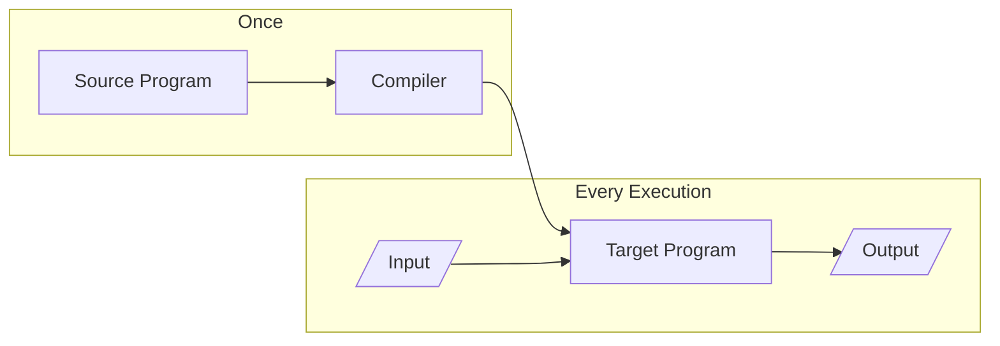
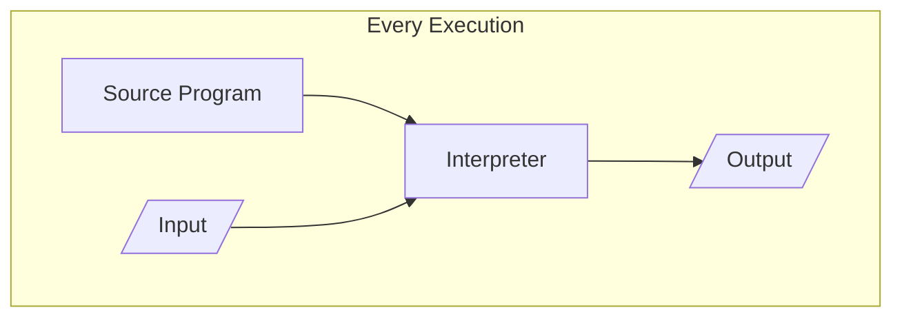
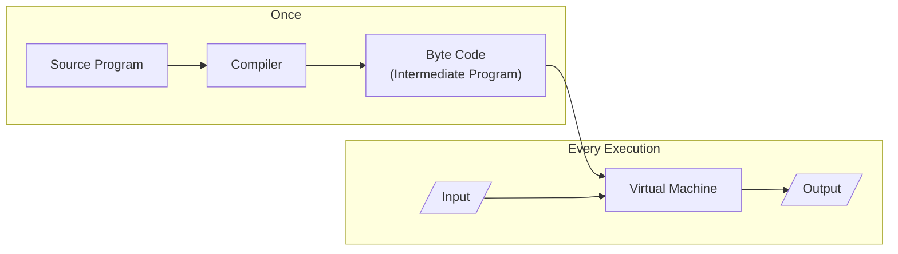

## Programming Lanugage

Tool for humans to communicate with a computer system

We should try to generalize a programming language, to ensure compatibility.

### Properties

- Turing Complete
  Must be able to express anything computable 
- Must be able to implement on existing hardware platforms

### What makes a good language?

- Syntax close to what we are used to
- Readability
- Expressibility
  For eg, `while ` loop instead of `if` and `goto`
- Reliability: Error Checking
    - Detect use of initialized variables
    - Type checking
    - Array Bounds (C vs Java)
    - Testing Support

## Paradigms

|                               | Imperative                                                   | Declarative                                                  |
| ----------------------------- | ------------------------------------------------------------ | ------------------------------------------------------------ |
| Programmer tells __ to do     | how                                                          | what                                                         |
| Focus of programming language | Do exactly what is told                                      | Do what is meant                                             |
| Classifications               | - **Procedural**: Fortran, C<br />- **Object-Oriented**: C++, Java<br />- **Scripting**: Python, Javascript, Bash(Shell) | - **Functional**: LISP/Scheme/Haskel, symbolic data processing<br/>- **Logic**: Prolog, Logic Reasoning<br/>- **SQL**: mySQL, PostgreSQL, Cassandra, NoSQL |
|                               |                                                              | - Sequential<br/>- Concurrent                                |

### Why do we usually use imperative languages?

As we mainly use von [Neumann machines](#von Neumann Architecture), which is the class of stored program digital computer.

Imperative languages give control over moving data and program instructions between registers in CPU and Memory location

### von Neumann Architecture

There is no distinction between code and data, as they are stored in the same memory

### Structured Programming


Dijkstra

Also referred to as ‘goto-less’ programming

- Single entry, Single exit sequence
- Selection
- Repetition

## Generations

| Language<br />Generation | Description                                                  | Language<br />Translator<br />required | Example                             | Performance |
| :----------------------: | :----------------------------------------------------------- | :------------------------------------- | :---------------------------------- | :---------: |
|         Machine          | This is what your machine understands                        | None                                   |                                     |      🔥      |
|         Assembly         | Mnemonics (names and symbols)                                | Assembler                              | x86<br />MIPS                       |      🔥      |
|        High-Level        | - Machine independence<br />- Semantics not limited to machine architecture<br />- Human-Friendly<br />- Data/Control Flow abstractions<br />- Availability of libraries<br />- Consistency check (data types) | Compiler<br />Interpreter              | C<br />C++<br />Fortran<br />Pascal |      🔥      |
|         4th Gen          |                                                              | Interpreter                            | Python                              |      🐌      |
|         5th Gen          |                                                              | Just-in-Time Compiler                  | Julia                               |      🔥      |

In the present-day, compiler-generated code is faster than human-written assembly code; it was not the case before

## Bugs

> Programming testing can be used to show the presence of bugs, but never their absence!
>
> ~ Dijkstra

### Solution

- Organize code modularly, such that each part can be understood
- Alpha Testing by company testers
- Beta Testing by end-users

## Early Programming Languages

| Year | Language | Full Form                         | Creator                          | Purpose                   | Focus                 | Still Used? |
| ---- | -------- | --------------------------------- | -------------------------------- | ------------------------- | --------------------- | ----------- |
| 1954 | Fortran  | Formula Translator                | J Backus (IBM)                   | Numerical Computing       | Efficiency            | ✅           |
| 1958 | ALGOL    | Algorithmic Language              | J Backus (IBM)<br />F Bauer (TU) | Algo $\to$ Programs       | Clarity<br />Elegance | ❌           |
| 1958 | LISP     | List Processor                    | J McCarthy (MIT)                 | Symbolic Computing        | Abstractions          | ✅           |
| 1959 | COBOL    | Common Business Oriented Language | G Hopper (US Navy)               | Data Processing (Payroll) | ‘English-like’        | ✅           |

## Scripting Language vs Programming Language

Programming languages

- follow EBNF(Extended Bacus Normal Form)
- have CFG(Context-Free Grammar)

## Language Translators

|                        | Compiler                                                     | Interpreter             | Virtual Machine  |
| ---------------------- | ------------------------------------------------------------ | ----------------------- | ---------------- |
| Speed                  | Faster                                                       | Slower                  |                  |
| Error Detection        | Harder                                                       | Easier                  |                  |
| Code Processing Method | One-Go                                                       | Line-by-Line            |                  |
| Translation            | Once                                                         | Every execution         |                  |
| Distributes            | Executable                                                   | Executable not possible |                  |
| Development time       | Slower                                                       | Faster                  |                  |
| Typing                 | Static/Dynamic                                               | Dynamic                 |                  |
| Target Program         | Machine Code<br />Portable Machine Code (Java Byte Code)<br />C Code |                         |                  |
| Example                | C<br />C++<br />Java                                         | Javascript<br />Python  | Java<br />Python |

### Compiled Code



### Interpreted Code



### Virtual Machines



combine the plus points of compiler/interpreter

Interpreting high level code is slow

### Java

```java
javac Prog.java
java Prog
```

#### Python

```python
python prog.py
```

- First time the program is run, it is interpreted
- In subsequent runs, the cached byte code `.pyc` is executed
## RAM

Random Access Memory

Stores program instructions, addresses, and immediate values

## Shell Scripts

```bash
ls | sort | more
```

View resources consumption by various users

```bash
ipcs
```
