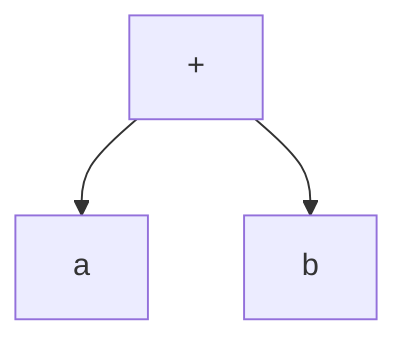
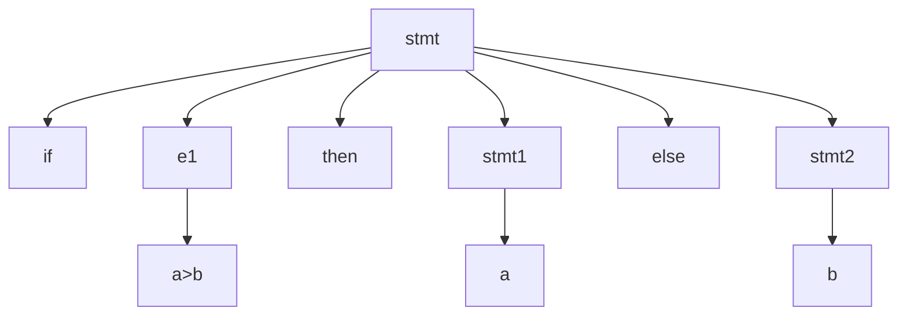
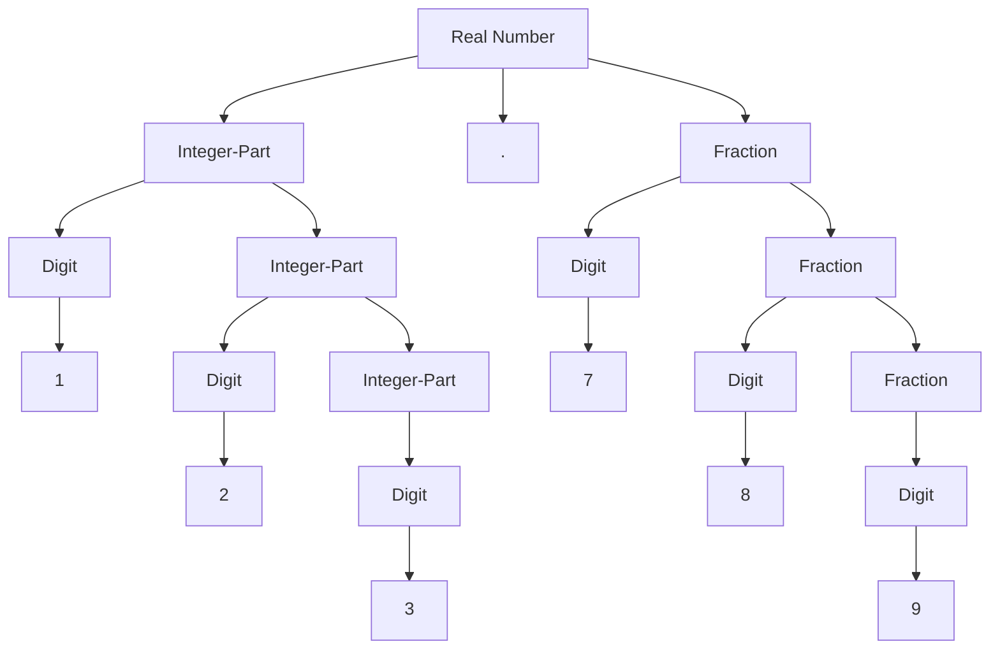

## Syntax vs Semantics

| Syntax                                                  | Semantics                                             |
| ------------------------------------------------------- | ----------------------------------------------------- |
| **Structure** of expressions, statements, program units | **Meaning** of expressions, statements, program units |
| - Lexical layer - Grammar layer                     |                                                       |

## Grammar

Means of

- describing a language: all possible legally-correct programs
- analyzing a sentence: check if program is valid
- derive a sentence: program

## Notations

|        | Example                                                                                                                  | Easy to decode during left-right scan | Parenthesis-free | Operands of each operator can be found unambiguously | Can be evaluated with|
|:-:     | :--                                                                                                                      | :-:                                   | :-:              | :-:                                                  | ---|
|Prefix  | $+ ab$                                                                                                                   | ✅                                     | ✅                | ✅                                                    | - Tree - Stack |
|Postfix | $ab +$                                                                                                                   | ❌                                     | ✅                | ✅                                                    | - Tree - Queue |
|Infix   | $a+b$                                                                                                                    | ❌                                     | ❌                | ❌                                                    | - Tree |
|Mixfix  | **If** $a>b$ **then** $a$ **else** $b$ - `if`, `then`, `else` are keywords - $a, b$ are components of expression | ❌                                     | ❌                | ❌                                                    | |

## Infix Notation

### Associativity

- Left: $+, -, *, /$
- Right: $=,$ ^

### Precedence

BODMAS

1. Brackets
2. Orders (Powers, Indices, Roots)
3. Division
4. Multiplication
5. Addition
6. Subtraction

## Abstact Syntax Tree

identifies meaningful components of each construct in the language

### $+ab, \ a+b, \ ab+$

all have the same abstract syntax tree

### if $a > b$, then $a$, else $b$

## Lexical Syntax

group characters of source program into meaningful sequence (omitting blank spaces and comments) and generate tokens/terminals

### Syntax of token

<token name, attribute value>

### Token Classes

| Class                                   | Example               |
| --------------------------------------- | --------------------- |
| Keyword                                 | `if`, `else`, `while` |
| Operator                                | $+ - * /$             |
| Identifier (Variables)             | max, a, total         |
| Constant (Numeric/String constant) | pi                    |
| Punctuation Marks                       | $, ; () [] \{ \}$     |
| Number                                  | $1 \ 2 \ 3 \ \dots$   |

### Example

$a*b-4$
has the following tokens
<identifier, a> <op, *> <identifier, b> <op, -> <number, 4>

## CFG

Context-Free Grammar

Used to specify grammar of non-regular expressions (refer Theory of Computation)

### Parts

- Set of tokens/terminals
- Set of non-terminals
- Set of rules/productions
  Each production has a
    - non-terminal on its left hand-side
    - $::=$ or $\rightarrow$ on right-hand side
    - String of terminals/non-terminals on right-hand side
- A Non terminal is chosen as the starting non-terminal
  Unique starting terminal is called starting symbol

## BNF

Bacus Naur Form

used to specify grammar

### Parts

- Terminal appear as keyword, opeator, identifiers, constant, punctuation mark
- Non-terminals are enclosed between $< >$
  Eg: < fraction >
- Productions
    - Read $::=$ as ‘can be’
    - Read $|$ or

### Example

- < fraction > $::=$ < digit > | < digit >< fraction >
  Fraction can be digit or a digit followed by fraction

### CFG for real number BNF

- < real-number > $::=$ <integer_part> . < fraction >
- < integer_part > $::=$ < digit > | <integer_part> < digit >
- < fraction > $::=$ < digit > | < digit >< fraction >
- < digit > $::=$ 0 | 1 | 2 | 3 | 4 | 5 | 6 | 7 | 9

## Parse Tree

Also called as Concrete Syntax Tree

Tree built using starting non-terminal and productions

Construction of a parse tree is called parsing

Generates the string formed by reading terminals at its leaves from left to right

A string is only in a language if it is generated by some parse tree

### Rules

- Root is labeled with the starting non terminal
- Each non-leaf is labeled with a non terminal
- Each leaf is labeled with a terminal

### Example

$123.789$

## Ambiguous Grammar

A grammar for a language is syntactically ambiguous, if some string in its language has more than one parse tree.

### Dangling Else

`if E1 then if E2 then S1 else S2` has 2 parse trees with the following grammar

- S $::=$ if E then S
- S $::=$ if E then S else S

### Math

$2+3*5$ has 2 parse trees with the following grammar

- < expr > $::=$ < expr > < op > < expr> | < digit >
- < op > $::=$ + | - | * | /
- < digit > $::= 0 | 1 | 2 | …. | 9$

## Derivations

Text version of Parse Tree

| Top-Down Derivation                                 | Bottom-Up Derivation                                |
| --------------------------------------------------- | --------------------------------------------------- |
| Start from Starting symbol and derive the sentence. | Start from the sentence and reach the start symbol. |
| Replace the LHS of a production by RHS              | Replace the RHS of a production by the LHS          |

| Leftmost Derivation                         | Rightmost Derivation                         |
| ------------------------------------------- | -------------------------------------------- |
| Leftmost nonterminal is replaced repeatedly | Rightmost nonterminal is replaced repeatedly |

### Example

Real Number

real-number $\implies$ integer-part . fraction $\implies$ integer-part digit.fraction

## Grammar for Expressions

- Left-Recursive Grammars handle 
- Right-Recursive Grammars handle right-associativity

|             | Left-Recursive                                     | Right-Recursive                                    |
| :---------: | -------------------------------------------------- | -------------------------------------------------- |
| **Handles** | Left-associativity                                 | Right-associativity                                |
| **Example** | $L ::= L + \text{num} |L – \text{num} |\text{num}$ | $R ::= \text{num} + R |\text{num} – R |\text{num}$ |

### Operator Precedence

(Low to High)

| Operator             | Meaning        |
| -------------------- | -------------- |
| $=$                  | Assignment     |
| $||$                 | Logical or     |
| $\&\&$               | Logical and    |
| $|$                  | inclusive or   |
| ^                    | exclusive or   |
| $\&$                 | and            |
| $== \ \ \ne$         | equality       |
| $< \ \le \ \ge \ > $ | relational     |
| $<< \ \ >>$          | shift          |
| $+ -$                | additive       |
| $* / \%$             | multiplicative |
| $\uparrow$           | exponentiation |

### Operator Association

| Association |                |
| ----------- | -------------- |
| Left        | $+ - */$       |
| Right       | $= \ \uparrow$ |

## Extended BNF

- Braces $\{ \}$ represent zero/more repetitions
- Brackets $[]$ represent optional contruct
- Vertical bar $|$ represents a choice
- Parentheses $()$ are used for grouping

$$
\begin{align}
E &::= T \Big\{ (+ | -) \ T \Big\} \\T &::= F \Big\{ (* | /) \ F \Big\} \\F &::= ( E ) | \text{Name} | \text{Number}
\end{align}
$$

- $E =$ Expression
- $T =$ Term
- $F =$ Factor

## Syntax Chart

The above can be represented as ⬇

