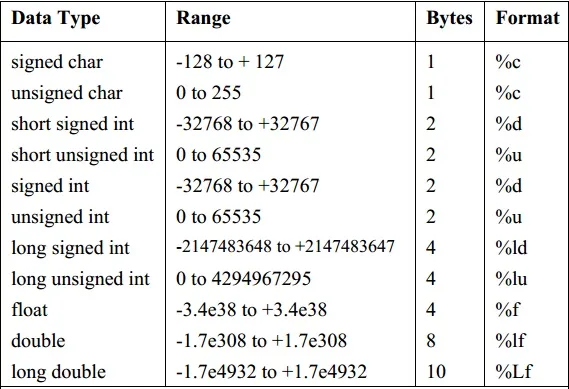

## Data Type Definition

Collection of dat objects, having a set of predefined operations

- Descriptor: Collection of attributes for a variable
- Object: Instance of a user-defined/abstract data type

## Primitive Data Types

### `void`

### `boolean`

true/false

represented as a byte

- Could be represented as bit
- but accessing a single bit is not as efficient as accessing a byte (as it is the smallest **addressable** unit of memory)

### `char`

### `int`

### `float`

### `double`

### Table

No need to study this; just for reference



## Derived Data Types

### Array

- Collection of elements of the same data type
- Linear data structure

Implementing arrays require high compile-time effort. Code to allow accessing of array elements must be generated during compilation. At run time, this code must be executed to produce element addresses.

Dynamic allocation of arrays allows to choose an array length at runtime. Java has built-in dynamic arrays.

#### Alternative Names

| Dimension of array | Alternative Name |
| ------------------ | ---------------- |
| 1                  | Vector           |
| 2                  | Matrix           |

#### Row/Column Major

Most programming languages use row major

| Major  | Address of $(i, j)$th element   |
| ------ | ------------------------------- |
| Row    | $B + W[C(i – L_r) + (j – L_c)]$ |
| Column | $B + W[(i – L_r) + R(j – L_c)]$ |

| Variable | Meaning                                                      |
| :------: | ------------------------------------------------------------ |
|   $B$    | Base address                                                 |
|   $W$    | Width of every block<br />Size of every element<br />(bytes) |
|  $L_r$   | index of 1st row, if in-between<br />(assume 0 if not specified) |
|  $L_c$   | index of 1st col<br />(assume 0 if not specified)            |
|   $R$    | total number of rows                                         |
|   $C$    | total number of columns                                      |

### Structures

- Collection of elements of one/more data types
- Non-linear data structure
- Another way to think of it: Represent a record of different attributes

```c
struct Book
{
  char title[50];
  int year;
};

void main()
{
	struct Book b1;

  strcpy(b1.title, "Blah Blah");
  b1.year = 2020;
}
```

### union

Data type in C that allows to store different data types in the same memory location

```c
union Book
{
  char title[50];
  int year;
}
```

Union is very similar to structure, but the memory implementation is different; both `title` and `year` will be stored together in one block, rather than different blocks.

==**The size of the block will be the size of the largest data type**==. So, the value of the block will be the latest value we stored. So we won’t get the correct expected output like structure.


### Enum

Assign names to integral constants

```c
enum week {
  Mon, // 0
  Tue, // 1
  Wed, // 2
  Thu, // 3
  Fri, // 4
  Sat, // 5
  Sun  // 6
}

void main()
{
  enum week d1;
  d1 = Wed;
  printf("%d", day);
}

// Output
// 2
```

### Pointer

Variable containing address to memory location

```c
char *p;
int *p;
float *p;
double *p;
```

```c
void main()
{
  int var = 20;

  int *ip;
  ip = &var;

  printf(
    "Address of var variable: %x\n",
    &var
  ); 
  printf(
    "Address stored in ip variable: %x\n",
    ip
  ); 

  printf(
    "Value of *ip variable: %d\n",
    *ip
  );
}

// Output
// Address of var variable: bffd8b3c 
// Address stored in ip variable: bffd8b3c 
// Value of *ip variable: 20 
```

## Null Pointer

Pointer pointing to ‘nothing’ (empty location in memory)

Value of pointer is 0

```c
int *p = NULL;
```

## Issues with Pointers and Dynamic Allocation

|           | **Dangling Pointer**                                                               | **Memory Leak**|
|---             | ---                                                                                | ---|
|**Meaning**         | Pointer is pointing to<br />- invalid memory<br />- memory not owned by program    | Allocated memory is not de-allocated, after utilization|
|**Occurs when** | Referencing object is deleted/de-allocated, without changing the value of pointers | Programmer does not de-allocate memory, if the PL doesn’t have automatic garbage collection.|
|**Solution**    | Set the pointer as null pointer when not required anymore.                         | Have a counter variable to track no of<br />- Dynamic allocations<br />- De-allocations<br />At the end, both counters should be equal |

```c
void main()
{
	int *p = NULL;
  p = malloc( // or calloc
    sizeof(int) * 5
  ); // dynamic array that can contain 5 integers
  
  free(p); // Without This => Memory Leak
  *p = NULL; // without this => Dangling Pointer
}
```

## Subrange Type

Limits the range of values a variable can take, by defining a subset of the values of a particular type. Code is inserted by compiler to restrict assingments to subrange values

**Example**

```
type
digit = 0..9;
letter = 'A'..'Z';

var
num: digit;
alpha: letter;
```

## Types & Error Checking

### Purpose

- Avoid errors in programs
- Analyze safety of program (eg bufferoverflow)

### Variable Bindings

Associate a property with a variable

Binding can be

- static (early)
- dynamic (late)

| Language    | Variables  | Values  |
| ----------- | ---------- | ------- |
| Compiled    | Fixed      | Dynamic |
| Interpreted | Changeable | Dynamic |

### Types Systems

- Set of rules for associating a type with expressions
- Used for detecting invalid operations on incompatible types
  For eg
    - pointer + int = ✅
    - pointer + pointer = ❌

### Type Checking

- Uses property of function
- Function maps element of one set to another set
- For eg: Arithmetic operations are functions
    - If $E, F$ are `int`, then $E+F$ will also be `int`

- **Strongly-typed language** is one that allows only safe expressions.

- **Type-Safe Program** is one that executes without any type errors

### Static vs Dynamic Typing

| Type-Checking | When?        | Execution Time | Example |
| ------------- | ------------ | :------------: | ------- |
| Static        | Compile-Type |  $\downarrow$  | C, C++  |
| Dynamic       | Run-Time     |   $\uparrow$   | Python  |

### Type Conversion

| Conversion | By                  | Automatic? | Alternate Name | Example                  |
| ---------- | ------------------- | ---------- | -------------- | ------------------------ |
| Implicit   | Language Translator | ✅          | Coercion       | `double x = 3;`          |
| Explicit   | User                | ❌          | Casting        | `double x = (double) 5;` |

### Type Name & Equivalence

| Equivalence<br />Type |                      | Meaning                                                      | Example                                                      |
| --------------------- | -------------------- | ------------------------------------------------------------ | ------------------------------------------------------------ |
| Structural            | SE1                  | Type is structurally-equivalent to itself                    | $\text{char} \equiv \text{char}$                             |
|                       | SE2                  | 2 types are structurally-equivalent, if they are formed using the same construtor to structurally-equivalent types | $\text{char} \equiv \text{char} \implies \text{char}[10] \equiv  \text{char}[10]$ |
|                       | SE3                  | One data type is declared using `typedef` with the other     | `typedef X Y` $\implies X \equiv Y$                          |
| Restricted<br />Type  | Pure Name            | Type name is equivalent to itself                            | $\text{char} \equiv \text{char}$                             |
|                       | Transitive Name      |                                                              | `typedef X int; typedef Y X` $\implies X \equiv Y \equiv \text{int}$ |
|                       | Type<br />Expression | Type name is equivalent only to itself<br />Apply same constructor to equivalent expressions |                                                              |

**Notes**

- C uses SE for all types, except structures
- (Somethign about circular types - I didn’t understand)

### Type Error

> If a function/operation expects an argument of type $T$, but is supplied with argument of type $S$, such that $S \not \equiv T$

### Polymorphism

> assuming different forms

| Binding Type | When        | Example                                            |
| ------------ | ----------- | -------------------------------------------------- |
| Static       | Compilation | - Operator Overloading<br />- Function Overloading |
| Dynamic      | Execution   | Function Overriding                                |

