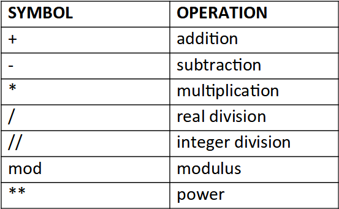

## Logic Programming

Logic program is expressed as a set of atomic sentences(facts) and Horn clauses (rules)

We can ask questions in the form of conjectures (like facts, but with variables) to find out what values will make the conjecture true

| Statement                                                    | Type of Statement       |
| ------------------------------------------------------------ | ----------------------- |
| Ramu is a boy                                                | Fact                    |
| Ramu’s father is Kicha                                       | Relationship            |
| Ramu eats chocolate if chocolates are available and chocolates have nuts | Horn Clause<br />(Rule) |

LIPS: Logical Inferences per second

## Prolog

Consists of a database of predicates composed of facts and rules, involving constants and variables

### Properties

- There is no structure imposed on a Prolog program, there is no main procedure, and there is no nesting of definitions. 
- ==**Terminator is `.`**==
- ==**Assignment is performed using `is`**==
- Program is executed by asking a question using `?-`, called a query
- All facts and rules are global in scope and the scope of a variable is the fact or rule in which it appears
- Facts, rules, and queries are called clauses. 

|                       | Naming Rule                                                  | Example                                           |
| --------------------- | ------------------------------------------------------------ | ------------------------------------------------- |
| Constant<br />(Atoms) | Number<br />String starting with lowercase letter            | tom<br />bill<br />a1<br />x<br />217<br />-33.74 |
| Variable              | String starting with uppercase letter<br />String starting with `_` | Thahir<br />_thahir<br />X                        |

|           |                                          |
| --------- | ---------------------------------------- |
| Fact      | True about some constant                 |
| Predicate | Function result, which can be true/false |

### Relationship

```prolog
father(bukhari, thahir)
mother(habeeb_fathima, bukhari)
```

### Rules

| Symbol | Meaning |
| ------ | ------- |
| `:-`   | `if`    |
| `,`    | `and`   |
| `;`    | `or`    |

```prolog
grandmother(x, z) :- mother(x, y), parent(y, z)

grandmother(x, z) :- mother(x, y), ( father(y, z); mother(y, z) )
```

### Query

Queries in Prolog are entered by the user following the  ?- prompt

```prolog
?- grandmother(habeeb_fathima, thahir) % will give Yes
?- grandmother(What, thahir) % will give habeeb_fathima
```

## Datatypes

### Complex term

No of arguments in a complex term is called arity

```prolog
position(20, 10)
employee(1234, 'Jones', 'James', 1000)
hide(X, father(father(father(butch))))
```

### Other

```prolog
% list
[dog, cat, mouse]

% records/tuples are represented as patterns; elements are accessed by pattern matching
```

## Example of a Knowledge Base

```prolog
loves(vincent, mia).
loves(marcellus, mia).
loves(pumpkin, honey_bunny).
loves(honey_bunny, pumpkin).

jealous(X, Y) :- loves(X, Z), loves(Y, Z).

?- loves(X, mia) % gives us who loves mia
?- jealous(X, Y) % gives us which pairs are jealous
```

## Database

```prolog
part(p001,nut).
part(p002,bolt).

supplier(s001,abc).
supplier(s002,def).

part_supplier_cost(p001,s001,0.10).
part_supplier_cost(p002,s001,0.15).

list(Pkey):-
  part(Pkey,Pname),
  part_supplier_cost(Pkey,Skey,Cost),
  supplier(Skey,Sname),
  
  write(Pkey),write(' '),
  write(Pname),write(' '),
  write(Skey),write(' '),
  write(Sname),write(' '),
  write(Cost),nl.
```

## Type Predicates


`=..` is used to compose and decompose terms

## Arithmetic Expression



```prolog
?- X is 3*4.
	X = 12
yes
```

```prolog
plus(X, Y, Z) :- Z is X + Y.

?- plus(2,3,Z)
Z=5
```

## Unification

Two terms unify,

- if they are the same term
  or
- if they contain variables that can be uniformly instantiated with terms in such a way that the resulting terms are equal.

### Example

|                            | Unify? |
| -------------------------- | ------ |
| mia and mia                | ✅      |
| 42 and 42                  | ✅      |
| woman(mia) and woman(mia)  | ✅      |
| vincent and mia            | ❌      |
| woman(mia) and woman(jody) | ❌      |

```prolog
?- mia = mia.
yes

?- mia = vincent.
no 

?- mia = X.
X=mia
no

?- X=mia, X=vincent.
no
```

## Comparison Operators

| Symbol     | Operation         |
| ---------- | ----------------- |
| `A =:= B`  | A==B<br />(value) |
| `A =\+= B` | A!=B<br />(value) |
| ``A < B``  | numeric           |
| `A @< B`   | String comparison |
| `A =< B`   | numeric           |
| `A @=< B`  | String comparison |
| `A > B`    | numeric           |
| `A @> B`   | String comparison |
| `A >= B`   | numeric           |
| `A @>= B`  | String comparison |

```prolog
3 @< 4 % yes
3 @< a % yes
a @< abc6 % yes
ab @< abc % yes
abcd @< ab % no

?- 3>0 % yes
```

==**Value of functor with argument (term) is always more than any numeric and character (or string)**==

## Logical Operators

```prolog
a :- b.					% a if b
a :- b,c.				% a if b and c.
a :- b;c.				% a if b or c.
a :- not b.			% a if b fails
a :- b -> c;d.	% a if (if b then c else d)
```

|                  | Meaning                   |
| ---------------- | ------------------------- |
| `a :- b.`        | a if b                    |
| `a :- b,c.`      | a if b and c              |
| `a :- b;c.`      | a if b or c               |
| `a :- not b.`    | a if b fails              |
| `a :- b -> c;d.` | a if (if b then c else d) |

## Functions

Functions are implemented using relations

```prolog
fac(0,1).
fac(N,F) :- N > 0, M is N - 1, fac(M,Fm), F is N * Fm.

?- fac(5,F).
120
```

