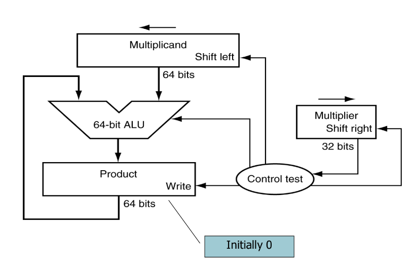
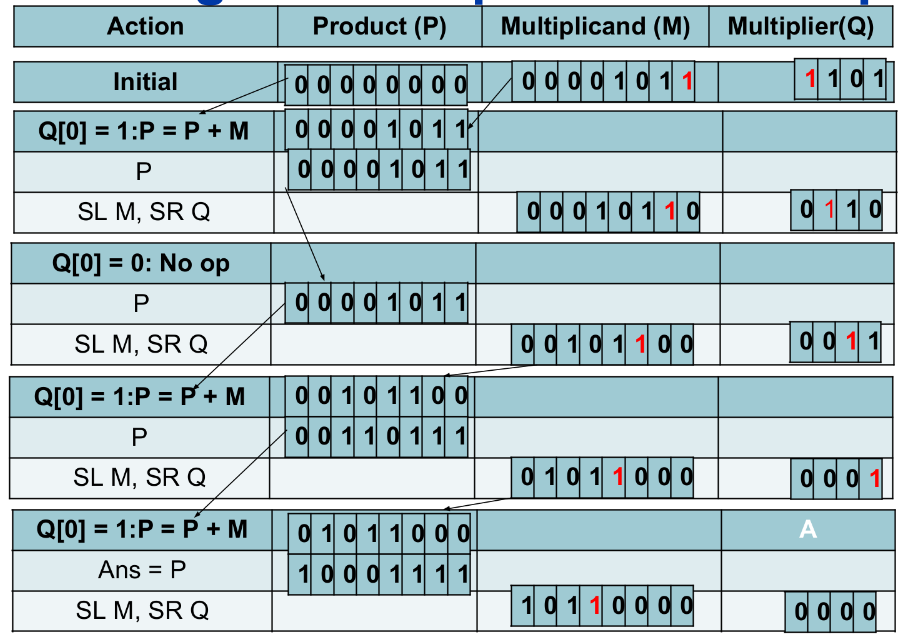
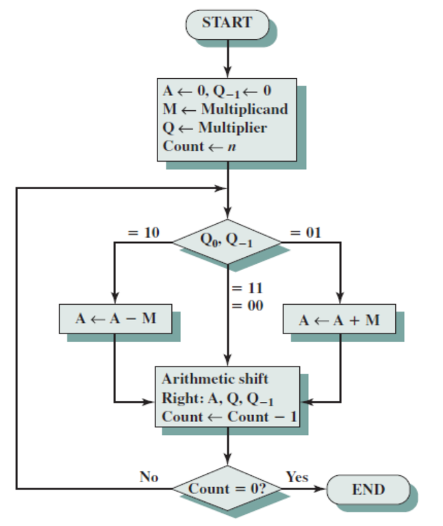
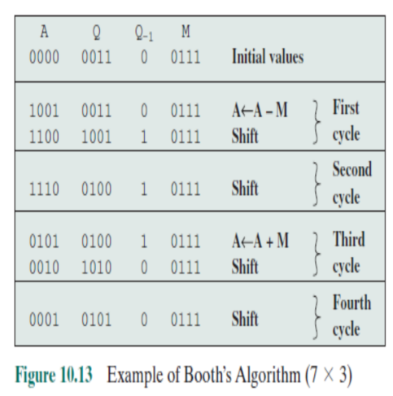

## Signed Integer Addition

Overflow if result out of range

| Operands    | Overflow?             |
| ----------- | --------------------- |
| +ve $+$ +ve | ✅ if result sign is 1 |
| +ve $+$ –ve | ❌                     |
| -ve $+$ -ve | ✅ if result sign is 0 |

## Signed Integer Subtraction

Take the twos complement (negation) of the subtrahend and add it to the minuend.

Overflow if result out of range

| Operands    | Overflow?             |
| ----------- | --------------------- |
| +ve $-$ +ve | ❌                     |
| +ve $-$ -ve | ✅ if result sign is 1 |
| -ve $-$ +ve | ✅ if result sign is 0 |
| -ve $-$ -ve | ❌                     |

## Dealing with Overflow

Some languages (e.g., C) ignore overflow

- Use MIPS `addu`, `addui`, `subu` instructions

Other languages (e.g., Ada, Fortran) require raising an exception

- Use MIPS `add`, `addi`, `sub` instructions
- On overflow, invoke exception handler
    - Save PC in exception program counter (EPC) register
- Jump to predefined handler address
- `mfc0` (move from coprocessor 0 reg) instruction can retrieve EPC value, to return after corrective action

## Multiplication Hardware



## Regular Unsigned Multiplication

Length of product is sum of operand lengths

### Observations

- Multiplication involves the generation of partial products, one for each digit in the multiplier
  | Multiplier bit | Partial Product |
  | -------------- | --------------- |
  | 0              | 0               |
  | 1              | Multiplicand    |

- Each successive partial product is shifted one position to the left relative to the preceding partial product
  (Effectively shifting multiplicand left one position for every
  bit of multiplier)
  
- The final product is produced by summing the partial products.
### Possible Improvements

Can be done more efficiently

- A running sum of partial products is maintained rather
  than waiting until the end to sum all partial products
    - Saves storage
- Shift multiplier right each step
    - Allows to look at a constant position (i.e) examine the least
    significant bit only
- For each 1 on the LSB of the multiplier
    - Add (add running sum of partial product with the multiplicand)
    - Shift (shift-left the multiplicand)
- For each 0 on the LSB of multiplier
    - Shift left the multiplicand


### Example



## Booth’s Multiplication

- Multiplier and multiplicand are placed in the $Q$ and $M$ registers
- 1-bit register $Q_{-1}$ placed logically to the right of the least-significant bit of the $Q$ register
- The results of the multiplication will appear in the $A$ and $Q$ registers
- $A$ and $Q_{-1}$ are initialized to $0$

Control logic scans the bits of the multiplier
Each bit is examined along with the bit to its right

| $Q_0$ | $Q_{-1}$ | Action                                     |
| ----- | -------- | ------------------------------------------ |
| 0     | 0        | Shift-Right $A,Q, Q_{-1}$                  |
| 1     | 1        | Shift-Right $A,Q, Q_{-1}$                  |
| 0     | 1        | $A = A + M$<br />Shift-Right $A,Q, Q_{-1}$ |
| 1     | 0        | $A = A – M$<br />Shift-Right $A,Q, Q_{-1}$ |

In order to preserve sign bit arithmetic shift right is performed. The leftmost bit of $A$, $A_{n-1}$ is not only shifted into $A_{n-2}$ but also remains in $A_{n-1}$



### Example



### Advantage

- Speeds up the multiplication process
- Blocks of 1s or 0s are skipped over, with an average of only one addition/subtraction per block

## MIPS Multiplication

Two 32-bit registers for product

- `HI`: most-significant 32 bits
- `LO`: least-significant 32-bits

### Instructions

```assembly
## 64-bit product in HI/LO
mult rs, rt
multu rs, rt

## Move from HI/LO to rd
mfhi rd
mflo rd

## Least-significant 32 bits of product –> rd
mul rd, rs, rt ## (pseudoinstruction!)
```

