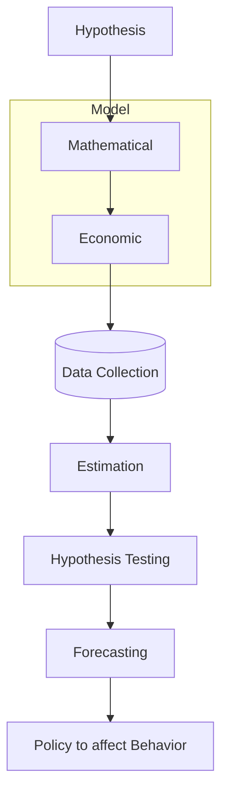
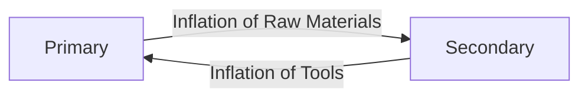

## Methodology for measuring relationships

## Theory/Logic

### Hyphothesis

Theoretical assertion whose truth can be tested

Logical reasoning on how variables would be related, ie what could be the factors

This is also called as specification of relationship. We need to make appropriate specification.

> An increase in $x$ will cause an increase in $y$

- Null Hypthosis
- Alternate Hypthosis

Problem with social sciences (business, economics, etc) is that there may be number of factors, but it is not feasible to incorporate all the features

### Some theories

#### Structural changes

Population shifting from primary sector (agriculture) to secondary sector(manufacturing, construction)

Economic sectors are highly-interconnected.

#### Population Sentiment

People will spend money because they feel secure.

#### Govt

Govt gives out many schemes and development projects, in order to mitigate the effect of decreased private interest.

#### Moral Hazard

Insurance will actually cause people to be **less** cautious.

Check in India if the direct monetary support to infected bank agents actually increased the amount of cases.

## Mathematical Model

Expressing theory in terms of mathematical equations.

❌ Assumes that the relationship is perfect

|               | **Single**  |                          **Multi**                           |                      **Simulateneous**                       |
| ------------- | :---------: | :----------------------------------------------------------: | :----------------------------------------------------------: |
| Dependency    |   Direct    |                           Indirect                           |                       Multiple Direct                        |
| Direction     |     Uni     |                             Uni                              |                            Multi                             |
| Uni-variate   |  $y=f(x)$   |                  $y = f(x)$ $x = g(z)$                  |                  $y = f(x)$ $x = g(y)$                  |
| Multi-variate | $y=f(x, z)$ |               $y = f(x, a)$ $x = g(z, b)$               |                                                              |
| Example       |             | - Dubai economy depends on US, which depends on China - Risk & Return | - Attendance & Performance - Demand & Price - Basically all economic aspects |
|               |             | The intermediary variable of multi-equation model is called as **moderator** |                                                              |

Let’s say that, height of wife is a function of height of husband, but not vice-versa; it is a **male-dominated society**

- height of husband is independent
- height of wife is dependent

Let’s say that, height of wife is a function of height of husband, but vice-versa is also applicable, then it is a equal society.

- height of husband is independent
- height of wife is independent

## Econometric Model

Similar to [Mathematical Model](#Mathematical Model), but understands that relationships are not perfect. There will remain some change unexplained by our mathematical model.

The real world is complex and continuously changing, but human knowledge is limited.

### Specifying inexact relationships

$$
y = \beta_1 + \beta_2 x + u

$$

- $y$ is actual value of the dependent variable
- $\beta_1 + \beta_2 x$ is the estimated/forecasted/predicted component of $y$
    - $B_1$ is the value of $y$ even when $x=0$
    It is the value of $x$, that is independent of $x$
    - For eg, consumption can be non-zero even if income is 0 (called as autonomous consumption spending)

    - $B_2$ is the change in $y$ for a unit change in $x$

- $u$ is the residual/error/disturbance/unexplained component of $y$
    - difference between estimated value and actual value
    - component not explained by your initial mathematical model in terms of only $x$
    - it is different for each point

| Nature of $u$ | Accepted? | Note                                                         |
| ------------- | :-------: | ------------------------------------------------------------ |
| Random        |     ✅     |                                                              |
| Systematic    |     ❌     | $\exists$ some factor that can be used to better explain $y$ Increase no of independent variables, until $u$ becomes random |

### Linear vs Non-Linear Model

We have to decide based on theory and logic

If you are not aware about the theory, then visualize and use trial-error

### Types of Regression

|                    | Regression through Intercept |   Regression through Origin   |
| :----------------: | :--------------------------: | :---------------------------: |
| $y$ has a minimum? |              ✅               |               ❌               |
|  $B_1$ required?   |              ✅               | ❌ Basically no intercept |
|      Example       |       Supply function        |                               |

## Data

### Why do we need data?

To estimate numerical values, we need data.

### Types

Basics - Refer other notes

- Cross Sectional Data
    - Marks of all students in 1 year

- Time Series Data
    - Marks of 1 student from all years

- Panel Data
    - Marks of all students from all years

- Scale Data
    - Qualitative data
    - Ratings: Good-Poor
### Sources of Data

#### Primary Data

Data collected on your own, using sensors/surveys

#### Secondary Data

Data collected by someone else

### Data Frequency

How often the data is collected

- High Frequency: Stock Prices (recorded every second)
- Low Frequency: GDP (recorded monthly)

#### High Frequency data is preferred over Low Frequency

This is because, monthly data does not capture small changes appearing between 2 time periods, those small changes may not even be visible if you collect low frequency data.

### Data Quality

We must check the following properties of the data

- Verify Characteristics
    - Mean
    - Standard Deviation
    - Skewness
- Ensure Reliability
    - Sensors are working correctly
    - Calculations were made correctly

- No Bias
    - There should be no researcher bias
    - Picking a particular sample

    - Ensuring participants of survey have been unbiased
    - For ex: Satisfaction of students in UAE

## Sample Estimation

Obtain the values of parameters/coefficients, using a sample of data

### Types

We have to choose a method based on

- Nature of relationship
- Distribution of variables

#### OLS

Assumes normal distribution

Finds the best fit to reduce error term

#### Maximum Likelihood

Assumes normal or other distribution

Finds the best fit to pick the data point corresponding to highest probability of occurance for each data point

## Hypothesis Testing

Testing if our hypothesis holds true

Is our sample representative?

### Sample Evidence and Statistical Inference

Is estimated value statistically closer to hypothesized/assume value?

Here, we are only interested in the existence of a relationship.

- $H_0: B_1 = 0$ (there exists a relationship)
- $H_1: B_1 \ne 0$ (there exists **no** relationship)

### Localization of Hypothesis

| Localization   | Meaning                                                      |
| -------------- | ------------------------------------------------------------ |
| Local/Specific | You cannot generalize a hypothesis for the entire test sample/population that only applies to a training sample. |
| General        | Universally-applicable hypothesis                            |

## Forecast/Prediction

Using the estimated equation

### Types

| Implementation type | Model only learns from |
| ------------------- | ---------------------- |
| Static              | Initial training       |
| Dynamic             | latest data            |

| Sample type   |                                                     |
| ------------- | --------------------------------------------------- |
| In-Sample     | Train and test on the same dataset                  |
| Out-of-Sample | Train on a dataset Test on a different dataset |

### Evaluation

Error is the deviation between predicted and actual value

| Type | Full Form               | Equation                                   |
| ---- | ----------------------- | ------------------------------------------ |
| MAE  | Mean Absolute Error     | $\sum_{i=1}^n |\hat y_i - y_i|$            |
| MSE  | Mean Squared Error      | $\sum_{i=1}^n (\hat y_i - y_i)^2$          |
| RMSE | Root Mean Squared Error | $\sqrt{ \sum_{i=1}^n (\hat y_i - y_i)^2 }$ |

## Policy Purpose/Impact Analysis

Understand the impact of a policy decision

### Multiplier

$$
M = \frac{1}{1 - \beta_2}
$$

An initial increase in income will increase the aggregate income to $M$ times the initial aggregate income.

## Disposal Income

Income ready for spending
