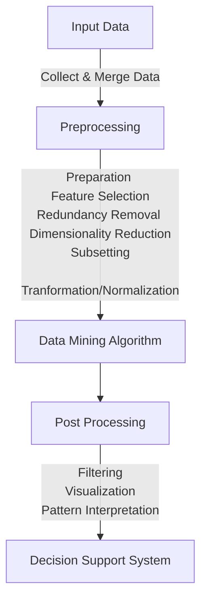

## Data Mining

Generate Decision Support Systems

> Non-trivial extraction of implicit, previously-unknown and potentially useful information from data

> Automatic/Semi-automatic means of discovreing meaningful patterns from large quantities of data

## KDD

Knowledge Discovering from Databases

Redundant means repeated data

## Predictive Task

Predict value of target/independent variable using values of independent variables

- Regression - Continuous
- Classification - Discrete

## Descriptive Task

Goal is to find

- Patterns
- Associations/Relationships

### Association Analysis

Find hidden assocations and patterns, using association rules

#### Applications

- Gene Discovery
- Market Baset Data Analysis
  Find items that are bought together

### Clustering/Cluster Analysis

Grouping similar customers

#### Metrics

- Similarity
- Dissimilarity/Distance Metrics

#### Applications

- Grouping similar documents

- Clustering documents

  1. Vocabulary - All terms(key words) from all docs

  2. Generate document-term frequency matrix

     | Document \| Term | T1   | T2   | …    | Tn   |
     | ---------------- | ---- | ---- | ---- | ---- |
     | D1               |      |      |      |      |
     | D2               |      |      |      |      |
     | …                |      |      |      |      |
     | Dm               |      |      |      |      |

     

### Deviation/Outlier/Anomaly Detection

Outlier is a data point that does not follow the norms.

Don’t mistake outlier for noise.

#### Application

- Credit Card Fraud Detection
  - Collect user profile such as Name, Age, Location
  - Collect user behavior data

- Network Intrusion Detection
- Identify anomalous behavior from surveillance camera videos

## Learning Types

- Supervised - Labelled data
- Unsupervised - Unlabelled data

