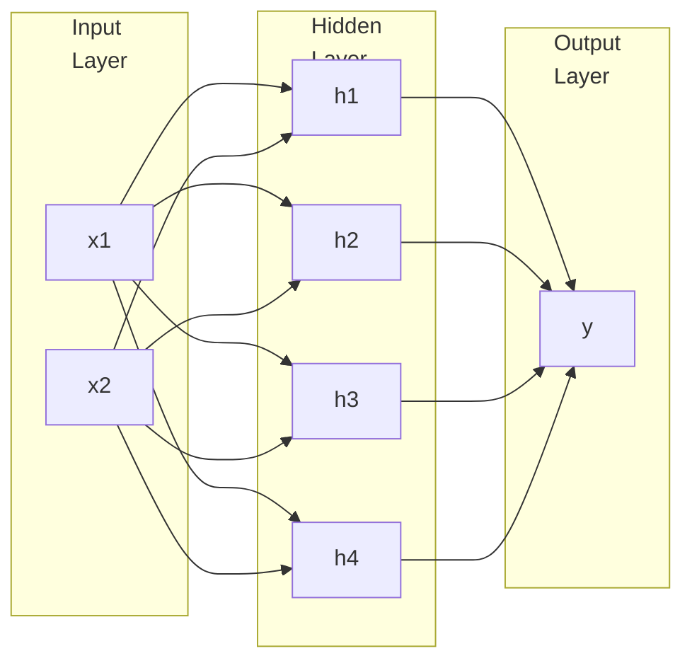

Artifical Nerual Network

## MP Neuron

McCulloch Pitts Neuron

Highly simplified compulational model of neuron

$g$ aggregates inputs and the function $f$ and gives $y \in \{ 0, 1 \}$

$$
\begin{align}
y &= f \circ g \ (x) \\&= f \Big( g (x) \Big)
\end{align}
$$

$$
y = \begin{cases}
1, & \sum x_i \ge \theta \\0, & \text{otherwise}
\end{cases}
$$

- $\sum x_i$ is the summation of boolean inputs
- $\theta$ is threshold for the neuron

### ❌ Limitation

MP neuron can be used to represent [linearly-separable functions](#Linearly-Separable Function)

## Perceptron

MP neuron with a mechanism to learn numerical weights for inputs

✅ Input is no longer limited to boolean values

$$
\begin{align}
y
&= \begin{cases}
1, & \sum w_i x_i \ge \theta \\0, & \text{otherwise}
\end{cases} \\
\Big(
x_0 &= 1, w_0 = -\theta
\Big)
\end{align}
$$

- $w_i$ is weights for the inputs

### Key Terms for Logic

- Pre-Activation (Aggregation)
- Activation (Decision)

### Perceptron Learning Algorithm

Something

## Perceptron vs Sigmoidal Neuron

|                       | Perceptron | Sigmoid/Logistic |
| --------------------- | :--------: | :--------------: |
| Type of line          | Step Graph |  Gradual Curve   |
| Smooth Curve?         |     ❌      |        ✅         |
| Continuous Curve?     |     ❌      |        ✅         |
| Differentiable Curve? |     ❌      |        ✅         |

## Multi-Layer Perceptron

### 3 Layers

For an input layer with $n$ nodes, we will have

- 1 output
- $2^n$ nodes in hidden layer

## Feed-Forward Neural Network

Every layer feeds forward to the next layer (backward/self-loop is not allowed)

For an input layer with $n$ nodes, we will have

-$$
 hidden layers
    - 
$$

- $W_i$ is the weights to layer $i$

$$
\begin{align}
\textcolor{hotpink}{\text{PreActivation}_{H_1}}
&= b_1 + w_1 x_1 + w_2 x_2 + \dots \\
\text{Activation}_{H_1}
&= \frac{1}{1 + e^{- \textcolor{hotpink}{\text{PreActivation}_{H_1}}}}
\end{align}
$$

### Decision Boundary

| Hidden Layers | Shape              |
| ------------- | ------------------ |
| 0             | Open region        |
| 1             | Closed/Open Region |
| $\ge 2$       | Closed             |

As you increase the number of hidden layers, the possibility of open decision boundary decreases.

### Activation Function

| Layer  | Name                               | $f(x)$                                                       |
| ------ | ---------------------------------- | ------------------------------------------------------------ |
| Hidden | Identity                           | $x$                                                          |
|        | Binary Step                        | $\begin{cases} 0, &x < 0 \\ 1, & x \ge 0 \end{cases}$        |
|        | Tariff                             | $\tanh(x)$                                                   |
|        | ArcTan                             | $\tan^{-1} (x)$                                              |
|        | Rectified Linear Unit              | $\begin{cases} 0, &x < 0 \\ x, & x \ge 0 \end{cases}$        |
|        | Parametric Rectified Linear Unit   | $\begin{cases} \alpha x, &x < 0 \\ x, & x \ge 0 \end{cases}$ |
|        | Exponential Linear Unit            | $\begin{cases} \alpha (e^x-1), &x < 0 \\ x,&  x \ge 0 \end{cases}$ |
| Output | Logistic (Sigmoid, Soft Step) | $\frac{1}{1+e^{-x}}$                                         |
|        | SoftPlus                           | $\log(1+e^x)$                                                |

### Training

- Something

## Backpropagation

occurs at every neuron

### Perceptron

occurs only once, as there is only one neuron in the output layer

Assume

- $y$ is activation function
- $a$ is accumulator (pre-activation) function

#### Steps

1. Find $\frac{\partial J}{\partial y}$

2. $$
   \begin{align}
   \frac{\partial J}{\partial a}
   &= \frac{\partial J}{\partial y} \frac{\partial y}{\partial a} \\   
   \implies \frac{\partial J}{\partial \theta}
   &= \frac{\partial J}{\partial a} \frac{\partial a}{\partial \theta}
   \end{align}
   $$

3. $$
   \begin{align}
   \nabla J_\text{outputLayer}
   &= \frac{\partial J}{\partial x} \\   &= \frac{\partial J}{\partial \theta} \frac{\partial \theta}{\partial x}
   \end{align}
   $$

4. Something

5. $$
   \theta_\text{new} = \theta_\text{old} - \eta \ \nabla J
   $$

### MLP

Assume

- $y$ is activation function of output layer
- $b$ is accumulator (pre-activation) function of output layer
- $z_j$ is activation function of node $j$ in hidden layer
- $a_j$ is accumulator (pre-activation) function of node $j$ in hidden layer

$$
\begin{align}
\text{Find } \frac{\partial J}{\partial y} & \\ 
\frac{\partial J}{\partial b}
&= \frac{\partial J}{\partial y} \frac{\partial y}{\partial b} \\
\frac{\partial J}{\partial \beta_j}
&= \frac{\partial J}{\partial b} \frac{\partial b}{\partial \beta_j} \\
\frac{\partial J}{\partial z_j}
&= \frac{\partial J}{\partial \beta_j} \frac{\partial \beta_j}{\partial z_j} \\
\frac{\partial J}{\partial a_j}
&= \frac{\partial J}{\partial \beta_j} \frac{\partial \beta_j}{\partial z_j} \\
\frac{\partial J}{\partial \alpha_j}
&= \frac{\partial J}{\partial a_j} \frac{\partial a_j}{\partial \alpha_j} \\
\implies
\nabla J_\text{outputLayer}
&=\frac{\partial J}{\partial x} \\&= \frac{\partial J}{\partial \alpha_j} \frac{\partial \alpha_j}{\partial x}
\end{align}
$$

## Recurrent Neural Network

NN where forward-feed, backward-feed, and self-loop is allowed

## Linearly-Separable Function

Function for which $\exists$ a line/plane that separates the $y=0$ points and $y=1$ points
