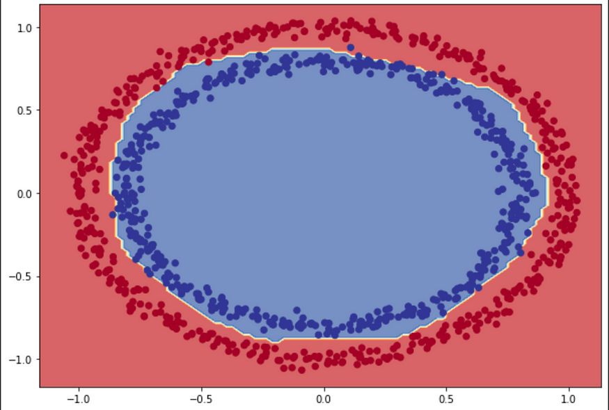

# Sklearn

Always set `n_jobs` and `random_state` explicitly

## Output Format

```python
transformer.set_output(transform="polars") # "pandas"
```

## Basics

```python
model = model()

if "n_jobs" in dir(model):
    kwargs["n_jobs"]= -1
if "probability" in dir(model):
    kwargs["probability"]= True

model.set_params(**kwargs)

model.fit(X_train, y_train)
model.predict(X)
```

## PCA

```python
from sklearn.decomposition import PCA

df = pd.DataFrame(data=np.random.normal(0, 1, (20, 10)))

pca = PCA(n_components=5)
pca.fit(df)

pca.components_
```
## Stratified Sampling
```python
X_train, X_test, y_train, y_test = train_test_split(X, y, 
  test_size = 0.5,
  random_state = 0,
  stratify = y
)
```
## Save & Load Model
## Pickle

> [!WARNING]
> Pickling is unsafe

```python
import pickle
file_name = "model.pkl"

## save
with open(file_name, "wb") as f:
    pickle.dump(model, f)

#load
with open(file_name, "rb") as f:
  model = pickle.load(f)
```
## Json
```python
## save
model.save_model("model.json")

## load
model_new = xgb.XGBRegressor()
model_new.load_model("model.json")
```
## Pipelines
## What?
Systematic organization of required operations
## Parts
### Transformer
filter and/or modify data
`fit()` and `transform()`
### Estimator
Learn from data
`fit()` and `predict()`
## Implementation
### Libraries
```python
from sklearn.pipeline import make_pipeline
##  just `Pipeline` involves naming each step

from sklearn.linear_model import LogisticRegression
from sklearn.tree import DecisionTreeClassifier
from sklearn.ensemble import RandomForestClassifier

from sklearn.model_selection import train_test_split
from sklearn.preprocessing import StandardScaler
from sklearn.decomposition import PCA
```
### Pipeline Used Here
Data Preprocessing by using Standard Scaler
Reduce Dimension using PCA
Apply Classifier
### Initializing Pipelines
```python
pipeline_lr = make_pipeline(
  StandardScaler(),
  LogisticRegression()
)

## more controlled way
pipeline_dt = Pipeline([
  ('scaler',StandardScaler()),
  ('classifier',DecisionTreeClassifier())
])
```
```python
pipelines = [pipeline_lr, pipeline_dt, pipeline_randomforest]

## Dictionary of pipelines and classifier types for ease of reference
pipe_dict = {
  0: 'Logistic Regression',
  1: 'Decision Tree'
}

best_accuracy = 0.0
best_classifier = 0
best_pipeline=""
```
### Pipeline Parameters

```python
pipe.get_params()
```

### Training/Fitting

```python
## Fit the pipelines
for pipe in pipelines:
  pipe.fit(X_train, y_train)
    ## pipe.fit(X_train, y_train, classifier__sample_weight=1)
```
### Results
```python
for i,model in enumerate(pipelines):
    print(
      pipe_dict[i], "Test Accuracy:", model.score(X_test,y_test)
    )
```
```python
for i,model in enumerate(pipelines):
    if model.score(X_test,y_test)>best_accuracy:
        best_accuracy=model.score(X_test,y_test)
        best_classifier=i
        best_pipeline=model

print('Classifier with best accuracy:{}'.format(pipe_dict[best_classifier]))
```
## Change Loss_Cost Function
```python
def custom_loss(y_true, y_pred):
    fn_penalty = 5 ## penalty for false negatives
    fp_penalty = 1 ## penalty for false positives

    ## calculate true positives, false positives, and false negatives
    tp = ((y_true == 1) & (y_pred == 1)).sum()
    fp = ((y_true == 0) & (y_pred == 1)).sum()
    fn = ((y_true == 1) & (y_pred == 0)).sum()

    ## calculate loss
    loss = fp_penalty * fp + fn_penalty * fn

    return loss

from sklearn.linear_model import LogisticRegression
model = LogisticRegression(loss=custom_loss)
```
## Custom Ensembling
Voting
Stacking

## Linear Regression statistical inference

### Parameter standard errors

```python
N = len(X)
p = len(X.columns) + 1  ## plus one because LinearRegression adds an intercept term

X_with_intercept = np.empty(shape=(N, p), dtype=np.float)
X_with_intercept[:, 0] = 1
X_with_intercept[:, 1:p] = X.values

beta_hat = np.linalg.inv(X_with_intercept.T @ X_with_intercept) @ X_with_intercept.T @ y.values
print(beta_hat)

y_hat = model.predict(X)
residuals = y.values - y_hat
residual_sum_of_squares = residuals.T @ residuals
sigma_squared_hat = residual_sum_of_squares[0, 0] / (N - p)
var_beta_hat = np.linalg.inv(X_with_intercept.T @ X_with_intercept) * sigma_squared_hat
for p_ in range(p):
    standard_error = var_beta_hat[p_, p_] ** 0.5
    print(f"SE(beta_hat[{p_}]): {standard_error}")
```

### Parameter confidence intervals

```python
import numpy as np
import pandas as pd
from scipy import stats
from sklearn.linear_model import LinearRegression


def get_conf_int(X, y, model, alpha=0.05):

    """
    ## alpha = 0.05 for 95% confidence interval; 0.01 for 99%-CI

    Returns (1-alpha) 2-sided confidence intervals
    for sklearn.LinearRegression coefficients
    as a pandas DataFrame
    """

    coefs = np.r_[[lr.intercept_], lr.coef_]
    X_aux = X.copy()
    X_aux.insert(0, 'const', 1)
    dof = -np.diff(X_aux.shape)[0]
    mse = np.sum((y - model.predict(X)) ** 2) / dof
    var_params = np.diag(np.linalg.inv(X_aux.T.dot(X_aux)))
    t_val = stats.t.isf(alpha/2, dof)
    gap = t_val * np.sqrt(mse * var_params)

    return pd.DataFrame({
        'lower': coefs - gap, 'upper': coefs + gap
    }, index=X_aux.columns)


model = LinearRegression().fit(X_train, Y_train)
get_conf_int(X_train, y_train, model, alpha = 0.05)
```

### Mean response confidence intervals

```python
import numpy as np
import pandas as pd
from scipy import stats

X = np.array([
  [0, 10],
  [5, 5],
  [10, 2]
])

X_centered = X - X.mean()

x_pred = np.array(
  [[5, 10]]
)
x_pred_centered = x_pred-X.mean()

n = X.shape[0]
k = X.shape[1]

idk = (
    #(1/n) +
    np.diag(
      x_pred_centered.T
      .dot(
          np.linalg.inv(
              X_centered.T
              .dot(X_centered)
          )
      )
      .dot(x_pred_centered)
    )
)

se_confidence = (
    X.std()
    *
    np.sqrt(
      idk
  )
)
se_prediction = (
    X.std()
    *
    np.sqrt(
      1 + idk
  )
)

alpha = 0.05
dof = n - k
t_val = stats.t.isf(alpha/2, dof)

gap_confidence = t_val * se_confidence
gap_prediction = t_val * se_prediction

print(gap_confidence)
#print(gap_prediction)
```

## Custom Scorer

```python
from sklearn.metrics import make_scorer
from sklearn.model_selection import cross_val_score

def mean_error(y, y_pred):
    return np.mean(y_pred - y)
def std_error(y, y_pred):
    return np.std(y_pred - y)

mean_error_scorer = make_scorer(mean_error, greater_is_better=False)
std_error_scorer = make_scorer(mean_error, greater_is_better=False)

model = LinearRegression()
cross_val_score(model, X, y, scoring=mean_error_scorer)
cross_val_score(model, X, y, scoring=std_error_scorer)
```

## Scaling

```python
## demonstrate data normalization with sklearn
from sklearn.preprocessing import MinMaxScaler
## load data
data = ...
## create scaler
scaler = MinMaxScaler()
## fit and transform in one step
normalized = scaler.fit_transform(data)
## inverse transform
inverse = scaler.inverse_transform(normalized)
```

## Time-Series Split

```py
|X||V|O|O|O|
|O|X||V|O|O|
|O|O|X||V|O|
|O|O|O|X||V|
```

X / V are the training / validation sets. "||" indicates a gap (parameter n_gap: int>0) truncated at the beginning of the validation set, in order to prevent leakage effects.

```python
class StratifiedWalkForward(object):
    
    def __init__(self,n_splits,n_gap):
        self.n_splits = n_splits
        self.n_gap = n_gap
        self._cv = StratifiedKFold(n_splits=self.n_splits+1,shuffle=False)
        return
    
    def split(self,X,y,groups=None):
        splits = self._cv.split(X,y)
        _ixs = []
        for ix in splits: 
            _ixs.append(ix[1])
        for i in range(1,len(_ixs)): 
            yield tuple((_ixs[i-1],_ixs[i][_ixs[i]>_ixs[i-1][-1]+self.n_gap]))
            
    def get_n_splits(self,X,y,groups=None):
        return self.n_splits
```

Note that the datasets may not be perfectly stratified afterwards, cause of the truncation with n_gap.

## Regression with Custom Loss Function

[using scipy](../Scipy/04_Regression_with_Custom_Loss_Function.md) 

## Decision Boundary

```python
x_min, x_max = X[:, 0].min(), X[:,0].max()
y_min, y_max = X[:, 1].min(), X[:, 1].max()
resolution = 100

x = np.linspace(x_min - 0.1, x_max + 0.1, resolution)
y = np.linspace(y_min - 0.1, y_max + 0.1, resolution)
```

```python
xx, yy = np.meshgrid(x, y)
```

```python
x_in = np.c_[xx.ravel(), yy.ravel()]
y_pred = model.predict(x_in).reshape(xx.shape)
```

```python
plt.contourf(xx, yy, y_pred, cmap=plt.cm.RdYlBu, alpha=0.7 )
plt.scatter(X[:,0], X[:, 1], c=y, s=40, cmap=plt.cm.RdYlBu)
plt.xlim(xx.min(), xx.max())
plt.ylim(yy.min(), yy.max())
```



## SVM

- LinearSVC: Primal
- SVC: Dual

## Boosted Hybrid Model

Multi-Level Model

```python
from sklearn.base import RegressorMixin, TransformerMixin
from sklearn.utils.validation import check_is_fitted, check_array, check_X_y

class HybridBoostingRegressor(RegressorMixin, TransformerMixin):
    def __init__(self, kwargs):
        self.names = []
        self.models = []
        self.features_list = []
        self.targets = []

        for name, model, features, target in kwargs:
            self.names.append(name)
            self.models.append(model)
            self.features_list.append(features)

            if len(target) == 1:
              self.targets.append(target[0])
            else:
              self.targets.append(target)

    def filter_X(self, X, features):
        if len(features) > 0:
          X = X[features]
        return X

    def get_y(self, y, y_intermediate, target):
        if len(target) == 0:
          y = y
        else:
          y = y_intermediate[target]

        return y

    def fit(self, X, y, y_intermediate = None, **fit_params):
        if y_intermediate is None or y_intermediate.shape[0] == 0:
          for target in self.targets:
            if len(target) > 0:
              return Exception(f"y_intermediate not found for {target}")

        y_res = y.copy()
        y_intermediate_res = y_intermediate.copy()

        self.fitted_models_ = []
        for model, features, target in zip(self.models, self.features_list, self.targets):

            X = self.filter_X(X.copy(), features)
            y = self.get_y(y_res, y_intermediate_res, target)

            # Check that X and y have correct shape
            X, y = check_X_y(X, y)

            model.fit(X, y, **fit_params)

            self.fitted_models_.append(model)

            if len(target) == 0:
              pred = model.predict(X)
            else:
              pred = model.predict(X)

            # residual
            if len(target) != 0:
              y_intermediate_res[target] = self.accumulate(y_intermediate_res[target], pred)
            y_res = self.get_residual(y_res, pred)

        return self

    def predict(self, X):
        check_is_fitted(self, "fitted_models_")

        pred = self.pred_init
        for fitted_model, features, target in zip(self.fitted_models_, self.features_list, self.targets):
            X = self.filter_X(X.copy(), features)

            # Input validation
            X = check_array(X)

            pred = self.accumulate(pred, fitted_model.predict(X))

        return pred

class AdditiveHybridBoostingRegressor(HybridBoostingRegressor):
    """
    y_hat = f_1(x_1) + f_1(x_2) + ...
    """
    def __init__(self, kwargs):
      super().__init__(kwargs)
      self.pred_init = 0
    def get_residual(self, y, pred):
      return y-pred
    def accumulate(self, y, pred):
      return y+pred

class MultiplicativeHybridBoostingRegressor(HybridBoostingRegressor):
    """
    y_hat = f_1(x_1) * f_1(x_2) * ...
    """
    def __init__(self, kwargs):
      super().__init__(kwargs)
      self.pred_init = 1
    def get_residual(self, y, pred):
      return y/pred
    def accumulate(self, y, pred):
      return y*pred
```

```python
x = np.arange(1, 1000, 1)
X = pd.DataFrame().assign(
  x1 = x,
  x2 = x**2
)
y_intermediate = pd.DataFrame().assign(
  trend = 10000*X["x1"] + X["x2"],
  seasonality = np.sin(X["x1"]) + np.sin(X["x1"])
)

y = y_intermediate["trend"] + y_intermediate["seasonality"]
```

```python
from sklearn.linear_model import LinearRegression
from sklearn.ensemble import RandomForestRegressor

model = AdditiveHybridBoostingRegressor(
	[
		('lr', LinearRegression(), [], ["trend"]),
		('rf', RandomForestRegressor(n_estimators=10, random_state=42, n_jobs=-1), [], ["seasonality"])
	]
)
model.fit(X, y, y_intermediate)
model.predict(X)
```

## Bootstrap

```python
from sklearn.utils import resample
X_test_bootstrap, y_test_bootstrap = resample(
	X_test,
	y_test,
	replace = True,
	n_samples = 1_000,
	random_state = 0
)
```

## Variable Size Rolling Statistics

```python
import numpy as np
import pandas as pd
from pandas.api.indexers import BaseIndexer

class VariableWindowIndexer(BaseIndexer):
    def __init__(self, window_size, max_periods=None):
        super().__init__()
        self.window_size = window_size.values
        self.max_periods = max_periods

    def get_window_bounds(self, num_values, min_periods, center, closed, step):
        temp = np.arange(0, num_values, 1)

        if self.max_periods is not None:
          self.window_size = np.where(
              self.window_size <= self.max_periods,
              self.window_size,
              self.max_periods
          )

        window_end = temp + 1
        window_start = window_end - self.window_size
        return window_start, window_end
```

```python
horizon = 1
lag = df["y"].shift(horizon)
window_size = df.index + 1

rolling = lag.rolling(
    VariableWindowIndexer(window_size=window_size, max_periods=None),
    min_periods=1,
    center=False
)

df[["y_rolling_mean", "y_rolling_std"]] = rolling.agg(["mean", "std"])
```

|     |   t |   y |  lag | y_rolling_mean | y_rolling_std |
| --: | --: | --: | ---: | -------------: | ------------: |
|   0 |   1 |   1 |  NaN |            NaN |           NaN |
|   1 |   2 |   2 |  1.0 |            1.0 |           NaN |
|   2 |   3 |   3 |  2.0 |            1.5 |      0.707107 |
|   3 |   4 |   4 |  3.0 |            2.0 |      1.000000 |
|   4 |   5 |   5 |  4.0 |            2.5 |      1.290994 |
|   5 |   6 |   6 |  5.0 |            3.0 |      1.581139 |
|   6 |   7 |   7 |  6.0 |            3.5 |      1.870829 |
|   7 |   8 |   8 |  7.0 |            4.0 |      2.160247 |
|   8 |   9 |   9 |  8.0 |            4.5 |      2.449490 |
|   9 |  10 |  10 |  9.0 |            5.0 |      2.738613 |
|  10 |  11 |  11 | 10.0 |            5.5 |      3.027650 |
|  11 |  12 |  12 | 11.0 |            6.0 |      3.316625 |
|  12 |  13 |  13 | 12.0 |            6.5 |      3.605551 |
|  13 |  14 |  14 | 13.0 |            7.0 |      3.894440 |

## Bias-Variance Decomposition

```python
from mlxtend.evaluate import bias_variance_decomp

# Regression
avg_expected_loss, avg_bias, avg_var = bias_variance_decomp(
        reg,
        X_train, y_train,
        X_test, y_test, 
        loss='mse',
        random_seed=123
)

# Classification
avg_expected_loss, avg_bias, avg_var = bias_variance_decomp(
        clf,
        X_train, y_train,
        X_test, y_test, 
        loss='0-1_loss',
        random_seed=123
)
```

## Paired T Test

```python
from mlxtend.evaluate import paired_ttest_5x2cv


t, p = paired_ttest_5x2cv(
	estimator1 = model1,
    estimator2 = model2,
    X=X, y=y,
    random_seed=1
)

print('t statistic: %.3f' % t)
print('p value: %.3f' % p)
```

## Feature Agglomeration 


```python
import numpy as np
from matplotlib import pyplot as plt
from scipy.cluster.hierarchy import dendrogram

from sklearn.cluster import FeatureAgglomeration

def plot_dendrogram(feature_clustering, names=None, title=None, **dendogram_params):
    # Create linkage matriX and then plot the dendrogram

    # create the counts of samples under each node
    counts = np.zeros(feature_clustering.children_.shape[0])
    n_samples = len(feature_clustering.labels_)
    for i, merge in enumerate(feature_clustering.children_):
        current_count = 0
        for child_idX in merge:
            if child_idX < n_samples:
                current_count += 1  # leaf node
            else:
                current_count += counts[child_idX - n_samples]
        counts[i] = current_count

    linkage_matrix = np.column_stack(
        [feature_clustering.children_, feature_clustering.distances_, counts]
    ).astype(float)

    if names is None:
        cols = None
    else:
        cols = lambda col_index: names[col_index]
    
    dendrogram(linkage_matrix, leaf_label_func=cols, **dendogram_params)
    
    if title is not None:
      plt.title(title)
    # plt.xlabel("Number of points in node (or index of point if no parenthesis).")
    plt.show()
```

```python
matrix_similarity = mutual_information # df.corr().abs()
matrix_distance = 1 - matrix_similarity # matrix_similarity.abs()

feature_clustering = FeatureAgglomeration(distance_threshold=0, n_clusters=None, metric="precomputed", linkage="average")
feature_clustering.fit(matrix_distance)
```

```python
# plot the top three levels of the dendrogram
plot_dendrogram(feature_clustering, matrix_distance.columns, title="Mutual Information", orientation = "right", truncate_mode="level")
```

## $R^2$

```python
y_baseline = np.mean(y_train)
r2 = 1 - np.mean((y_pred - y_test) ** 2) / np.mean((y_baseline - y_test) ** 2)
```

