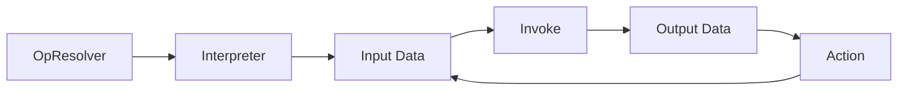

# TensorFlow Lite Micro

Built to fit ML on embedded systems

- Very small binary footprint
- No dynamic memory allocation
- No dependencies on complex parts of the standard C/C++ libraries
- No operating system dependencies, can run on bare metal
- Designed to be portable across a wide variety of systems

## Components
- Core functionality (< 20 KB)
	- Model loading
	- Error reporting
	- Memory planner
	- ...
- Model operators: select which operators required
	- conv2D
	- conv3D
	- tanh
	- sigmoid
	- ...

## Steps

Initialization
1. Declare variables
2. Load model
3. Resolve operators
4. Initialize interpreter
5. Allocate arena
6. Define model inputs
7. Set up main loop

## Interpreter
 Store the model as data and loop through its ops at runtime
- Interpreter overhead is very low due to complex instructions of the ML part; hence, no advantage in using compiler

Advantages
- Change the model without recompiling code
- Same operator code can be used across multiple different models in the system
- Same portable model serialization format can be used across a lot of systems

## Model Format

`g_model`
- Array of bytes
  - Acts as equivalent of a file on disk
  - Flatbuffer format
- Holds all info about
  - model
  - operators
  - connections
  - trained weights

## How TFL micro solves TinyML challenges

- Ask developers to supply a contiguous array of memory "arena" to interpreter
	- The framework avoids any other memory allocations
- Framework guarantees that it won’t allocate from this “arena” after initialization, so long-running applications won’t fail due to to fragmentation
- Ensures
	- clear budget for the memory used by ML
	  - framework has no dependency on OS facilities needed by `malloc` or `new`

Size of tensor arena
- Operator variables
- Interpreter state
- Operator I/O

Finding ideal size of arena

- Trial and error
- Create as large an arena as possible
- Use `arena_used_bytes()` to find actual size used
- Resize arena to this length and rebuild
- Best to do this for every deployment platform, since different op implementations may need varying scratch buffer sizes

Ops specification

## IDK

