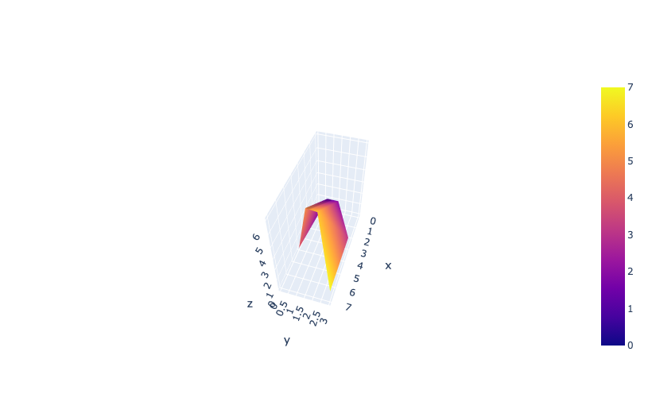
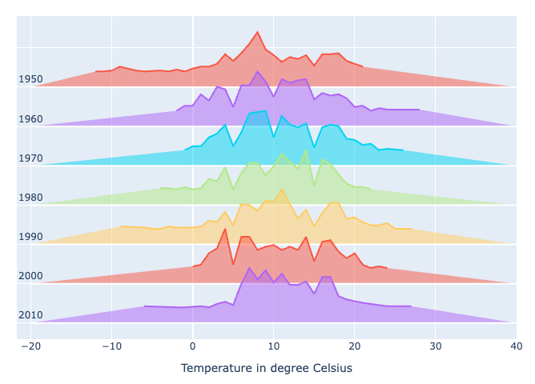

## Importing

```python
import plotly.express as px
import plotly.graph_objs as go

import plotly.io as pio
pio.templates.default = "ggplot2"
pio.renderers.default = "notebook"
## injects plotly.js into the notebook for offline plotly
## but only works for the first save, for some reason
```

## Plots

```python
px.scatter()
px.line()
px.imshow(df, text_auto=True) ## heatmap with value
```

## Maps

```python
  fig = px.scatter_geo(
      df,
      lat = "Lat",
      lon = "Lon",
      color = "Name"
  ).update_traces(
      marker = dict(size = 10),
  ).update_layout(
      margin = dict(t=0, l=0, r=0, b=0)
  ).update_geos(
      projection_type="orthographic",
      center=dict(lat=17, lon=65.5),
      projection_rotation=dict(lon=65, lat=10),
      showcountries=True,
      countrycolor="rgba(0,0,0, 0.1)"
  )
  fig.show()
```

## Sankey Chart

```python
  import plotly.graph_objects as go

  fig = go.Figure(data=[go.Sankey(
    node = dict(
      pad = 15,
      thickness = 20,
      line = dict(color = "black", width = 0.5),
      label = my_sankey['label'],
      color = "blue"
    ),
    link = dict(
      source = my_sankey['source'],
      target = my_sankey['target'],
      value = my_sankey['value']
  ))])

  fig.write_html('test.html')
```

## Useful Configuration

Only 2 series as colored

Useful when there are a lot of colors

```python
  df["order"] = (
    df["Country Name"]
    .map({"Japan": 1, "Turkey": 2})
    .fillna(3)
  )
  ## sort by this order
  df.sort_values(by=["order","years"], ascending=False, inplace=True)

  ## The line which comes the latest, is drawn on the top.
```

```python
  fig.update_traces({"line":{"color":"lightgrey"}})

  fig.update_traces(patch={"line":{"color":"blue", "width":5}}, 
                    selector={"legendgroup":"Turkey"})
  fig.update_traces(patch={"line":{"color":"red", "width":5}}, 
                    selector={"legendgroup":"Japan"})
```

### Adding text at the end of line, instead of legends

```python
  for i, d in enumerate(fig.data):
    text = '  ' + d.name + '  ' ## str(d.y[-1])

    ## last non-empty
    last_index = pd.Series(d.y).last_valid_index()
    ## last_index = len([x for x in d.y if x != "nan"])-1 ## for string/object col
    fig.add_scatter(
      x = [d.x[last_index]],
      y = [d.y[last_index]], ## last non-empty
      hoverinfo = 'skip',
      hovertemplate = 'skip',
      mode = 'text',
      text = text,
      textfont = dict(color = d.line.color),
      textposition = 'top left',
      showlegend = False
    )

    ## first non-empty
    first_index = pd.Series(d.y).first_valid_index()
    ## idk ## for string/object col
    fig.add_scatter(
      x = [d.x[first]],
      y = [d.y[first]], ## last non-empty
      hoverinfo = 'skip',
      hovertemplate = 'skip',
      mode = 'text',
      text = text,
      textfont = dict(color = d.line.color),
      textposition = 'top right',
      showlegend = False
    )
```

### `update_layout()`

```python
  fig = go.Figure().update_layout(
    ## Title and Subtitle
    title = dict(
      text =  "<span style='font-size:1.5em'>" +
          "Title"
        + "</span><br /><sup>" +
        "Subtitle"
        + "</sup>",
      x = 0, xref = "paper",
      #y = 0.95, yref = "paper",
    ),

    uirevision="foo", overwrite=True, ## ensures clicks are retained on refresh
    plot_bgcolor = "rgba(0, 0%, 0%, 0)",
    paper_bgcolor = "rgba(0, 0%, 0%, 0)",
    margin=dict(t=0, r=0, b=0, l=0),

    ## axes titles
    xaxis_title = "x_title",
    yaxis_title = "y_title",

    hovermode = "x unified",

    ## legend
    showlegend = False,
    legend = dict(
    groupclick="toggleitem",
      orientation = 'h',

      ## positioning
      x = 0,
      xanchor = "left",

      y = 1,
      yanchor = "bottom",

    font = dict(
            size = 10
      ),
      itemsizing = 'constant',

      ## click behavior
      #itemclick = 'toggleothers',
      #itemdoubleclick = 'toggle'
    )
  )
```

### custom menu

The [updatemenu method](https://plot.ly/python/reference/layout/updatemenus/#layout-updatemenus-items-updatemenu-buttons-items-button-method) determines which [plotly.js function](https://plot.ly/javascript/plotlyjs-function-reference/) will be used to modify the chart. There are 4 possible methods:

`"restyle"`: modify **data** or Data attributes

`"relayout"`: modify **layout** attributes

`"update"`: modify **data and layout** attributes; combination of `"restyle"` and `"relayout"`

`"animate"`: start or pause an [animation](https://plot.ly/python/#animations))

Examples

restyle

_1696709605012_0.png)

_1696709617587_0.png)

```python
      fig = go.Figure()

      ## Add surface trace
      fig.add_trace(go.Surface(z=df.values.tolist(), colorscale="Viridis"))

      ## Update plot sizing
      fig.update_layout(
          width=800,
          height=900,
          autosize=False,
          margin=dict(t=0, b=0, l=0, r=0),
          template="plotly_white",
      )

      ## Update 3D scene options
      fig.update_scenes(
          aspectratio=dict(x=1, y=1, z=0.7),
          aspectmode="manual"
      )

      ## Add dropdown
      fig.update_layout(
          updatemenus=[
              dict(
                  type = "buttons",
                  direction = "left",
                  buttons=list([
                      dict(
                          args=["type", "surface"],
                          label="3D Surface",
                          method="restyle"
                      ),
                      dict(
                          args=["type", "heatmap"],
                          label="Heatmap",
                          method="restyle"
                      )
                  ]),
                  pad={"r": 10, "t": 10},
                  showactive=True,
                  x=0.11,
                  xanchor="left",
                  y=1.1,
                  yanchor="top"
              ),
          ]
      )
```

relayout


```python
      import plotly.graph_objects as go

      ## Generate dataset
      import numpy as np
      np.random.seed(1)

      x0 = np.random.normal(2, 0.4, 400)
      y0 = np.random.normal(2, 0.4, 400)
      x1 = np.random.normal(3, 0.6, 600)
      y1 = np.random.normal(6, 0.4, 400)
      x2 = np.random.normal(4, 0.2, 200)
      y2 = np.random.normal(4, 0.4, 200)

      ## Create figure
      fig = go.Figure()

      ## Add traces
      fig.add_trace(
          go.Scatter(
              x=x0,
              y=y0,
              mode="markers",
              marker=dict(color="DarkOrange")
          )
      )

      fig.add_trace(
          go.Scatter(
              x=x1,
              y=y1,
              mode="markers",
              marker=dict(color="Crimson")
          )
      )

      fig.add_trace(
          go.Scatter(
              x=x2,
              y=y2,
              mode="markers",
              marker=dict(color="RebeccaPurple")
          )
      )

      ## Add buttons that add shapes
      cluster0 = [dict(type="circle",
                                  xref="x", yref="y",
                                  x0=min(x0), y0=min(y0),
                                  x1=max(x0), y1=max(y0),
                                  line=dict(color="DarkOrange"))]
      cluster1 = [dict(type="circle",
                                  xref="x", yref="y",
                                  x0=min(x1), y0=min(y1),
                                  x1=max(x1), y1=max(y1),
                                  line=dict(color="Crimson"))]
      cluster2 = [dict(type="circle",
                                  xref="x", yref="y",
                                  x0=min(x2), y0=min(y2),
                                  x1=max(x2), y1=max(y2),
                                  line=dict(color="RebeccaPurple"))]

      fig.update_layout(
          updatemenus=[
              dict(
                  type="buttons",
                  buttons=[
                      dict(label="None",
                           method="relayout",
                           args=["shapes", []]),
                      dict(label="Cluster 0",
                           method="relayout",
                           args=["shapes", cluster0]),
                      dict(label="Cluster 1",
                           method="relayout",
                           args=["shapes", cluster1]),
                      dict(label="Cluster 2",
                           method="relayout",
                           args=["shapes", cluster2]),
                      dict(label="All",
                           method="relayout",
                           args=["shapes", cluster0 + cluster1 + cluster2])
                  ],
              )
          ]
      )

      ## Update remaining layout properties
      fig.update_layout(
          title_text="Highlight Clusters",
          showlegend=False,
      )

      fig.show()
```

### `update_xaxes()`

```python
  fig.update_xaxes(autorange = 'reversed')
  fig.update_xaxes(range = [100, -30])

  ## only the first month has the year
  fig.update_xaxes(
    type = "date",
    dtick="M1",
    tickformat="%b\n%Y"
  )
```

### `config`

```python
  export_width = 1000
  export_height = export_width/2

  config = dict(
      doubleClickDelay = 400, ## (ms) affects the single click delay; default = 300ms
      ## displayModeBar = True,
      displaylogo = False,
      modeBarButtonsToRemove = ["zoom", "select2d", "lasso2d", "pan", "zoomIn", "zoomOut", "autoScale", "resetScale"],

      ## scrollZoom = True,
      showTips = False,

      toImageButtonOptions = dict(
        format = 'pdf', ## pdf, svg, png, jpeg, webp
        filename = title,
        width = export_width,
        height = export_height,
        scale = 1 ## Multiply title/legend/axis/canvas sizes by this factor
      )
  )
```

```python
  fig.show(config = config)
  dcc.Graph(config = config)
```

### Grey out areas not selected by marquee select

```python
  scatter = px.scatter_matrix(df)
  scatter.data[0].update(selected=dict(marker=dict(color='red')),
                         unselected=dict(marker=dict(color='blue',
                                                     opacity=0.001)))
```

## Animated

### Autoplay

```python
  config = {
    auto_play = True
  }
  fig.show(config = config)
```

### Save as GIF

Using moviepy

```python
    import numpy as np
    from scipy.spatial import Delaunay
    import plotly.graph_objects as go
    import  moviepy.editor as mpy
    import io 
    from PIL import Image

    def plotly_fig2array(fig):
        #convert Plotly fig to  an array
        fig_bytes = fig.to_image(format="png")
        buf = io.BytesIO(fig_bytes)
        img = Image.open(buf)
        return np.asarray(img)

    n = 20 ## number of radii
    h = 2/(n-1)
    r = np.linspace(h, 2,  n)
    theta = np.linspace(0, 2*np.pi, 60)
    r, theta = np.meshgrid(r,theta)
    r = r.flatten()
    theta = theta.flatten()

    x = r*np.cos(theta)
    y = r*np.sin(theta)

    ## Triangulate the circular  planar region
    tri = Delaunay(np.vstack([x,y]).T)
    faces = np.asarray(tri.simplices)
    I, J, K = faces.T

    f = lambda h: np.sinc(x**2+y**2)+np.sin(x+h)   

    fig = go.Figure(go.Mesh3d(x=x,
                         y=y,
                         z=f(0),
                         intensity=f(0),
                         i=I,
                         j=J,
                         k=K,
                         colorscale='matter_r', 
                         showscale=False))

    fig.update_layout(title_text='My hat is flying with MoviePy',
                      title_x=0.5,
                      width=500, height=500, 
                      scene_xaxis_visible=False, 
                      scene_yaxis_visible=False, 
                      scene_zaxis_visible=False)

    ## No Plotly frames are defined here!! Instead we define moviepy frames by
    ## converting each Plotly figure to  an array, from which MoviePy creates a clip
    ## The concatenated clips are saved as a gif file:
    def make_frame(t):
        z = f(2*np.pi*t/2)
        fig.update_traces(z=z, intensity=z)  #These are the updates that usually are performed within Plotly go.Frame definition
        return plotly_fig2array(fig)

    animation = mpy.VideoClip(make_frame, duration=2) ## or VideoFileClip
    animation.write_gif("image/my_hat.gif", fps=20)
    animation.write_videofile("gfg_intro.webm")
```

Manual

```python
    import plotly.express as px
    import pandas as pd
    import numpy as np
    import io
    import PIL

    ## sample data
    df = pd.DataFrame(
        {
            "step": [1, 2, 3],
            "x": [10, 20, 30],
            "y": [100, 200, 300],
        }
    )

    ## smaple plotly animated figure
    fig = px.bar(df, x="x", y="y", animation_frame="step")

    ## generate images for each step in animation
    frames = []
    for s, fr in enumerate(fig.frames):
        ## set main traces to appropriate traces within plotly frame
        fig.update(data=fr.data)
        ## move slider to correct place
        fig.layout.sliders[0].update(active=s)
        ## generate image of current state
        frames.append(PIL.Image.open(io.BytesIO(fig.to_image(format="png"))))

    ## create animated GIF
    frames[0].save(
      "test.gif",
      save_all=True,
      append_images=frames[1:],
      optimize=True,
      duration=500,
      loop=0,
    )
```

### Scatter Plot (Hans Rosling Style)

```python
  fig = px.scatter(data_frame = df, 
             x = 'consumption_co2',
             y = 'consumption_co2_per_capita', 
             size = 'population', 
             hover_name = 'country', 
             color = 'country',
             animation_frame = 'year',
             animation_group = 'country',

             size_max=60,

             log_x=True,

             range_x = [0, 1.05 * np.log10(df["consumption_co2"].max())],
             range_y = [0, 1.05 * df["consumption_co2"].max()]
            )
```

### Choropleth

```python
  px.choropleth(gapminder,               
                locations="iso_alpha",               
                color="lifeExp",
                hover_name="country",  
                animation_frame="year",    
                color_continuous_scale='Plasma',  
                height=600             
  )
```

### Line Chart

```python
  data = pd.read_csv(r"https://raw.githubusercontent.com/datageekrj/ForHostingFiles/master/income_per_person_gdppercapita_ppp_inflation_adjusted.csv")

  numOfRows = data.shape[0] ## No of Countries
  numOfCols = data.shape[1] ## No of years + one column for a country
  numOfFrames = numOfCols - 1
  xaxis_range = [0,numOfFrames + 2]

  ## While, testing the code, test with low numbers:
  ## Initial State of the data
  ## First we are just seeing it for afghanistan

  x_init = np.array([1])

  initial_data = []
  for cont_ind in [75,35,184,83,140]:
      y_axis = np.array(data.iloc[cont_ind,0])
      initial_data.append(go.Scatter(x =x_init, y = y_axis,mode = "lines",name = data.country[cont_ind]))
  initial_max = 600

  ## Frames
  frames = []
  for f in range(1,numOfFrames+1):
      x_axis = np.arange(1,f+1)
      curr_data = []
      title_names = []
      start = "For " + str(1800 + f + 1)
      for cont_ind in [75,35,184,83,140]:
          curr_country = data.country[cont_ind]
          y_axis = np.array(data.iloc[cont_ind,1:f+1])
          curr_data.append(go.Scatter(x = x_axis, y = y_axis,mode = "lines", name = curr_country))
          title_names.append(curr_country + ": " + str(y_axis[f-1]/1000) + "K Dollar. ")
      title = start + " " + " ".join(title_names)
      curr_frame = go.Frame(data = curr_data, layout = {"title":title})
      frames.append(curr_frame)

  fig = go.Figure(
      data = initial_data,
      layout = {
          "title":"Line Chart Race",
          "xaxis":{"range":xaxis_range, "visible":False, "showline":False},
          "yaxis":{"type":"log", "visible":False, "showline":False},
          "updatemenus":[{"type":"buttons","buttons":[{"method":"animate","label":"play", "args":[None]}]}]
          },
      frames = frames
      )
  fig.show()
```

## Performance

### Webgl renderer

```python
  px.scatter(df, x="x", y="y", render_mode='webgl')
  px.scatter_polar(df, x="x", y="y", render_mode='webgl')

  px.line(df, x="x", y="y", render_mode='webgl')
  px.line_polar(df, x="x", y="y", render_mode='webgl')

  go.Scattergl()
  go.Scatterpolargl()
  go.Heatmapgl()
```

### Specify axis range

Letting plotly autorange means it needs to do relayouts often and requires it to calculate the range each time.

```python
  fig = px.scatter(df, x="x", y="y", range_x=[2, 3], range_y=[10, 20])
```

### Use heatmap instead of pairplot

```python
  import numpy as np

  N = 1000
  M = 500
  xx = np.arange(N, dtype=np.float64)
  yy = np.arange(M, dtype=np.float64)
  x, y = np.meshgrid(xx, yy)
  b = N/20.0
  c = M/2.0
  r = np.sqrt(((x-c)/b)**2 + ((y-c)/b)**2)
  a = np.sin(r)

  ## Limits
  xmin = xx[0]
  xmax = xx[-1]
  ymin = yy[0]
  ymax = yy[-1]
  amin = np.amin(a)
  amax = np.amax(a)

  from PIL import Image
  from matplotlib import cm
  from matplotlib.colors import Normalize

  ## Some normalization from matplotlib
  cNorm = Normalize(vmin=amin, vmax=amax)
  scalarMap  = cm.ScalarMappable(norm=cNorm, cmap='viridis' )
  seg_colors = scalarMap.to_rgba(a) 
  img = Image.fromarray(np.uint8(seg_colors*255))

  ## Now the plotly code
  import plotly.graph_objects as go

  ## Create figure
  fig = go.Figure()

  ## Constants
  img_width = 900
  img_height = 600

  ## Add invisible scatter trace.
  ## This trace is added to help the autoresize logic work.
  ## We also add a color to the scatter points so we can have a colorbar next to our image
  fig.add_trace(
      go.Scatter(
          x=[xmin, xmax],
          y=[ymin, ymax],
          mode="markers",
          marker={"color":[np.amin(a), np.amax(a)],
                  "colorscale":'Viridis',
                  "showscale":True,
                  "colorbar":{"title":"Counts",
                              "titleside": "right"},
                  "opacity": 0
                 }
      )
  )

  ## Add image
  fig.update_layout(
      images=[go.layout.Image(
          x=xmin,
          sizex=xmax-xmin,
          y=ymax,
          sizey=ymax-ymin,
          xref="x",
          yref="y",
          opacity=1.0,
          layer="below",
          sizing="stretch",
          source=img)]
  )

  ## Configure other layout
  fig.update_layout(
          xaxis=dict(showgrid=False, zeroline=False, range=[xmin, xmax]),
          yaxis=dict(showgrid=False, zeroline=False, range=[ymin, ymax]),
      width=img_width,
      height=img_height,
  )

  fig.show()
```

Use summary statistics whenever possible

### Plotly Resampler

### Datashader

### use Plotly.react instead of Plotly.newPlot (only for plotly.js)

## Tutorials

https://www.youtube.com/watch?v=hSPmj7mK6ng

https://www.youtube.com/watch?v=pGMvvq7R1IM

https://www.youtube.com/watch?v=8d7rArayuzc

https://www.youtube.com/watch?v=_b2KXL0wHQg

## Exporting

### Static

```python
  fig.write_image(f"{title}.pdf")
  fig.write_image(f"{title}.svg")
  fig.write_image(f"{title}.png")
  fig.write_image(f"{title}.jpg")
  fig.write_image(f"{title}.webp")
```

### Interactive

#### Embed within

```python
    fig.write_html("graph_name.html",
                   full_html=False,
                   include_plotlyjs = True,
                   config = dict(
                     doubleClickDelay = 400, ## (ms) affects the single click delay; default = 300ms
                     displayModeBar = False,
                     showTips = False
                   )
                  )
```

#### Export a js file to the same directory

```python
    fig.write_html("graph_name.html",
                   full_html=False,
                   include_plotlyjs = "directory_path",
                   config = dict(
                     doubleClickDelay = 400, ## (ms) affects the single click delay; default = 300ms
                     displayModeBar = False,
                     showTips = False
                   )
                  )
```

#### Use external source (useful for revealjs)

```python
    fig.write_html(
      "graph_name.html",  ## no need to add _plotly to the file name, because the iframe will request
      full_html=False,
      include_plotlyjs = "../../../backend/plugins/plotly/plotly-basic.min.js", ## 3 backtracks because it is an iframe in the assets folder, so it has to an extra backtrack
      include_mathjax = "",
      config = config
    )
```

## Interactive Hover

```python
def hover_fn(trace, points, state):
    ind = points.point_inds[0]
    details.value = cars_df.iloc[ind].to_frame().to_html()

scatter.on_hover(hover_fn)
```

## Multiple Traces from the same

```python
for i in range(4): ## 0-3
    subset = spf_unrate[
        spf_unrate["PREDICTION_PERFORMED_LAG"] == i
    ]
    fig.add_trace(go.Scattergl(
        x = subset.index.astype(str),
        y = subset["UNRATE"],
        name = f"SPF (Forecast) with Lag = {i}"
    ))
```

## Maps 

Default

```python
  fig = px.scatter_geo(
    df,
    lat="Lat",
    lon="Lon",
    hover_name="Name",
    projection="orthographic",
    ## center = (0, 0)
  )

  fig.update_geos(
    ## (meters) : higher number --> lower detail --> smoother
    resolution=110,
    bgcolor='hsla(0, 0%, 0%, 0)',

    showcountries=True, countrycolor="Grey",
    showcoastlines=True, coastlinecolor="Grey",

    showland=True, landcolor="LightYellow",
    showocean=True, oceancolor="LightBlue",
    ## showlakes=True, lakecolor="LightBlue",
    ## showrivers=True, rivercolor="LightBlue",
  )

  fig.update_layout(
    margin=dict(r=0, t=0, l=0, b=0),
    uirevision="foo",
    overwrite=True,
    paper_bgcolor='hsla(0, 0%, 0%, 0)',
    plot_bgcolor='hsla(0, 0%, 0%, 0)',
    modebar=dict(
      bgcolor='hsla(0, 0%, 0%, 0.5)',
      color='hsla(0, 0%, 100%, 0.5)',
    )
  )
```

Mapbox

```python
  ## create a map of area, where houses from data set located
  fig = px.scatter_mapbox(data, #our data set
                          lat="lat", lon="long", #location
                          color="price", #select a column for ranking
                          hover_name="price", 
                          hover_data=["bedrooms", "bathrooms"], 
                          color_discrete_sequence=["green"],
                          size_max=15, 
                          zoom=8, 
                          width=900, height=600, #map size
                          title =  'Map of area, check location')
  #style of map
  fig.update_layout(mapbox_style="open-street-map")
  fig.show(config={'scrollZoom': False})
```
## 4D Surface

3 axes, color as output

```python
x = [0, 1, 2, 3, 4, 5, 6, 7, 0, 1, 2, 3, 4, 5, 6, 7]
y = [0, 1, 2, 3, 0, 1, 2, 3, 0, 1, 2, 3, 0, 1, 2, 3]
z = [0, 2, 3, 1, 0, 5, 6, 1, 0, 2, 3, 1, 0, 5, 6, 1]
f = x+y+z

fig = go.Figure(
    go.Mesh3d(
        x = x,
        y = y,
        z = z,
        intensity = f,
        showscale=True
    )
)
fig
```



## Ridge Plot

```python
# the idea behind this ridgeline plot with Plotly is to add traces manually, each trace corresponding to a particular year's temperature distribution
# thus, we are to store each year's data (temperatures and their respective count) in seperate arrays or pd.series that we store in a dictionnary to retrieve them easily
array_dict = {} # instantiating an empty dictionnary
for year in year_list:
    array_dict[f'x_{year}'] = temp[temp['year']==year]['Mean_TemperatureC'] # storing the temperature data for each year
    array_dict[f'y_{year}'] = temp[temp['year']==year]['count'] # storing the temperature count for each year
    array_dict[f'y_{year}'] = (array_dict[f'y_{year}'] - array_dict[f'y_{year}'].min()) \
                                / (array_dict[f'y_{year}'].max() - array_dict[f'y_{year}'].min()) # we normalize the array (min max normalization)

# once all of this is done, we can create a plotly.graph_objects.Figure and add traces with fig.add_trace() method
# since we have stored the temperatures and their respective count for each year, we can plot scatterplots (go.Scatter)
# we thus iterate over year_list and create a 'blank line' that is placed at y = index, then the corresponding temperature count line
fig = go.Figure()
for index, year in enumerate(year_list):
    fig.add_trace(go.Scatter(
                            x=[-20, 40], y=np.full(2, len(year_list)-index),
                            mode='lines',
                            line_color='white'))
    
    fig.add_trace(go.Scatter(
                            x=array_dict[f'x_{year}'],
                            y=array_dict[f'y_{year}'] + (len(year_list)-index) + 0.4,
                            fill='tonexty',
                            name=f'{year}'))
    
    # plotly.graph_objects' way of adding text to a figure
    fig.add_annotation(
                        x=-20,
                        y=len(year_list)-index,
                        text=f'{year}',
                        showarrow=False,
                        yshift=10)

# here you can modify the figure and the legend titles
fig.update_layout(
                title='Average temperature from 1950 until 2010 in Seattle',
                showlegend=False,
                xaxis=dict(title='Temperature in degree Celsius'),
                yaxis=dict(showticklabels=False) # that way you hide the y axis ticks labels
                )

fig.show()
```

