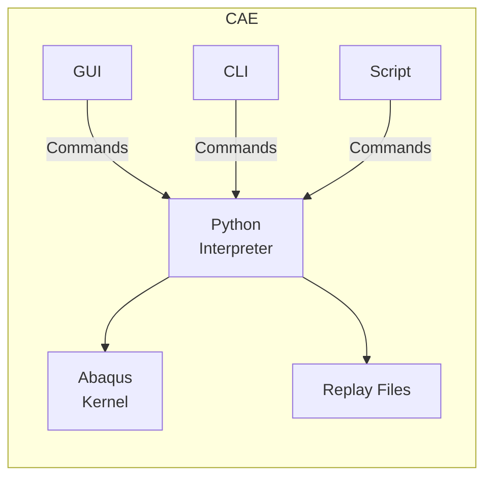

# Introduction

## Units

Abacus does not have a unit system. You need to use everything based on SI/SI(mm) units.

## Interface

### Tools Tree

- Model
- Analysis

### Analysis Tree

- Jobs

## Files

|        |                                                              | Gets updated when   | Cleared when       |
| ------ | ------------------------------------------------------------ | ------------------- | ------------------ |
| `.cae` | Project file                                                 | Interact with GUI   | Never              |
| `.rpy` | Replay Python file Allows to recreate the model Contains all used actions Only 5 recent versions of replay files will be retained | Interact with GUI   | New session starts |
| `.jnl` | Journal/Log Stores used model-related commands Allows to recreate the model if model database gets corrupt | Save model database | Never              |
| `.rec` | Recovery file Stores unused model-related commands Useful if Abacus aborts unexpectedly | Interact with GUI   | Save CAE file      |
| `.odb` | Output DataBase from modelling stage Analysis result data & model-related info: Nodes, elements, surfaces, sets |                     |                    |
| `.inp` | Input configuration file for analysis stage                  |                     |                    |
| `.rpt` | Report file                                                  |                     |                    |
| images | Exported                                                     |                     |                    |

## Types of Objects

### Properties

- Deformable
- Rigid Discrete
- Rigid Analytical

|            | Object treated as                           |
| ---------- | ------------------------------------------- |
| Deformable | Block that deforms due to forces            |
| Rigid      | Solid block that cannot be deformed         |
| Discrete   | “mesh” of atomic “discrete/finite elements” |
| Analytical | Bounding box                                |

### Geometry

|       |      |
| ----- | ---- |
| Shell |      |
| Wire  |      |
| Point |      |

### Mesh Element Type

| Type                  |                            |
| --------------------- | -------------------------- |
| Triangular CPS3R | Faster computation         |
| Quad CPS4R       | Better geometric precision |
| Quad-Dominated        | Compromise between both    |

## Views

|               |      |
| ------------- | ---- |
| Feature Edges |      |

## Properties of Mesh

|        | Value when mesh is broken |
| ------ | ------------------------- |
| PHILSM | 1                         |
| PSILSM | 0                         |

## Export

### Image

1. Open ODB
2. Display ODB to viewport
3. Set field output to viewport
4. Adjust view commands
5. File > Print > File

## Field Report

Method to output data at desired locations, for a single frame within a single step at a time

### Procedure

1. Report
2. Field Output

### Display Group

1. Create display group
2. Pick from viewport

## Speed Up Simulation

- Decrease time period to 0.1
- Increase max increment size
  - Useful if you are just interested in final output only
- Use more cores
- Reduce output requests
- Reduce mesh in unnecessary portions
- Check element formulation
- Use Reduced integration/linear geometric order
- Use small artificial damping
