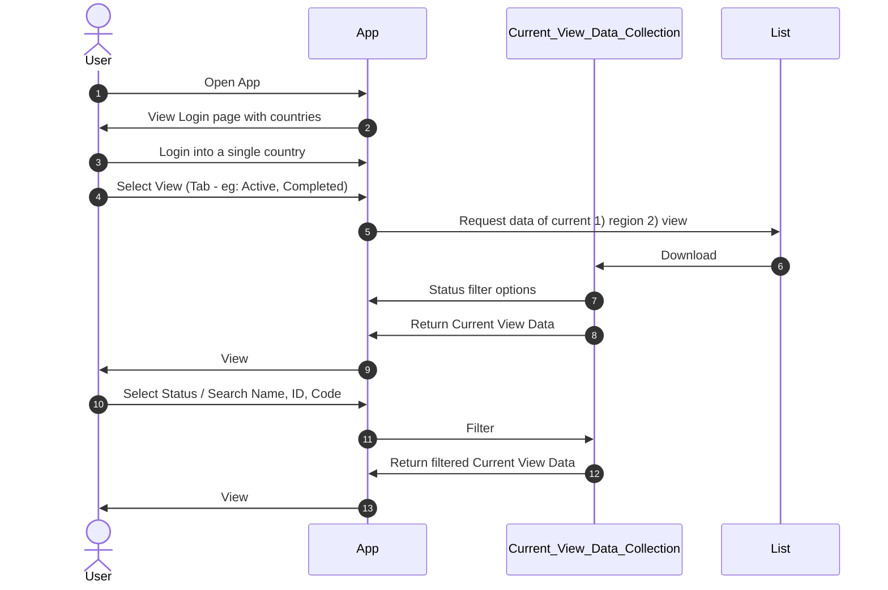
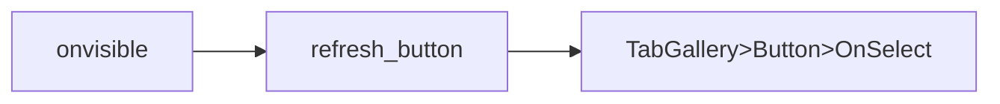

# Performance

## Loading Data

Try to do as much as possible on the server-side. ‘Lazily load’ only what is required in the current tab onto local collection for repeated operations, such as fuzzy search.





`TabGallery>Button>OnSelect`

```javascript
Set(
    data_loading,
    true
); // this is for toggling any loading animations you have
Set(
    new_tab_selected,
    ThisItem.ID
);
If(
    new_tab_selected = varTabSelected,
    Blank(),
    Reset(Status_Dropdown)
);
Set(
    varTabSelected,
    new_tab_selected
);
// repetition of filter() is required to overcome delegation issue
ClearCollect( // non-delegable
    current_view_data,
    Switch( // non-delegable
      varTabSelected,
      1,
      Filter(
        my_list,
        Region.Value = country,
        Status.Value = "Active"
      ),
      2,
      Filter(
        current_region_data,
        Region.Value = country,
        Status.Value = "Cancelled"
      )
    )
);
Set(
    data_loading,
    false
);
```

`Refresh Button`

```javascript
Select(
    Tab,
    varTabSelected,
    Tab_Button
);
```

## Avoid unnecessarily data requests

```javascript
// Onvisible of page
If(
  !loadapp,
  ClearCollect(collection,Filter(datasource,condition));
  UpdateContext({loadapp: true})
)
```

- Never use `Refresh()`. Data sources are already refreshed on start
- Forms & patch() connected to a data source (not collection) will automatically refresh that same data source (not collection)
- Even a designated refresh button does **not require** this. Just use `ClearCollect()`

## Concurrent Execution

```javascript
Concurrent(
  function_1(),
    function_2(),
    ...,
    function_n()
)

// function can be Set(), clear(), collect(), ...
```

## Delegable `in`

```javascript
Ungroup(
  ForAll(
    Selectbox.SelectedItems, // list of column values
    {
      ItemsGroupedByFilterValue: Filter(
      ListWithDelegationIssues,
      County.Value = CurrentFilterValue
      )
    }
  ),
  "ItemsGroupedByFilterValue"
)
```

## Optimizing Gallery

- Use gallery whenever possible instead of individual buttons/boxes
- Set `DelayItemLoading` to `true`
- Set `LoadingSpinner` to `LoadingSpinner.Data` or `LoadingSpinner.Controls`
- Dynamic height for menus container

```javascript
Gallery_Item.Height * Gallery.AllItemsCount
```

- Eliminate multi-screen dependency

  - This will prevent Powerapps from load everything from other screen

  - For example: Use global variable instead of `gallery.selected` for form

    row selection: `Onselect` will be `Set(current_item, ThisItem)`

## Settings

Enable `DelayedLoad`

> Speed up your app's start time by setting on-demand screen expression calls.
>
> Enable `Keep recently visited screens in memory`

Enable `Enhanced performance for hidden controls`

Hidden controls will not be created until they become visible

## Misc

- Use components wherever possible
- Use `Lookup()` instead of `First(Filter())`
  - `Lookup()` is delegable, `First(Filter())` is non-delegable
  - Lookup will stop at first match, `First(Filter())` will search the entire data even after first match and then return the first
- Change order of filters to further optimize logic
- Use Named Formulas
  - Go to `App` property
  - Formula
- Use Formula checker -> Performance Warnings - Unused Variables troubleshooting and some unused controls in the app
- Disable `onstart`
- Move things from `onstart` to `onvisible` to improve initial load
- `Delay Output` of text control
- Progress Message