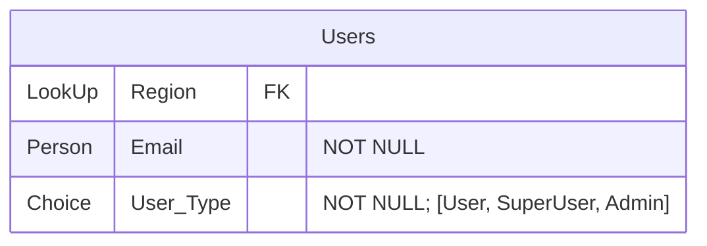

# SharePoint

Microsoft service that has both File Storage & Relational Database capabilities.

Mix of OneDrive & MySQL

Previously it was Microsoft Lists.

## Advantages

1. Free (within default O365 license)
2. Audit Trail (Version history of every record/file)
3. Flexible & Feature-Rich
4. LookUp are very useful
5. Easily to integrate with PowerPlatform ecosystem, and also to Python using SharePlum
6. Export query, which is a read-only view into the backend

## Disadvantages

1. It does not give as feature-rich queries/API compared to other solutions like SQL Server/Dataverse
2. LookUp columns has limitations
3. Setting up permissions is not easy
4. Export query only works on Windows

## SharePoint vs Dataverse

|               | SharePoint | Dataverse |
| ------------- | ---------- | --------- |
| Cost          |            |           |
| Advantages    |            |           |
| Disadvantages |            |           |
| Comments      |            |           |

## Hub of All SharePoint sites

`https://<subdomain>.sharepoint.com/_layouts/15/sharepoint.aspx?v=activities&spStartSource=spappbar`

## Vocabulary

| Normal Language | SharePoint |
| --------------- | ---------- |
| Database        | Site       |
| Table           | List       |

## Most Significant Read-Only Columns

1. ID
2. Created By
3. Modified By
4. Created
5. Modified

## Creating New Site

### Steps

### Important Configuration

1. Site Settings
2. View all site sittings
3. Regional settings
4. Make sure that time zone & locale are set correctly

## Creating New List

1. Home Page of the Site
2. Click `New`
3. Choose existing list or blank template

## Editing List

`Edit in Grid View` is your best friend!!! You can only bulk-edit only <100 items at a time

Behaves like a normal spreadsheet (copy, paste, etc)

## Schema Validation

1. Enforce unique (unique)
2. Requires information (not null)

If you use both, you are basically enforcing primary key

## Column Types

| Type                   | Comment                                                      | Advantages                                                   | Disadvantages                                                |
| ---------------------- | ------------------------------------------------------------ | ------------------------------------------------------------ | ------------------------------------------------------------ |
| Text                   | Max char $[1, 255]$                                          | Searchable on SharePoint Filterable                     | Max limit                                                    |
| Multiple Lines of Text |                                                              | No max limit                                                 | I think not Searchable on SharePoint Not filterable     |
| Choice                 | Should be used when you have a pre-defined list of options   | Very fast Looks nice                                    | Not easy to maintain the list; hence, should not be used when options are dynamic |
| DateTime               | Try to do everything in GMT                                  | Does not store date time, it stores in serial date time format | Dates & Times are not very well-managed in Microsoft ecosystem |
| Person                 |                                                              |                                                              |                                                              |
| Number                 | Float You can control precision to be 0 to enforce integer |                                                              |                                                              |
| Yes/No                 | Boolean                                                      |                                                              |                                                              |
| LookUp                 | Enforcing FK Becomes very slow/unusable after the list you are looking up from has > 5000 items |                                                              |                                                              |
| Calculated             | `Show more column types` > Calculated Helps creating regular database view-style calculated column |                                                              | Formula only gets executed when the row is updated; for eg, `Today()` cannot be used due to this |

## Recycle Bin

- Level 1
- Level 2

## Permissions

### Requirement

| Role | Access |
|---|---|
| Owners | Should have full-control |
| Superusers | Should have privileged control over the items, but cannot access the backend |
| Users | Can only access the app |
| No access | No access |

### Solution

#### Maintain SharePoint List

#### SharePoint Permissions

1. Go to site permissions
2. Advanced permission settings
3. Create permissions group and give permissions according to the below
4. Create custom permission levels according to the below

| Role | Sharepoint Permission Level | List Permission Level |
|---|---|---|
| Owners | Full-control | Full-control |
| Superusers | Contribute (Custom) | Contribute (Custom) |
| Users | Read (Custom) | Contribute (Custom) |
| No access | No access | No access |

| Level | Steps |
|---|---|
| Custom Read | Read access permission level with only `Open  -  Allows users to open a Web site, list, or folder in order to access items inside that container.` |
| Custom Contribute | Contribute access permission level with  1. `Add Items  -  Add items to lists and add documents to document libraries.`  2. `Edit Items  -  Edit items in lists, edit documents in document libraries, and customize Web Part Pages in document libraries.`  3. `View Items  -  View items in lists and documents in document libraries.`  4. `View Pages  -  View pages in a Web site.`  5. `Open  -  Allows users to open a Web site, list, or folder in order to access items inside that container.` |

#### Trick to do this faster

- First, edit the permission of the new group `Users` to `Custom Contribute`

- Then go to each list’s settings and specify do not inherit from parent

- Come back to site settings, and edit the permission to `Read`

- Add `Everyone but external users` to `Users`
	
	- Do this last to avoid any accidental access

- This way you don't have to edit list settings each time, only the site settings :)